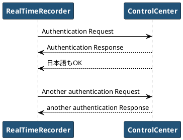
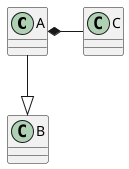
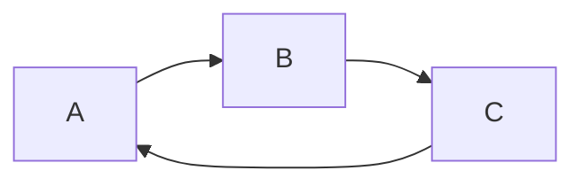

---
documentclass: ltjsarticle
title: Markdownサンプル
author: takec
date: 2017/09/13
figureTitle: "図 "
tableTitle: "表 "
listingTitle: "コード "
figPrefix: "図"
eqnPrefix: "式"
tblPrefix: "表"
lstPrefix: "コード"
...

# セクション

## 番号付きリスト

1. リスト
    1. リスト
    1. リスト
1. リスト


## 番号無しリスト

- リスト
    - リスト
    - リスト
        - リスト
    - リスト
- リスト







[@tbl:table] は表

| head1 | head2 |
|:------|------:|
| 1/1   | 1/2   |
| 2/1   | 2/2   |

: 表の例 {#tbl:table}

| i | サイコロの目 |
|------:|:------:|
| 1 | 3 |
| 2 | 2 |
| 3 | 6 |
| 4 | 5 |
| 5 | 1 |
| 6 | 4 |
| 7 | 2 |
| 8 | 6 |

[@eq:equation] は数式

$$ e^{j\theta} = \cos(\theta) + j\sin(\theta) $$ {#eq:equation}

$f(x) = sin(x) +12$

### よくある式
$$f(x) = \frac{a_0}{2} + \sum_{n = 1}^{\infty} a_n \cos nx + b_n \sin nx$${#eq:fourier}

こうやって [@eq:fourier] 参照する。

```{.numberLines caption="sample"}
      import math
      print(math.pi)
```

[@fig:sample]は画像

{#fig:sample width=100px}
