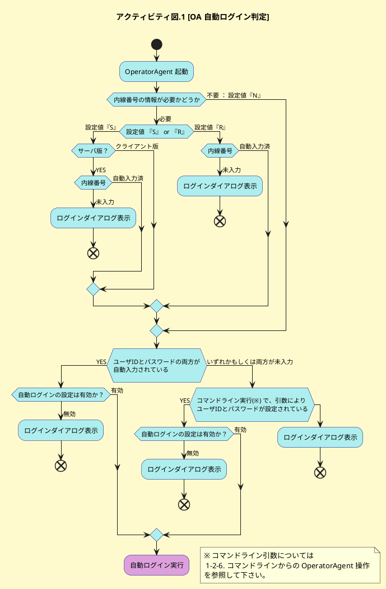
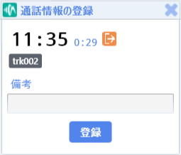
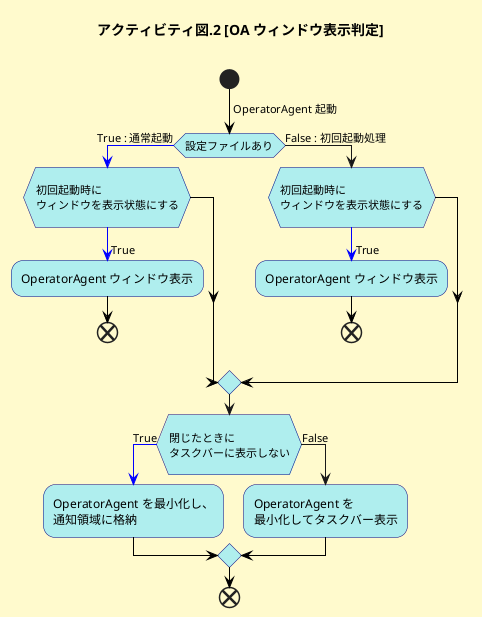

# 詳解 Communication Suite 機能編

## 目次
<!-- TOC depthFrom:2 depthTo:6 withLinks:1 updateOnSave:1 orderedList:0 -->

- [目次](#目次)
- [序章 トレーニングにあたって](#序章-)
	- [トレーニングの目的](#目的)
	- [トレーニング中の諸注意](#中諸注意)
- [第1章 OperatorAgent](#第1章-operatoragent)
	- [1-1. OperatorAgent のログイン](#1-1-operatoragent-)
		- [1-1-1. OperatorAgent でログインすることの意味](#1-1-1-operatoragent-意味)
		- [1-1-2. OperatorAgent のログインに関連する ControlCenter の詳細設定項目](#1-1-2-operatoragent-関連-controlcenter-詳細設定項目)
		- [1-1-3. プロジェクトの選択](#1-1-3-選択)
		- [1-1-4. 統合 Windows 認証](#1-1-4-統合-windows-認証)
		- [1-1-5. OperatorAgent 自動ログイン（統合 Windows 認証を利用しない）](#1-1-5-operatoragent-自動統合-windows-認証利用)
		- [1-1-6. 本節のまとめ](#1-1-6-本節)
	- [1-2. OperatorAgent のメイン画面](#1-2-operatoragent-画面)
		- [1-2-1.OperatorAgent メニュー](#1-2-1operatoragent-)
		- [1-2-2. 通話表示機能](#1-2-2-通話表示機能)
		- [1-2-4. メイン画面機能 - 通話終了後の機能](#1-2-4-画面機能-通話終了後機能)
		- [1-2-5. OperatorAgent の起動・終了時の動作](#1-2-5-operatoragent-起動終了時動作)
		- [1-2-6. OperatorAgent からのコマンド実行](#1-2-6-operatoragent-実行)
		- [1-2-7. コマンドラインからの OperatorAgent 操作](#1-2-7-operatoragent-操作)
		- [1-2-8. OperatorAgent のインストール](#1-2-8-operatoragent-)

<!-- /TOC -->
## 序章 トレーニングにあたって

### トレーニングの目的

- SI パートナー様及び Communication Suite ユーザ様に、Communication Suite の 各種機能を詳細に解説します。

### トレーニング中の諸注意
- 本トレーニングの受講資料及び内容を貴社外へ共有・配布することは禁止となります。
- 本トレーニングの内容の撮影・録音は原則として禁止となります。
- 一部、受講中の資料を補足した板書の内容などの撮影は可能ですが、講師の許可を得た上でお願い致します。
- 本資料の記載内容は、現時点（2020年03月 Communication Suite Ver3.6）での内容となります。  
  今後にリリースされるバージョンでは、記載内容が保証されない場合も生じます。

## 第1章 OperatorAgent

### 1-1. OperatorAgent のログイン
#### 1-1-1. OperatorAgent でログインすることの意味
1. ユーザアカウントの認証（ユーザID と パスワード）
2. ユーザアカウント権限のチェック
3. ユーザと通話（内線番号）の関連付け
4. 通話とプロジェクトの関連付け
5. クライアント PC を OperatorAgent ノードとして ControlCenter にレジスト

[@fig:login] は、OperatorAgent の基本的なログイン画面となります。

{#fig:login width=400px}

#### 1-1-2. OperatorAgent のログインに関連する ControlCenter の詳細設定項目

No. | 設定項目名       | デフォルト値 | 内容 |
---:|------------------|--------------|------|
1   |  ユーザーIDの保存 | false        | 最後にログイン成功した ユーザ ID を保存する |
2   |  パスワードの保存 | false        | 最後にログイン成功したパスワードを保存する |
3   |  自動ログイン | false        | 保存済みのユーザ ID とパスワード（と内線番号）で自動ログインする |
4   |  内線番号の指定 | false        | ログインダイアログに内線番号入力欄を表示する |
5   |  内線番号の情報が必要かどうか | S        | R = 必須, S = サーバ版では必須, N = 入力しない |
6   |  内線番号の保存 | false        | 最後にログイン成功した内線番号を保存する |

: 詳細設定 設定分 : OperatorAgent - ログイン {#tbl:table}  

 - [@tbl:table] の No.4 『内線番号の指定』 を **"true"** にすることで、ログインダイアログに内線番号入力欄が追加されます。（[@fig:naisenari]。VDI 等のシンクライアント環境で、クライアント PC と電話機を固定で紐付けできない場合に有効です。）  

{#fig:naisenari width=400px}

  - OperatorAgent のインストール時に内線番号を指定している場合には、指定番号が内線番号入力欄に表示されます。（[@tbl:table] の No.6 『内線番号の保存』 が **"false"** の場合も表示されます。）  
  変更すると、ログイン出来なくなったり、他の席の電話番号と紐付けされてしまうので注意してください。
  - [@tbl:table] の No.4 『内線番号の指定』 が **"false"** の場合でも、インストール時に内線番号が指定されていない場合で、かつ [@tbl:table] の No.5 『内線番号の情報が必要かどうか』 が "S" でかつサーバ版利用時 or "R" の場合には、内線番号入力欄が強制的に表示されます。
   - [@tbl:table] の No.1 ユーザID は、  
**`%USERPROFILE%/AppData/Local/Advanced_Media,_Inc/OperatorAgent.exe_StrongName_(長い文字列)/(バージョン番号)/user.config`**  
  の **LoginSettings/@LatestLoginUserId** に保存されます。 [^2] （この設定値は最後にログインに成功したユーザIDとなります。）

   - [@tbl:table]  の No.2 ログインパスワードは、Windows の  
	 [コントロールパネル] → [ユーザー アカウント] → [資格情報マネージャー]  
  に自動入力されたユーザIDに対応するパスワードが保存されます。（ [@fig:shikaku]。この設定値は最後にログインに成功したパスワードとなります。）  

{#fig:shikaku width=500px}  

   - [@tbl:table]  の No.6 内線番号は、  
	 **`%USERPROFILE%/AppData/Local/Advanced_Media,_Inc/OperatorAgent.exe_StrongName_(長い文字列)/(バージョン番号)/user.config`**  
	 の **LoginSettings/@LatestLoginLineKey** に保存されます。（この設定値は最後にログインに成功した内線番号となります。）

[^2]:最後に

#### 1-1-3. プロジェクトの選択
- ログインするユーザが複数のプロジェクトに所属している場合には、ログインダイアログに続けてプロジェクト選択ダイアログが表示されます。([@fig:project])

{#fig:project width=400px}

#### 1-1-4. 統合 Windows 認証

 - 統合 Windows 認証機能を有効化している場合には、ログイン画面は表示されません。ただし、通常ログイン同様、ユーザが複数プロジェクトに所属していれば、[1-1-3. プロジェクトの選択](#1-1-3-選択) ： [@fig:project] のダイアログが表示されます。
 - インストール時に内線番号が指定されていない場合には、内線番号入力ダイアログ（[@fig:naisen]）が追加表示されます。  

{#fig:naisen width=400px}

- 統合 Windows 認証を利用するための Communication Suite 上の設定はありません。  
  ただし、IIS に追加の設定が必要です。  
	1. OS の "機能と役割の追加" から IIS - Web サーバ - セキュリティ 設定で **Windows 認証** を有効化してください。([@fig:role])
	2. IIS マネージャーの Web サイトの設定で、ControlCenter と SpeechVisualizer のそれぞれのサイトの認証の設定を以下の図と同様に変更します。（[@fig:siteconfig]）  

{#fig:role width=400px}

{#fig:siteconfig width=400px}

#### 1-1-5. OperatorAgent 自動ログイン（統合 Windows 認証を利用しない）
- [1-1-2. OperatorAgent のログイン機能に関連する ControlCenter の詳細設定項目](#1-1-2-operatoragent-機能関連-controlcenter-詳細設定項目)  ：  [@tbl:table] の No.3 『自動ログイン』 が有効になっている場合には、統合 Windows 認証 を利用していなくてもログイン処理を省略可能です。

- [@tbl:oalogin] は、OperatorAgent の正常系ログインエラーをまとめたものです。（異常系は含んでいません。）

	No. | 事由                 | ログインダイアログのメッセージ       | デバッグログへの出力 |
---:|---------------------|------------------|--------------|
1   | ユーザ ID 誤り | OperatorAgent サービスにログインできませんでした | ステータス: 43031 ユーザID 'XXX'、またはパスワードが違います。 |
2   | パスワード誤り | OperatorAgent サービスにログインできませんでした | ステータス: 43031 ユーザID 'XXX'、またはパスワードが違います。 |
3   | 内線番号誤り | OperatorAgent サービスにログインできませんでした | ステータス: 42601 指定した内線番号 'NNN' は削除されたか、登録されていません。 |
4   | 所属プロジェクト無し | 所属するプロジェクトがありません | 出力無し|
5   | OperatorAgent の利用権限無し | OperatorAgent サービスにログインできませんでした | ステータス: 43207 権限のあるプロジェクトがありません。 |
6   | ユーザの有効期限切れ | OperatorAgent サービスにログインできませんでした | ステータス: 43031 ユーザID 'XXX'、またはパスワードが違います。 |
7   | ユーザの重複ログイン | このユーザは他の PC で利用中です | 43204 ユーザは別のホストからすでにログインしています。 |
8   | 内線番号の重複ログイン | OperatorAgent サービスにログインできませんでした | ステータス: 43205 指定された回線は現在使用されています。 |
9   | Communication Suite ユーザ未登録 | OperatorAgent サービスにログインできませんでした | このエラーは、IIS に入力されたユーザー名またはパスワードが無効であるか、または IIS がユーザーを認証するのためにそのユーザー名およびパスワードを使用できないときに発生します。 |
10   | ライセンス違反 | OperatorAgent サービスにログインできませんでした | 【要確認】 ステータス: XXXXX ○○○。 |  

	: OperatorAgent のログイン失敗事由 {#tbl:oalogin}  

	※ [@tbl:oalogin] の No.1、No.2 は **フォーム認証利用時のみ** のエラーとなります。  
※  [@tbl:oalogin] の No.9 は **統合 Windows 認証利用時のみ** のエラーとなります。

#### 1-1-6. 本節のまとめ
- [ ] OperatorAgent でのログインに関わる設定項目について理解ができた。  
- [ ] OperatorAgent でのログインが単に認証しているだけでは無いことが理解できた。
- [ ] OperatorAgent の自動ログインについて理解ができた。  
- [ ] OperatorAgent にログインできないときに原因の切り分けができそうだ。

### 1-2. OperatorAgent のメイン画面
#### 1-2-1.OperatorAgent メニュー

  {#fig:mainblank width=600px}

{#fig:oa_header width=600px}

  1. OperatorAgent バージョン確認  
  画面の左上の OperatorAgent ロゴを右クリックすると表示されるメニュー（[@fig:logoclick]）から OperatorAgent のバージョンを確認することができます。（[@fig:oaversion]）  

  {#fig:logoclick width=400px}  

  {#fig:oaversion width=400px}  

  2. 通話リスト  
  指定した検索条件に適合する SpeechVisualizer の通話詳細へのリンクをリストアップします。[@tbl:oa_conlist] は、通話リストに関連する ControlCenter の詳細設定項目です。  

		No. | 設定分類                 | 設定項目名       | デフォルト値 | 内容 |
---:|---------------------|------------------|--------------|------|
1   | OperatorAgent - 通話 | 検索条件 | mine:* d:1d | 今日の自分の通話 |
2   | OperatorAgent - 通話 | 最大表示件数 | 20 | 上位 20 件まで |

		: OperatorAgent - 通話リストの設定 {#tbl:oa_conlist}  

		※ 検索条件の書式は SpeechVisualizer の通話検索条件と同じ書式が利用できます。

  3. マイクエリ  
SpeechVisualizer の通話検索機能で設定したマイクエリへのリンク（マイクエリの条件で検索した状態の検索画面へのリンク）をリストアップします。
 4. メッセージ  
 チャット機能です。  

    **`利用のヒント`**  

    オペレータ同士のチャットは禁止し、座席表モニタ中の SV とのチャットのみ許可したい場合には、ロールに  **『OperatorAgent からのメッセージ送信』** 権限（[@fig:role_message]） が付与されていない場合、OperatorAgent からユーザを検索・指定しての能動的なメッセージ送信ができません。  
		権限がある場合（[@fig:message_authok]）には、宛先入力欄でユーザ検索・指定してのメッセージ送信ができますが、権限が無い場合には宛先を指定できない（[@fig:message_authng]）ため、能動的なメッセージ送信ができません。  
		権限が無い場合でも、座席表モニタ中の SV からの受信メッセージに対する返信は可能です。（[@fig:operatoragent_messagewindow]）また、SV とのチャット履歴がのこっている時間（受信後24時間以内）であれば、メッセージ受信履歴からの宛先指定が可能です。（[@fig:message_authngrireki]）

{#fig:role_message width=500px}  

{#fig:message_authok width=300px}  

{#fig:message_authng width=300px}  

{#fig:operatoragent_messagewindow width=400px}

{#fig:message_authngrireki width=300px}  

No. | 設定分類                 | 設定項目名       | デフォルト値 | 内容 |
---:|:--------------------|------------------|--------------|------|
1   | OperatorAgent - メッセージ | Enter キーでメッセージを送信 | true | false の場合には改行します |
2   | OperatorAgent - メッセージ | ヘルプ対応時にメッセージウインドウを自動的に開く | true | SV がヘルプ対応操作を行ったことがメッセージとして通知されます |  

: OperatorAgent - メッセージの詳細設定項目 {#tbl:oa_message_con}  

`メッセージの保存期間`  
---
- メッセージは、通話中にも非通話時にも送受信が可能です。  
  - 通話中のメッセージ - 通話の属性情報として扱われます。通話データが削除されるタイミングで消去されます。
  - 非通話中のメッセージ - 単純チャット情報として扱われます。24時間後に消去されます。  

  **通話中のメッセージも非通話中のメッセージも閲覧する機能はありません。**  

5. お知らせ  
  ControlCenter のお知らせ管理で登録されたお知らせのリストです。

	No. | 設定分類                 | 設定項目名       | デフォルト値 | 内容 |
---:|:--------------------|:-----------------|------------:|:-----|
1   | OperatorAgent - お知らせ | 更新間隔 | 3600 | 単位は秒 |
2   | OperatorAgent - お知らせ | 最大表示件数 | 20 | 上位 20 件まで |

	: OperatorAgent - お知らせの詳細設定項目 {#tbl:oa_news_con}  

  6. コンディション（感情メータ）  

  {#fig:Condtiong width=300px}  

- 直近1時間分の通話のオペレータ感情の **ポジティブ・ネガティブ（nemesysco.qa5.excitement）**  の平均値をメータ表示しています。左に振れると "ネガティブ"、右に振れると "ポジティブ" という判断になります。[@tbl:oa_condition_con]  はコンディションに関連する ControlCenter の詳細設定項目です。

	No. | 設定分類                 | 設定項目名       | デフォルト値 | 内容 |
---:|---------------------|------------------|--------------|------|
1   | OperatorAgent - 感情解析 | コンディションの表示 | true | false で表示しない |
2   | OperatorAgent - 感情解析 | コンディションのレッドゾーンの閾値 | 1.0 | 隠し項目 |
3| 共通 - 感情解析  | 感情解析の使用  | true  |  false = 感情解析に関するあらゆる UI を表示しない |  

	: OperatorAgent - コンディションの詳細設定項目 {#tbl:oa_condition_con}  

7. ログインユーザプロファイル
- ログインユーザ名表示部分をクリックするとプロフィール機能が利用できます。  
{#fig:logininfo width=300px}  

- プロフィールタブ（[@fig:oa_profile]）  
ログイン情報の表示・画像の設定・削除・パスワード変更（関連する詳細設定項目は [@tbl:oa_pwchange_con]）が実施できます。  

{#fig:oa_profile width=300px}  

No. | 設定分類                 | 設定項目名       | デフォルト値 | 内容 |
---:|---------------------|------------------|--------------|------|
1   | 共通  - セキュリティ | パスワードのポリシー | 未定義 | パスワードのフォーマット定義 |
2   | 共通  - セキュリティ | パスワードの最小桁数 | 1 |  |

: OperatorAgent - パスワード変更の詳細設定項目 {#tbl:oa_pwchange_con}  

- 設定タブ（[@fig:oa_user_con]）  
ControlCenter の詳細設定で設定された OperatorAgent の振る舞いを個人用にカスタマイズできます。  
[@tbl:oa_user_con] は、表示項目と詳細設定項目の対応表です。

 {#fig:oa_user_con width=300px}  

No. | 設定タブ項目 | 設定分類                 | 設定項目名       |
----:|---------------------|------------------|--------------|
1   | 起動時にウィンドウを表示 | OperatorAgent - 起動時動作 | 起動時にウィンドウを表示状態に戻す |
2   | 閉じたときにタスクバーに表示しない | OperatorAgent - 全般 | 閉じたときにタスクバーに表示しない |
3   | 感情解析ポップアップを自動表示 | OperatorAgent - 通知メッセージ | 感情解析の自動表示 |
4   | 通話フィルタの通知時間 | OperatorAgent - 通知メッセージ | 通話フィルタの通知時間レベル |
5   | チャンネル名を含める | OperatorAgent - 通話全文コピー | コピー時にチャンネル名を含める |
6   | 発話開始時間を含める | OperatorAgent - 通話全文コピー | コピー時に開始時間を含める |
7   | 発話終端時間を含める | OperatorAgent - 通話全文コピー | 終了時間を含めるか |
8   | Enter キーで送信 | OperatorAgent - メッセージ | Enter キーでメッセージを送信 |

: OperatorAgent - ユーザ設定項目と詳細設定項目の対応 {#tbl:oa_user_con}  

#### 1-2-2. 通話表示機能

1. 通話内容ビュー  

   OperatorAgentにログインした内線番号の通話の認識結果と関連する通話状態や通知イベントを表示します。  

- 状態通知  
状態通知は ControlCenter と OperatorAgent の間で http で通信します。  

  `通話開始 / 通話終了`・・・通話開始 / 通話終了した際に通知します。（[@fig:startobi] ）  
  `保留 / 保留解除　　`・・・オペレータ側の操作で保留 / 保留解除をした際に通知します。（[@fig:holdobi] ）  
  `通話切替`・・・録音対象としていたRTPパケットが切り替わったときに発生します。（[@fig:kirikaeobi] ）  

{#fig:startobi width=600px}  

{#fig:holdobi width=600px}  

{#fig:kirikaeobi width=600px}  

<!-- 【要確認】{width=50px}  
OperatorAgent は Internet Explorer の設定を利用して通信します。  
インターネットオプションの設定でプロキシが設定されている場合、状態通知がブロックされます。  
対処としてプロキシの例外リストにWEBサーバ のIPアドレスを登録する方法があります。    -->

- リアルタイムテキスト配信  
認識結果は StreamingRecognizer と OperatorAgent の間で http で通信します。（[@fig:hatuwa] ）  
通話内容は1文字ごとにテキスト配信されて発話単位で吹き出しが区切られます。

 {#fig:hatuwa width=600px}  

&nbsp;&nbsp;&nbsp;&nbsp;&nbsp;&nbsp;&nbsp;&nbsp;
[@tbl:enjin] は、送話と受話で使用する音声認識エンジンの設定です。  
&nbsp;&nbsp;&nbsp;&nbsp;&nbsp;&nbsp;&nbsp;&nbsp;
 ControlCenter - 認識オプションに設定項目があります。

 No. | 設定タブ項目 | 設定項目名                | 設定値      |
 ----:|---------------------|------------------|--------------|
 1   | オペレータ | 音声認識用エンジンモード | AMI提供のオペレータ用音声認識エンジンを登録 |
 2   | カスタマ | 音声認識用エンジンモード | AMI提供のカスタマ用音声認識エンジンを登録 |  

: 音声認識エンジンモードの設定 {#tbl:enjin}  

`よくある質問`  

- **通話開始の状態通知が表示されない**  
  - 対象内線で録音ができていない  
  - OperatorAgent でログインしている内線番号と通話中の内線番号が一致していない  
  - Internet Explorer でプロキシが設定されている

- **通話開始・通話終了の状態通知は表示されるが、テキスト結果が表示されない**  
  - OperatorAgent から StreamingRecognizer のHTTPポートに接続ができていない  
  - ControlCenter - 認識オプションの音声認識エンジンモードが設定されていない   

- **OperatorAgent起動後の一番最初の通話で認識結果が遅れて表示される**  
  - 仕様となります。初回認識処理時にはテキスト化に利用するエンジンモードや  
  追加登録した辞書単語等の各種設定をダウンロードしているためです。

2. 通話情報ビュー   
通話中のオペレータの通話情報が表示されます。   
この情報は通話相手によって変わらない情報のみを表示します。（[@fig:callinfo] ）  
  `自分の電話番号`・・・自番号  
  `自分のID　　　`・・・エージェントID  

{#fig:callinfo width=300px}  

3. 通話相手ビュー  
 通話状態や通話相手の情報を表示します。   
この情報は通話相手ごとに作成されます。（[@fig:callpartner] ）  

 {#fig:callpartner width=250px}  

[@tbl:callb] は、通話情報ビュー、通話相手ビューの設定項目です。
ControlCenter の詳細設定に設定項目があります。

  No. | 設定タブ項目 | 設定項目名                | 設定内容      |
  ----:|---------------------|------------------|--------------|
  1   |OperatorAgent - 通話 | 表示する通話属性の一覧 | （通話属性識別名）＝（名称)で指定  

: OperatorAgent 表示する通話属性の設定 {#tbl:callb}  

[@tbl:callb2] は、表示する通話属性で利用可能な通話属性の一覧です。(通話プロバイダにより利用できる通話属性が異なります。)

 No. | 通話属性識別名 | 名称                | Amazon Connect	      | Avaya AES    | Avaya     | SIP CIC     | SIP CTstage    |SIP OAI     | SIP T-Server      |
 ----:|---------------------|------------------|--------------|--------------|--------------|--------------|--------------|--------------|--------------|
 1   |amivoice.common.description | 備考 |  |  |  |  |  |  |  |
 2   |amivoice.common.direction | 向き|〇|〇|〇|〇|〇|〇|〇|
 3   |amivoice.common.linetype | 通話回線種別 |  |〇|  |〇|〇|〇|〇|
 4   |amivoice.common.summary| 要約 |   |  |  |  |  |  |  |
 5   |amivoice.common.headline| 見出し |   |  |  |  |  |  |  |
 6   |amivoice.common.mark | マーク |   |  |  |  |  |  |  |
 7   |amivoice.common.operator.key | 自分の識別名 |〇|〇|  |〇|〇|  |  |
 8   |amivoice.common.operator.name| 自分の名称|〇|  |  |  |〇|  |  |
 9   |amivoice.common.operator.phonenumber| 自番号 |〇|〇|〇|〇|〇|〇|〇|
 10   |amivoice.common.operator.group| 自分の所属グループ |〇|  |  |  |〇|  |  |
 11   |amivoice.common.operator.hostname | 自分のホスト名 |   |  |  |  |〇|  |  |
 12   |amivoice.common.customer.key | 相手の識別名 |   |  |  |〇|〇|  |  |
 13   |amivoice.common.customer.name | 相手の名称 |   |  |  |  |〇|  |  |
 14   |amivoice.common.customer.phonenumber| 相手番号|〇|〇|〇|〇|〇|〇|〇|
 15   |amivoice.common.customer.gender | 相手の性別 |   |  |  |  |  |  |  |
 16  |amivoice.common.telephony.dialin.phonenumber | ダイヤルイン番号 |   |  |  |〇|〇|〇|  |
 17   |amivoice.common.telephony.called.phonenumber | 掛先番号 |  |〇|〇|  |  |  |  |
 18   |amivoice.common.telephony.alerting.phonenumber | 呼出先番号|   |〇|  |  |  |  |  |
 19   |amivoice.common.telephony.trunk.group | トランクグループ |  |〇|  |〇|〇|〇|〇|
 20   |amivoice.common.telephony.trunk.member| トランクメンバ|  |〇|  |  |  |〇|  |
 21   |amivoice.common.telephony.queue.phonenumber| 通話キュー番号|   |〇|  |〇|  |  |  |
 22   |amivoice.common.telephony.transfer.source.key | 転送元識別名 |   |  |  |  |〇|  |  |
 23   |amivoice.common.telephony.transfer.source.name | 転送元名称 |   |  |  |  |〇|〇|  |
 24   |amivoice.common.telephony.transfer.source.phonenumber | 転送元番号 |   |〇|  |  |〇|  |〇|
 25   |amivoice.common.telephony.transfer.destination.key| 転送先識別名 |   |  |  |  |〇|  |  |
 26   |amivoice.common.telephony.transfer.destination.name | 転送先名称 |   |  |  |  |〇|  |  |
 27   |amivoice.common.telephony.transfer.destination.phonenumber | 転送先番号 |   |〇|  |  |〇|〇|〇|
 28   |amivoice.common.telephony.monitoring.target.key | モニタリング対象識別名 |   |  |  |〇|  |  |  |
 29   |amivoice.common.telephony.monitoring.target.name| モニタリング対象名称 |   |  |  |〇|  |  |  |
 30   |amivoice.common.telephony.monitoring.target.phonenumber| モニタリング対象番号 |   |  |  |〇|  |  |  |
 31   |amivoice.common.telephony.monitoring.target.type | 	モニタリング種別  |   |  |  |〇|  |  |  |
 32   |amivoice.common.reference.global.id | グローバル参照用のID |〇|〇|  | 〇|〇|  |〇|
 33   |amivoice.common.reference.global.url | グローバル参照用のURL |   |  |  |  |  |  |  |
 34   |amivoice.common.reference.local.id| ローカル参照用のID |   |〇|  |〇|  |  |  |
 35   |amivoice.common.reference.local.url| ローカル参照用のURL |   |  |  |  |  |  |  |
 36   |amivoice.common.reference.site.id | サイト参照用のID|   |  |  |  |  |  |  |
 37   |amivoice.common.reference.site.url| サイト参照用のURL |   |  |  |  |  |  |  |
 38   |amivoice.common.reference.private.id| プライベート参照用のID |   |  |  |  |  |  |  |
 39   |amivoice.common.reference.private.url | プライベート参照用のURL |   |  |  |  |  |  |  |
 40   |amivoice.common.recording.limit| 録音制限時間到達 |   |  |  |  |  |  |  |
 41   |amivoice.common.recording.split| 録音分割 |   |  |  |  |  |  |  |
 42   |amivoice.common.recording.split.previous| 録音分割された直前の通話 |   |  |  |  |  |  |  |
 43   |amivoice.common.reference.recording.id | 録音区間参照用のID |   |  |  |  |  |  |  |
 44   |amivoice.common.reference.recording.url | 録音区間参照用のURL |   |  |  |  |  |  |  |
 45   |amivoice.common.telephony.distributing.phonenumber| 受電グループ番号|  |〇|  |  |  |  |  |
 46   |amivoice.common.telephony.ivr.duration| IVR 応対時間 |   |〇|  |  |  |  |  |
 47   |amivoice.common.telephony.queue.duration | 待ち時間 |   |〇|  |  |  |  |  |

: OperatorAgent 表示する通話属性で利用可能な通話属性一覧 {#tbl:callb2}  

{width=50px}  
相手の性別 は通話プロバイダから情報を取得するのではなく、性別識別用エンジンにて判断しています。   
[@tbl:seibetuenjin] は性別識別エンジンに関連する設定項目となり、ControlCenter/認識管理/認識オプション にあります。   

 No. | 設定タブ項目 | 設定項目名                | 内容      |
 ----:|---------------------|------------------|--------------|
 1   |カスタマタブ | 性別識別 | 性別識別を利用するかどうか   
 2   |カスタマタブ | 性別識別用エンジンモード | 性別識別用エンジンを登録
 3   |カスタマタブ | 性別識別の閾値| 性別識別の判定に使用する閾値   
 4   |カスタマタブ | 性別識別に使用する発話時間（最大） | 性別識別の判定に使用する発話時間の最大値   
 5   |カスタマタブ | 性別識別に使用する発話時間（最小） | 性別識別の判定に使用する発話時間の最小値

: カスタマ 性別識別用エンジン設定 {#tbl:seibetuenjin}  

{width=50px}  
オペレータ側の性別判断は性別識別用エンジンを利用していません。   
オペレータ側の性別判断は ControlCenter/ユーザ管理/ のユーザごとのユーザ管理 - 詳細 設定の性別から判断しています。

4. 通話状態ビュー   
通話状態にあわせてアイコンや時間が変化します。（ [@fig:callstate]）  

{#fig:callstate width=250px}  

  `利用のヒント`  
通話状態に表示される時間はキャプチャサーバの時刻を参照しています。  

- 通話時間・・・録音開始 / 録音終了時刻から取得
- 保留・・・SIPまたはCTIイベントから取得

5. 通話フィルタビュー   
登録したキーワードがテキスト化された場合に様々なアクションを実行できる機能です。  （ [@fig:callfilter1]）  （ [@fig:callfilter2]）  

 {#fig:callfilter1 width=250px}  

 {#fig:callfilter2 width=250px}  

 `利用のヒント`   
通話フィルタはリアルタイムでレスポンスを返すことを重視した設計となっており、発動条件としては以下になります。  

- 登録したキーワードを検知したタイミング
- 認識結果が確定前の（※）  
（※）前後の文字の繋がりにより、最終的に認識結果が変わる場合があります。

つまり、１つのセグメント（発話）が完了するまで通話フィルタの処理を待つわけではなく  
キーワードを検知したタイミングですぐに処理が実行されます。  

[@tbl:callfilter] は、通話フィルタの ControlCenter の詳細設定項目です。  

  No. | 設定タブ項目 | 設定項目名                | 内容      |
 ----:|---------------------|------------------|--------------|
 1   |OperatorAgent - 通知メッセージ |通話フィルタの通知時間の倍率 (短め) | 通話フィルタの通知時間に対して通話時間レベルの「短め」とする時間を倍率で指定   
 2   |OperatorAgent - 通知メッセージ | 通話フィルタの通知時間の倍率 (長め)| 通話フィルタの通知時間に対して通話時間レベルの「長め」とする時間を倍率で指定
 3   |OperatorAgent - 通知メッセージ | 通話フィルタの通知時間レベル| 通話フィルタの表示時間を「0（普通）」とした場合に「-1（短め）」に表示するか「1（長め）」に表示するかを指定  
 4   |OperatorAgent - 通知メッセージ | 通話フィルタの表示時間|通話フィルタ検出時の通知メッセージの表示時間（秒）  
 5   |OperatorAgent - 通知メッセージ | 一度に通知する通話フィルタの対象発話数| OperatorAgent起動時に、検出済みの通話フィルタが大量に表示されるのを防止する機能。「-1」を指定した場合、通話内でそれまで検知した全ての通話フィルタの通知メッセージを表示  
 6   |共通 - 通話フィルタインポート | 通話フィルタインポートリクエストタイムアウト| インポート失敗を防ぐことを目的とした機能。有効値は「120以上の整数」

: OperatorAgent 通話フィルタの設定 {#tbl:callfilter}  

  `よくある質問`

- **通話フィルタで設定したコマンドが実行されません**  
  - Windows上で実行できないコマンドは「通話フィルタ」のコマンドでも実行できません。  
  設定したコマンドの実行可否を該当PCの「ファイル名を指定して実行」からコマンドが実行できるか確認してください。

 6. ヘルプ    
OperatorAgent から SpeechVisualizer の座席表に登録したヘルプ要求理由でアラート通知する機能です。([@fig:helpb]）  

 {#fig:helpb width=200px}  

  `利用上の注意`  
ヘルプを利用するには ControlCenter/モニタリング/ヘルプ要求理由管理、ヘルプ要求解除理由に登録が必要です。   
ヘルプ要求理由管理が登録されていない場合にはOperatorAgentの画面にヘルプボタンは表示されません。   

`利用のヒント`   
ヘルプ要求後のヘルプ解除は ControlCenter の設定で特定条件で自動終了することができます。  

- 通話前にヘルプ要求を実施、通話を開始した場合にヘルプ要求を自動解除
- 通話中にヘルプ要求を実施、通話終了後にヘルプ要求を自動解除

[@tbl:help] は、ヘルプに関する ControlCenter の詳細設定項目は以下です。

 No. | 設定分類| 設定項目名                | 内容      |
----:|---------------------|------------------|--------------|
1   |OperatorAgent - メッセージ | ヘルプ対応時にメッセージウインドウを自動的に開く | ヘルプ応答時にメッセージウインドウを自動的に開くかどうか   
2   |OperatorAgent - 通知メッセージ | ヘルプの解除理由選択の表示時間|ヘルプ要求の自動解除後にヘルプ解除理由を表示する時間    
3   |OperatorAgent - 通知メッセージ | ヘルプを案内する感情解析の通話重要度の閾値 |感情解析のポップアップ画面にヘルプボタンを表示する通話重要度の閾値  
4   |OperatorAgent - 通知メッセージ  |ヘルプ中のクローズ |ヘルプ中の通知メッセージをユーザがクローズできるかどうか
5   |OperatorAgent - 通知メッセージ  |ヘルプ中の表示 | ヘルプ要求時の通知メッセージを表示するかどうか
6   |OperatorAgent - 通話  |通話開始時にヘルプを解除する |通話開始時にヘルプ要求中だった場合、自動で解除するかどうか
7   |OperatorAgent - 通話  |通話終了時にヘルプを解除する |通話終了時にヘルプ要求中だった場合、解除するかどうか  

: OperatorAgent ヘルプ設定 {#tbl:help}  

7. 感情解析ポップアップ   
オペレータとカスタマの通話中の発話をリアルタイムで感情を数値化して表示する機能です。  
この感情解析 ([@fig:emo]) は StreamingRecognizer から取得して表示しています。  

  {#fig:emo width=250px}

通話終了後には通話の開始から通話終了までの感情のサマリ値([@fig:emosama])が表示されます。  

{#fig:emosama width=350px}  

[@tbl:emopop] は、表示する感情の設定項目です。ControlCenter の詳細設定項目にあります。  

No. | 設定分類| 設定項目名                | 設定内容      |
  ----:|---------------------|------------------|--------------|
  1   |OperatorAgent - 感情解析| 表示する感情（オペレータ）| （感情解析識別名）＝（感情名)で指定   
  2   |OperatorAgent - 感情解析| 表示する感情（カスタマ） | （感情解析識別名）＝（感情名)で指定  |  

: OperatorAgent の感情解析ポップアップ {#tbl:emopop}  

 `表示する感情の注意事項`   
 **表示する感情を変更する場合には詳細設定の 「保存する感情スコア」 の設定変更も必要です。   
 保存する感情スコアに設定されていない感情は感情値が取得できず、感情解析ポップアップに対象の感情が表示されません。**  

[@tbl:emoscore] は、保存する感情スコアの設定項目です。ControlCenter の詳細設定項目にあります。  

  No. | 設定分類| 設定項目名                | 設定内容      |
  ----:|---------------------|------------------|--------------|
  1   |共通 - 感情解析| 保存する感情スコア| （感情解析識別名）.（話者)で指定    

: 保存する感情スコア {#tbl:emoscore}  

 `表示する感情の注意点`   
**表示する感情はデータベースのパフォーマンスの観点からデフォルトで登録されている８つまでの感情に抑えるようにしてください。  
  「保存する感情スコア」に設定した感情のみが感情のサマリ値（最小/平均/最大/開始/終了）をデータベースに保存されます。  
  「保存する感情スコア」に登録されていない感情については発話単位の感情値は取得可能で Emotion ファイルに保存されます。**

[@tbl:emolist] は、「表示する感情」、「保存する感情スコア」で利用可能な感情一覧です。ControlCenter の詳細設定項目にあります。

  No. | 感情解析識別名| 感情名                | 複合型| 説明 |
  ----:|---------------------|------------------|----------|---------|
  1   |nemesysco.qa5.angry      |怒り         |  |どのくらい怒っているかを示す値      |
  2   |nemesysco.qa5.concentration     |集中         |  |どのくらい集中しているかを示す値      |
  3   |nemesysco.qa5.embarrassment      |不快         |  |どのくらい不快に感じているかを示す値      |
  4   |nemesysco.qa5.excitement      |ポジティブ・ネガティブ |〇  |値が小さいい場合はネガティブ　値が大きい場合はポジティブを示す値      |
  5   |nemesysco.qa5.excitement.positive      |ポジティブ         |  |どのくらいポジティブかを示す値      |
  6   |nemesysco.qa5.excitement.negative      |ネガティブ         |  |どのくらいネガティブかを示す値      |
  7   |nemesysco.qa5.hesitation      |後悔・快適         |〇  |値が小さい場合は快適　値が大きい場合は後悔を示す値      |
	8   |nemesysco.qa5.hesitation.regret      |後悔         |  |どのくらい後悔していると感じているかを分析した値      |
  9   |nemesysco.qa5.hesitation.comfort      |快適         |  |どのくらい快適と感じているかを分析した値      |
  10   |nemesysco.qa5.imaginationactivity      |イメージ         |  |記憶や映像化された何かから記憶を思い出している事を示す値      |
  11   |nemesysco.qa5.intensivethinking      |思考         |  |集中して考えていることを示す値      |
  12   |nemesysco.qa5.content      |喜び         |  |どのくらい嬉しいかを示す値      |
  13   |nemesysco.qa5.savorarousalfactor      |興味         |  |会話に対する深い関心、覚醒要因を示す値      |
	14   |nemesysco.qa5.upset      |悲しみ         |  |どのくらい悲しいかを示す値      |
  15   |nemesysco.qa5.extremestate      |感情変化の極端さ         |  |感情活動が全体的にどのくらい極端かを示す値      |
  16   |nemesysco.qa5.stress      |恐怖         |  |どのくらい神経質になっているかを示す（ストレスを感じているか） 参考値：1～14 緊張・神経質 15以上 恐怖      |
  17   |nemesysco.qa5.uncertainty      | 確信無し・有り        |〇  |値が小さい場合は確信　値が大きい場合は不確かな発言として示す値 参考値：15未満 確信 15以上 不安・不確か |
  18   |nemesysco.qa5.uncertainty.uncertainty      |確信無し         |  |どのくらい不確かな発言かを示す値 |
  19   |nemesysco.qa5.uncertainty.certainty      |確信有り         |  |どのくらい確信がある発言かを示す値|
	20   |nemesysco.qa5.energy      |エネルギッシュ・疲労         |〇  |値が小さい場合は疲労　値が大きい場合は精力的であるかを示す値 参考値：1 飽きている・疲労　4未満 退屈・疲労　5～9 通常　10以上 精力的       |
  21   |nemesysco.qa5.energy.energetic      |エネルギッシュ         |  |どのくらい精力的かを示す値     |
  22  |nemesysco.qa5.energy.tired      |疲労         |  |どのくらい疲労しているかを示す値      |
  23   |nemesysco.qa5.brainpower      |脳活動のサマリ         |  |脳の感情的・論理的プロセスの全体的な概要。主に研究目的で使用される。      |
  24   |nemesysco.qa5.emotionalcognitiveratio      |感情的・論理的         |〇  |話題について感情的・論理的のどちらに基づいて話をしているかの全体的な概要。値が小さい場合は論理的、大きい場合は感情的を示す。      |
  25   |nemesysco.qa5.emotionalcognitiveratio.emotional      |感情的         |  |感情的に話をしているかを示す値      |
	26   |nemesysco.qa5.emotionalcognitiveratio.cognitive      |論理的         |  |論理的に話をしているかを示す値      |
  27   |nemesysco.qa5.amplitude      |思考深さ         |  |音量を示している値（利用実績なしのため、実用性不明）      |
  28  |nemesysco.qa5.voiceenergy      |音のエネルギー         |  |音の強さ（Energy）を示す値      |
  29   |nemesysco.qa5.voicevolume      |ボリューム         |  |「音のエネルギー」とは別の計算方法で算出した音の強さ(Volume)を示す値      |
  30   |nemesysco.qa5.anticipation      |期待         |  |期待・興味を示す値      |
  31   |nemesysco.qa5.dissatisfaction      |不満         |  |不満かどうかを示す値      |
	32   |nemesysco.qa5.callpriority      |通話重要度         |  |通話の中で重要と思われる箇所を複数の感情から算出して値を示す      |
  33   |nemesysco.qa5.agentscore      |エージェントスコア         |  |関連するいくつかの感情の要約を示す。値が大きいほど、変化の度合いが激しいことを示す。      |
  34  |nemesysco.qa5.emotionlevel      |感情レベル         |  |利用用途については検討中      |
  35   |nemesysco.qa5.logicallevel      |倫理的レベル         |  |利用用途については検討中      |
  36   |nemesysco.qa5.hesitantlevel      |困惑レベル         |  |利用用途については検討中      |
  37   |nemesysco.qa5.stresslevel      |緊張レベル         |  |利用用途については検討中      |
	38   |nemesysco.qa5.energeticlevel      |活動レベル         |  |利用用途については検討中      |
  39   |nemesysco.qa5.thinkinglevel      |思考レベル         |  |利用用途については検討中      |
  40  |nemesysco.qa5.passionlevel      |情熱レベル         |  |利用用途については検討中      |
  41   |nemesysco.qa5.concentrationlevel      |集中レベル         |  |利用用途については検討中      |
  42   |nemesysco.qa5.shylevel      |疑いレベル         |  |利用用途については検討中      |
  43   |nemesysco.qa5.anticipationlevel      |期待レベル         |  |利用用途については検討中      |

: 利用可能な感情一覧 {#tbl:emolist}

#### 1-2-3. 通話終了後の機能

1. SpeechVisualizer ボタン  
OperatorAgent 上に表示されている通話の SpeechVisualizer の通話詳細画面を呼び出します。 ([@fig:opsv])  

 {#fig:opsv width=100px}  

　　`利用のヒント`  
　　Speech Visualizer ボタンは条件を満たしたタイミングで活性化されます。  
　　ボタンが活性化される条件としては以下です。  
　　・通話が終了していること  
　　・StreamingRecognizer の通話アップロードが完了していること  

　　[@tbl:svshort] は、「SpeechVisualizer を開く」 際に起動するブラウザを指定する設定です。  
　　設定は ControlCenter の詳細設定の項目にあります。  

No. | 設定分類| 設定項目名                | 設定内容      |
----:|---------------------|------------------|--------------|
1   |OperatorAgent - Web| SpeechVisualizer を表示するウェブブラウザ|SpeechVisualizer を表示するウェブブラウザのパスを指定     

: OperatorAgent SpeechVisualizerを表示するブラウザ設定 {#tbl:svshort}  

2. 手動で通話属性の追加  
通話終了後に通話に紐づく属性情報を手動で追加することができる機能です。([@fig:callp2])  

{#fig:callp2 width=200px}  

No. | 設定分類| 設定項目名                | 設定内容      |
----:|---------------------|------------------|--------------|
1   |OperatorAgent - 通話| 通話終了後に手動で通話属性を設定可能にする|True で手動通話属性の設定可能  
1   |共通 - 通話| 手動で設定可能な通話属性|手動で設定可能な通話属性を指定。  

手動で追加可能な通話属性は（[1-2-2. 通話表示機能　表 11: OperatorAgent 表示する通話属性で利用可能な通話属性一覧](#1-2-2. 通話表示機能) 参照。）  

#### 1-2-4. OperatorAgent の起動・終了時の動作  

1. OperatorAgent 起動時の処理  
- OperatorAgent の自動更新処理  
  OperatorAgent を起動すると、ログインダイアログが表示される前に自身のバージョンとサーバ側のバージョンの比較を行います。  
 
  - OperatorAgent のバージョンがサーバのバージョンより古い場合には、自動的に更新処理が行われ OperatorAgent が自動的にバージョンアップします。この更新処理は機能として、正常なバージョンアップがされることが保証されています。  
 
  - OperatorAgent のバージョンがサーバのバージョンより新しい場合も同様に自動更新処理が行われ、 OperatorAgent の自動バージョンダウン処理が行われますが、この処理は機能によって正常更新が保証されない場合があります。  
  バージョンダウン処理がサポートされるかどうかは、そのときのバージョン次第です。必要がある場合には、サポートへお問合せください。  
	{width=50px}  
  更新処理では、 **Windows Script Host （WSH）** の vbs がいくつか実行されます。（[@tbl:vbslist]）  
	セキュリティソフトによって、WSH の実行が阻害されてしまう環境では、自動更新処理が正常に行われません。（インストーラによる初期インストールでもバージョンアップインストールでも、WSH は実行されます。）  

    No. | ファイル名 | 説明  |
    ----|---------------------|------------------|
 1   | moduleindexbuilder.vbs | バージョン毎にファイルのハッシュ値が**必ず変更になります**。 |
 2   | @301_RR_CTILink_RegAsm.vbs | バージョン毎にファイルのハッシュ値の変更はありませんが将来のバージョンで削除となる可能性はあります。 |
 3   | @341_RR_RemoveFiles.vbs | バージョン毎にファイルのハッシュ値の変更はありませんが将来のバージョンで削除となる可能性はあります。 |
 4   | @341_SR_RemoveFiles.vbs | バージョン毎にファイルのハッシュ値の変更はありませんが将来のバージョンで削除となる可能性はあります。 |
 5   | @352_SR_Web_RemoveFiles.vbs | バージョン毎にファイルのハッシュ値の変更はありませんが将来のバージョンで削除となる可能性はあります。 |
 6   | @Updater.vbs | ファイルが更新されていればハッシュ値も変更になります。 |

 	: OperatorAgent のアップデート時に実行される vbs のリスト {#tbl:vbslist}  

    **※ \@数字_モジュール_処理名.vbs のファイルは、特定の処理を行う (不要になったファイルの削除や、不具合修正のための処理とか) 為にあるので、以降のバージョンで追加になる可能性があります。**  

	   

	{width=50px}  
		OperatorAgent をコマンドラインから引数付きで起動することで自動更新を抑制できます。（[1-2-6. コマンドラインからの OperatorAgent 操作](#1-2-6-operatoragent-操作) 参照。）  

 

- ライセンス引当  
    処理詳細は【要確認】  

 

- メインウィンドウの表示について  
メインウィンドウの表示は、 [@tbl:oa_window] の項目の設定値を判断して行われます。  
 
	- 初回起動  
    	1. `C:\Users\%UserName%\AppData\Local\Advanced_Media,_Inc` に設定ファイルが無ければ、初回起動時として動作します。  
    	2. [@tbl:oa_window] の  No.2 の設定値を判断し、ウィンドウ表示を制御します。  
  - 通常起動  
	1. `C:\Users\%UserName%\AppData\Local\Advanced_Media,_Inc` に設定ファイルが有れば、通常起動として動作します。  
	2. [@tbl:oa_window] の  No.1 の設定値を判断し、ウィンドウ表示を制御します。  
	3. 表示しない設定の場合、[@tbl:oa_window] の  No.3 の設定値を判断し、タスクバー or 通知領域に情報を表示します。  

	No. | 設定分類| 設定項目名                | デフォルト値  | 内容 |
----:|---------------------|------------------|------|----|
1   | OperatorAgent - 起動時動作 | 起動時にウィンドウを表示状態に戻す | true | OperatorAgent 起動毎に、終了時のウィンドウ状態に依存せずメインウィンドウを画面表示状態に戻します。false の場合には、OperatorAgent の終了時の状態を引き継ぎます。
2   | OperatorAgent - 起動時動作 | 初回起動時にウィンドウを表示状態にする | true | 初回起動時の メインウィンドウの表示状態を設定します。オペレータさんに基本的に画面を一度も見せたくない場合などに false 設定しておきます。  
3   | OperatorAgent - 全般 | 閉じたときにタスクバーに表示しない | False | true にするとメインウィンドウの　× ボタンでウィンドウを閉じたときに、通知領域にのみアイコンが表示されます。  

	: OperatorAgent のウィンドウ表示に関わる詳細設定項目 {#tbl:oa_window}  

2. OperatorAgent 終了時の処理  
  - ログオフ処理  
  ControlCenter にレジストされた、OperatorAgent のレジスト情報（ユーザ・座席表の位置・内線番号との関連付け）などをリリースします。  
  OperatorAgent を VDI オプション付きでインストールしている場合には、ライセンスのリリースも実施します。

#### 1-2-5. OperatorAgent からのコマンド実行
  - あ
  - あ
  - あ

#### 1-2-7. コマンドラインからの OperatorAgent 操作
- OperatorAgent をコマンドラインから操作する  
  OperatorAgent は、コマンドラインから  
`インストールパス\OperatorAgent.exe --オプション＝値（-オプション 値）`  
	のように起動（終了）できます。  
	[@tbl:oa-option] はコマンドラインで指定可能なオプションの一覧です。  

	No.| 内容 | オプション名 | 短いオプション名  
--:|---|---|--
1| ControlCenterの指定 | --server=[ControlCenterURL] | -s [ControlCenterURL]  
2| ユーザIDの指定 | --user=[ユーザID] | -u [ユーザID]  
3| パスワードの指定 | --password=[パスワード] | -p [パスワード]  
4| 内線番号の指定 | --line=[内線番号] | -l [内線番号]  
5| 自動アップデート禁止 | --disable-update |  
6| 言語の指定 | --culture=[カルチャ名(\<languagecode2>-\<country/regioncode2>)] |  
7| 起動中のOAを終了 | --exit |  

	: OperatorAgent のコマンドラインオプション {#tbl:oa-option}  

	{width=50px}  
	1. 一時的に OperatorAgent　の接続先をステージング環境に向けたいときなどに利用します。  
	2. 3 パスワードと組み合わせて、統合 Windows 認証 を利用することなく自動ログインを可能にします。  
	3. 2 ユーザID と組み合わせて、統合 Windows 認証 を利用することなく自動ログインを可能にします。  
	4. 一時的に設定済みの内線番号ではない電話機と組み合わせてテストするときなどに指定します。  
	5. なんらかの事情で OperatorAgent の自動バージョンアップをさせたくない場合に指定します。  
	5. 【要確認】  
	5. 端末の操作が著しく限定されている。 かつ、端末シャットダウン時に実行中のアプリケーションの全終了が条件の環境で利用しています。

#### 1-2-7. OperatorAgent のインストール
