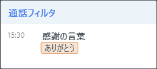

# 詳解 Communication Suite 機能編
## 誰も知らない Communication Suite の謎

## 目次
<!-- TOC depthFrom:1 depthTo:6 withLinks:1 updateOnSave:1 orderedList:0 -->

- [詳解 Communication Suite 機能編](#詳解-communication-suite-機能編)
	- [誰も知らない Communication Suite の謎](#誰知-communication-suite-謎)
	- [目次](#目次)
	- [序章 トレーニングにあたって](#序章-)
		- [トレーニングの目的](#目的)
		- [トレーニング中の諸注意](#中諸注意)
	- [第1章 OperatorAgent](#第1章-operatoragent)
		- [1-1. OperatorAgent のログイン](#1-1-operatoragent-)
			- [1-1-1. OperatorAgent でログインすることの意味](#1-1-1-operatoragent-意味)
			- [1-1-2. OperatorAgent のログイン機能に関連する ControlCenter の詳細設定項目](#1-1-2-operatoragent-機能関連-controlcenter-詳細設定項目)
			- [1-1-3. プロジェクトの選択](#1-1-3-選択)
			- [1-1-4. 統合 Windows 認証](#1-1-4-統合-windows-認証)
			- [1-1-5. OperatorAgent 自動ログイン（統合 Windows 認証を利用しない）](#1-1-5-operatoragent-自動統合-windows-認証利用)
			- [1-1-5. OperatorAgent へのログイン失敗事由](#1-1-5-operatoragent-失敗事由)
			- [1-1-6. 1-1 のまとめ](#1-1-6-1-1-)
		- [1-2. OperatorAgent のメイン画面](#1-2-operatoragent-画面)
			- [1-2-1. メイン画面機能](#1-2-1-画面機能)
			- [1-2-2. メイン画面機能 - 通話中の機能](#1-2-2-画面機能-通話中機能)
			- [1-2-2. メイン画面機能 - 通話中の機能](#1-2-2-画面機能-通話中機能)
			- [1-2-3. メイン画面機能 - 通話終了後の機能](#1-2-3-画面機能-通話終了後機能)
			- [1-2-４. OperatorAgent の起動・終了時の動作](#1-2-operatoragent-起動終了時動作)
			- [1-2-5. OperatorAgent からのコマンド実行](#1-2-5-operatoragent-実行)
			- [1-2-6. コマンドラインからの OperatorAgent 操作](#1-2-6-operatoragent-操作)
			- [1-2-7. OperatorAgent のインストール](#1-2-7-operatoragent-)

<!-- /TOC -->

## 序章 トレーニングにあたって

### トレーニングの目的

- SI パートナー様及び Communication Suite ユーザ様に、Communication Suite の 各種機能を詳細に解説します。

### トレーニング中の諸注意
- 本トレーニングの受講資料及び内容を貴社外へ共有・配布することは禁止となります。
- 本トレーニングの内容の撮影・録音は原則として禁止となります。
- 一部、受講中の資料を補足した板書の内容などの撮影は可能ですが、講師の許可を得た上でお願い致します。
- 本資料の記載内容は、現時点（2020年03月 Communication Suite Ver3.6）での内容となります。  
  今後にリリースされるバージョンでは、記載内容が保証されない場合も生じます。

## 第1章 OperatorAgent

### 1-1. OperatorAgent のログイン
#### 1-1-1. OperatorAgent でログインすることの意味
1. ユーザアカウントの認証（ユーザID と パスワード）
2. ユーザアカウント権限のチェック
3. ユーザと通話（内線番号）の関連付け
4. 通話とプロジェクトの関連付け
5. クライアント PC を OperatorAgent ノードとして ControlCenter にレジスト

1 行空行を空けると "[^1]" 別のパラグラフになる。  

[^1]:C

[@fig:login] は、OperatorAgent の基本的なログイン画面となります。

{#fig:login width=60% height=60%}

#### 1-1-2. OperatorAgent のログインに関連する ControlCenter の詳細設定項目

No. | 設定項目名       | デフォルト値 | 内容 |
----|------------------|--------------|------|
1   |  ユーザーIDの保存 | false        | 最後にログイン成功した ユーザ ID を保存する |
2   |  パスワードの保存 | false        | 最後にログイン成功したパスワードを保存する |
3   |  自動ログイン | false        | 保存済みのユーザ ID とパスワード（と内線番号）で自動ログインする |
4   |  内線番号の指定 | false        | ログインダイアログに内線番号入力欄を表示する |
5   |  内線番号の情報が必要かどうか | S        | R = 必須, S = サーバ版では必須, N = 入力しない |
6   |  内線番号の保存 | false        | 最後にログイン成功した内線番号を保存する |

: 詳細設定 設定分類 : OperatorAgent - ログイン {#tbl:table}  

 - [@tbl:table] の No.4 『内線番号の指定』 を **"true"** にすることで、[@fig:naisenari] のようにログインダイアログに内線番号入力欄が追加されます。（VDI 等のシンクライアント環境で、OS に固有情報を保持できない場合に利用する想定です。）  

{#fig:naisenari width=60% height=60%}

  - OperatorAgent のインストール時に内線番号を指定している場合には、指定番号が内線番号入力欄に表示されます。（[@tbl:table] の No.6 『内線番号の保存』 が **"false"** の場合も表示されます。）
  - [@tbl:table] の No.4 『内線番号の指定』 が **"false"** の場合でも、インストール時に内線番号が指定されていない場合で、かつ [@tbl:table] の No.5 『内線番号の情報が必要かどうか』 が "S" でかつサーバ版利用時 or "R" の場合には、内線番号入力欄が強制的に表示されます。
   - [@tbl:table] の No.1 ユーザID は、  
	 '%USERPROFILE%/AppData/Local/Advanced_Media,_Inc/OperatorAgent.exe_StrongName_(長い文字列)/(バージョン番号)/user.config'  
  の **LoginSettings/@LatestLoginUserId** に保存されます。（この設定値は最後にログインに成功したユーザIDとなります。）

   - No.2 ログインパスワードは、Windows の  
	 [コントロールパネル] → [ユーザー アカウント] → [資格情報マネージャー]  
  に自動入力されたユーザIDに対応するパスワードが [@fig:shikaku] のように保存されます。（この設定値は最後にログインに成功したパスワードとなります。）  

{#fig:shikaku width=50% height=50%}  

   - No.6 内線番号は、
	 '%USERPROFILE%/AppData/Local/Advanced_Media,_Inc/OperatorAgent.exe_StrongName_(長い文字列)/(バージョン番号)/user.config'  
	 の **LoginSettings/@LatestLoginLineKey** に保存されます。（この設定値は最後にログインに成功した内線番号となります。）

\clearpage

#### 1-1-3. プロジェクトの選択
- ログインするユーザID が複数のプロジェクトに所属している場合には、ログインダイアログに続けて [@fig:project] のプロジェクト選択ダイアログが表示されます。

{#fig:project width=60% height=60%}

#### 1-1-4. 統合 Windows 認証

 - 統合 Windows 認証機能を有効化している場合には、ログイン画面は表示されません。ただし、ユーザがプロジェクトに複数所属している場合には、[1-1-3. プロジェクトの選択](#1-1-3-選択) のプロジェクト選択ダイアログ（[@fig:project]）が表示されます。
 - インストール時に内線番号が指定されていない場合には、[@fig:naisen]　の内線番号の入力欄のみのダイアログが追加表示されます。  

{#fig:naisen width=60% height=60%}

- 統合 Windows 認証を利用するための Communication Suite 上の設定はありません。以下、IIS 上でいくつか追加の設定が必要です。  
	1. OS の "機能と役割の追加" から IIS - Web サーバ - セキュリティ 設定で **Windows 認証** を有効化してください。([@fig:role])
	2. IIS マネージャーの Web サイトの設定で、ControlCenter と SpeechVisualizer のそれぞれのサイトの認証の設定を以下の図と同様に変更します。（[@fig:siteconfig]）

{#fig:role width=60% height=60%}

{#fig:siteconfig width=60% height=60%}

#### 1-1-5. OperatorAgent 自動ログイン（統合 Windows 認証を利用しない）

#### 1-1-5. OperatorAgent へのログイン失敗事由
- OperatorAgent にログインできない原因を以下に列挙します。ただし、仕様によりログインできなかった事由に限定しています。（NW 切断やサーバシャットダウンは含んでいません。）

No. | 事由                 | ログインダイアログのメッセージ       | デバッグログへの出力 |
----|---------------------|------------------|--------------|
1   | ユーザ ID 誤り | OperatorAgent サービスにログインできませんでした | ステータス: 43031 ユーザID 'XXX'、またはパスワードが違います。 |
2   | パスワード誤り | OperatorAgent サービスにログインできませんでした | ステータス: 43031 ユーザID 'XXX'、またはパスワードが違います。 |
3   | 内線番号誤り | OperatorAgent サービスにログインできませんでした | ステータス: 42601 指定した内線番号 'NNN' は削除されたか、登録されていません。 |
4   | 所属プロジェクト無し | 所属するプロジェクトがありません | 出力無し|
5   | OperatorAgent の利用権限無し | OperatorAgent サービスにログインできませんでした | ステータス: 43207 権限のあるプロジェクトがありません。 |
6   | ユーザの有効期限切れ | OperatorAgent サービスにログインできませんでした | ステータス: 43031 ユーザID 'XXX'、またはパスワードが違います。 |
7   | ユーザの重複ログイン | このユーザは他の PC で利用中です | 43204 ユーザは別のホストからすでにログインしています。 |
8   | 内線番号の重複ログイン | OperatorAgent サービスにログインできませんでした | ステータス: 43205 指定された回線は現在使用されています。 |
9   | Communication Suite ユーザ未登録 | OperatorAgent サービスにログインできませんでした | このエラーは、IIS に入力されたユーザー名またはパスワードが無効であるか、または IIS がユーザーを認証するのためにそのユーザー名およびパスワードを使用できないときに発生します。 |
10   | ライセンス違反 | OperatorAgent サービスにログインできませんでした | 【要確認】 ステータス: XXXXX ○○○。 |


※ 1、2 は **フォーム認証利用時のみ** のエラーとなります。  
※ 9 は **統合 Windows 認証利用時のみ** のエラーとなります。

#### 1-1-6. 1-1 のまとめ
- [ ] OperatorAgent でのログインに関わる設定項目について理解ができた。
- [ ] OperatorAgent でのログインが単に認証しているだけでは無いことが理解できた。
- [ ] OperatorAgent にログインできないときに原因の切り分けができそうだ。

### 1-2. OperatorAgent のメイン画面
#### 1-2-1. メイン画面機能

 1. OperatorAgent バージョン確認  
 画面の左上の OperatorAgent ロゴを右クリックすると表示されるメニューから OperatorAgent のバージョンを確認することができます。
 
 
 2. 通話リスト  
 指定した検索条件に適合する SpeechVisualizer の通話詳細へのリンクをリストアップします。通話リストに関連する ControlCenter の詳細設定項目は以下です。

 No. | 設定分類                 | 設定項目名       | デフォルト値 | 内容 |
----|---------------------|------------------|--------------|------|
1   | OperatorAgent - 通話 | 検索条件 | mine:* d:1d | 今日の自分の通話 |
2   | OperatorAgent - 通話 | 最大表示件数 | 20 | 上位２０件まで |

 ※ 検索条件の書式は SpeechVisualizer の通話検索条件と同じ書式が利用できます。

 3. マイクエリ  
 SpeechVisualizer の通話検索機能で設定したマイクエリへのリンク（マイクエリの条件で検索した状態の検索画面へのリンク）をリストアップします。
 4. メッセージ  
 チャット機能です。
 #### `利用のヒント`  
  オペレータ同士のチャットは禁止するが、座席表モニタ中の SV とのチャットのみ許可したい場合には、ロールに付与する権限  "OperatorAgent からのメッセージ送信" を付与しないことにより、OperatorAgent からユーザを検索・指定してのメッセージ送信ができなくなります。  

     
権限があると宛先検索が有効です。

	   
  権限が無いと宛先検索ができません。

	   
	管理者から受信したメッセージに対して返信は可能です。

	   
	メッセージウィンドウにチャット履歴が残っている期間（受信後24時間以内）であれば、メッセージ受信履歴からの宛先指定が可能です。

 メッセージに関連する ControlCenter の詳細設定項目は以下です。

 No. | 設定分類                 | 設定項目名       | デフォルト値 | 内容 |
----|---------------------|------------------|--------------|------|
1   | OperatorAgent - メッセージ | Enter キーでメッセージを送信 | true |  |
2   | OperatorAgent - メッセージ | ヘルプ対応時にメッセージウインドウを自動的に開く | true |  |

 #### `メッセージの保存期間`  
メッセージは、通話中にも非通話時にも送受信できます。
  - 通話中のメッセージ - 通話の付加情報として扱われます。通話データが削除されるタイミングで消去されます。
  - 非通話中のメッセージ - 単純チャット情報として扱われます。24時間後に消去されます。  
      **通話中のメッセージも非通話中のメッセージも閲覧する機能はありません。**


 5. お知らせ  
 ControlCenter のお知らせ管理で登録されたお知らせをリストアップします。お知らせに関連する ControlCenter の詳細設定項目は以下です。

 No. | 設定分類                 | 設定項目名       | デフォルト値 | 内容 |
----|---------------------|------------------|--------------|------|
1   | OperatorAgent - お知らせ | 更新間隔 | 3600 | 単位は秒 |
2   | OperatorAgent - お知らせ | 最大表示件数 | 20 | 上位２０件まで |

 6. コンディション（感情メータ）  
   
 直近1時間分の通話のオペレータ感情の **ポジティブ・ネガティブ（nemesysco.qa5.excitement）**  の平均値をメータ表示しています。左に振れると "ネガティブ"、右に振れると "ポジティブ" という判断になります。コンディションに関連する ControlCenter の詳細設定項目は以下です。

 No. | 設定分類                 | 設定項目名       | デフォルト値 | 内容 |
----|---------------------|------------------|--------------|------|
1   | OperatorAgent - 感情解析 | コンディションの表示 | true | false で表示しない |
2   | OperatorAgent - 感情解析 | コンディションのレッドゾーンの閾値 | 1.0 | 隠し項目 |
3| 共通 - 感情解析  | 感情解析の使用  | true  |  false = 感情解析に関するあらゆる UI を表示しない |

 7. ログインユーザプロファイル  
 - ログインユーザ名表示部分をクリックするとプロフィール機能が利用できます。  
   

1. プロフィールタブ  
	 ログイン情報の表示・画像の設定・削除・パスワード変更が実施できます。  
   

	 パスワード変更機能に関連する ControlCenter の詳細設定項目は以下です。

 No. | 設定分類                 | 設定項目名       | デフォルト値 | 内容 |
----|---------------------|------------------|--------------|------|
1   | 共通  - セキュリティ | パスワードのポリシー | 未定義 | パスワードのフォーマット定義 |
2   | 共通  - セキュリティ | パスワードの最小桁数 | 1 |  |

   2. 設定タブ  
	 ControlCenter の詳細設定で設定された OperatorAgent の振る舞いを個人用にカスタマイズする機能になります。  
	   

	 設定タブの項目と ControlCenter の詳細設定項目の関連は以下です。

 No. | 設定タブ項目 | 設定分類                 | 設定項目名       |
----|---------------------|------------------|--------------|
1   | 起動時にウィンドウを表示 | OperatorAgent - 起動時動作 | 起動時にウィンドウを表示状態に戻す |
2   | 閉じたときにタスクバーに表示しない | OperatorAgent - 全般 | 閉じたときにタスクバーに表示しない |
3   | 感情解析ポップアップを自動表示 | OperatorAgent - 通知メッセージ | 感情解析の自動表示 |
4   | 通話フィルタの通知時間 | OperatorAgent - 通知メッセージ | 通話フィルタの通知時間レベル |
5   | チャンネル名を含める | OperatorAgent - 通話全文コピー | コピー時にチャンネル名を含める |
6   | 発話開始時間を含める | OperatorAgent - 通話全文コピー | コピー時に開始時間を含める |
7   | 発話終端時間を含める | OperatorAgent - 通話全文コピー | 終了時間を含めるか |
8   | Enter キーで送信 | OperatorAgent - メッセージ | Enter キーでメッセージを送信 |

#### 1-2-2. メイン画面機能 - 通話中の機能

1. 通話内容  
OperatorAgent でログインした内線番号で通話が開始すると通話内容の枠に「通話開始」帯の （[@fig:startobi] ）が表示されます。  
この状態通知はWEBサーバ（ControlCentere）とクライアント端末（OperatorAgent）が８０番ポートを経由して通知します。  

{#fig:startobi width=60% height=60%}  

  `利用のヒント`  
「通話開始」の状態通知を検知できない場合には、通話内容の枠に発話内容のテキストを表示できません。  
状態通知が検知できない原因としては以下が考えられます。  
**・クライアント端末からWEBサーバの80番ポートに接続できない**  
**・対象通話の録音ができていない**  

通話開始後、StreamingRecognizer から認識結果を取得してオペレータとカスタマの認識結果（[@fig:hatuwa] ）を表示します。  
オペレータ側の発話は緑色枠に表示されてカスタマ側の発話は橙色枠で表示されます。  

 {#fig:hatuwa width=60% height=60%}  


オペレータとカスタマで使用する音声認識エンジンが異なります。  
ControlCenter - 認識オプションの設定でオペレータ、カスタマの音声認識エンジンを設定します。  

 No. | 設定タブ項目 | 設定項目名                | 設定値      |
 ----|---------------------|------------------|--------------|
 1   | オペレータ | 音声認識用エンジンモード | AMI提供のオペレータ用音声認識エンジンを登録 |
 2   | カスタマ | 音声認識用エンジンモード | AMI提供のカスタマ用音声認識エンジンを登録 |
`利用のヒント`  
 通話開始・通話終了の帯は表示されるが、テキスト結果が画面上に表示されない場合には以下の原因が考えられます。  
**・クライアント端末から StreamingRecognizer のHTTPポートに接続ができない**   
**・ControlCenter - 認識オプションの音声認識エンジンモードが設定されていない**

#### 1-2-2. メイン画面機能 - 通話中の機能


2. 通話情報   
通話属性が取得できる場合には通話情報の欄に（[@fig:callinfo] ）のように属性情報が表示されます。

{#fig:callinfo width=30% height=30%}   

自分の電話番号・・・自番号  
自分のID・・・エージェントID  


 通話情報の ControlCenter の詳細設定項目は以下です。   

 No. | 設定タブ項目 | 設定項目名                | 設定値      |
 ----|---------------------|------------------|--------------|
 1   |OperatorAgent - 通話 | 表示する通話属性の一覧 | （通話属性キー）＝（表示ラベル名)で指定します。

3. 通話相手  
 通話の状態や通話相手の情報を表示します。（[@fig:callpartner] ）   
 取得可能な属性情報は通話プロバイダにより異なります。   

 {#fig:callpartner width=20% height=15%}  

 `利用のヒント`   
 相手の性別 は通話プロバイダから情報を取得するのではなく、性別識別用エンジンにて判断しています。   
 相手の性別 に関連する設定項目は ControlCenter/認識管理/認識オプション にあります。   

 No. | 設定タブ項目 | 設定項目名                | 内容      |
 ----|---------------------|------------------|--------------|
 1   |カスタマタブ | 性別識別 | 性別識別を利用するかどうか   
 2   |カスタマタブ | 性別識別用エンジンモード | 性別識別用エンジンを登録
 3   |カスタマタブ | 性別識別の閾値| あああああ（よくわくらない）   
 4   |カスタマタブ | 性別識別に使用する発話時間（最大） | 性別識別の判定に使用する発話時間の最大値   
 5   |カスタマタブ | 性別識別に使用する発話時間（最小） | 性別識別の判定に使用する発話時間の最小値

  `利用のヒント`   
オペレータ側の性別判断は性別識別用エンジンを利用していません。   
オペレータ側の性別判断は ControlCenter/ユーザ管理/ のユーザごとのユーザ管理 - 詳細 設定の性別から判断しています。

 通話相手の ControlCenter の詳細設定項目は以下です。   

 No. | 設定タブ項目 | 設定項目名                | 設内容      |
 ----|---------------------|------------------|--------------|
 1   |OperatorAgent - 通話 | 表示する通話属性の一覧 | （通話属性キー）＝（表示ラベル名)で指定します。   

4. 通話状態   
通話状態にあわせてアイコンや時間が変化します。（ [@fig:callstate]）  

{#fig:callstate width=25% height=25%}  


 `利用のヒント`  
 通話が終了しているのに通話時間が継続してしまうなど、通話状態が正しく取得できない場合には   
ControlCenter からの状態通知を OperatorAgent がなにかしらの理由で受信できていないことが原因です。   

5. 通話フィルタ   
登録したキーワードがテキスト化された場合に様々なアクションを実行できる機能です。（ [@fig:callfilter]）  

 {#fig:callfilter width=25% height=25%}  

 通話フィルタの ControlCenter の詳細設定項目は以下です。   

  No. | 設定タブ項目 | 設定項目名                | 内容      |
 ----|---------------------|------------------|--------------|
 1   |OperatorAgent - 通知メッセージ |通話フィルタの通知時間の倍率 (短め) | あ   
 2   |OperatorAgent - 通知メッセージ | 通話フィルタの通知時間の倍率 (長め)| あ
 3   |OperatorAgent - 通知メッセージ | 通話フィルタの通知時間レベル| あ  
 4   |OperatorAgent - 通知メッセージ | 通話フィルタの表示時間| あ  
 5   |OperatorAgent - 通知メッセージ | 一度に通知する通話フィルタの対象発話数| 隠し項目  
 6   |共通 - 通話フィルタインポート | 通話フィルタインポートリクエストタイムアウト| あ

  `利用のヒント`   
通話フィルタは発動条件として登録したキーワードを検知したタイミングで実行されます。   
つまり１つのセグメント（発話）が終了するまで通話フィルタの処理が実行されないわけではありません。   

 6. ヘルプ    
OperatorAgent から SpeechVisualizer の座席表に登録したテンプレートでアラート通知する機能です。   

`利用のヒント`  
ヘルプを利用するには ControlCenter/モニタリング/ヘルプ要求理由管理、ヘルプ要求解除理由にテンプレートの登録が必要です。   
テンプレートを登録していない場合には OperatorAgentの画面左下部にヘルプのアイコン([@fig:helpb]）は表示されません。   

 {#fig:helpb width=20% height=20%}  


 ヘルプの ControlCenter の詳細設定項目は以下です。

 No. | 設定分類| 設定項目名                | 内容      |
----|---------------------|------------------|--------------|
1   |OperatorAgent - メッセージ | ヘルプ対応時にメッセージウインドウを自動的に開く | ヘルプ応答時にメッセージウインドウを自動的に開く   
2   |OperatorAgent - 通知メッセージ | ヘルプの解除理由選択の表示時間|ヘルプ要求の自動解除後にヘルプ解除理由のテンプレートを表示する時間    
3   |OperatorAgent - 通知メッセージ | ヘルプを案内する感情解析の通話重要度の閾値 | あああ（よくわからない）   
4   |OperatorAgent - 通知メッセージ  |ヘルプ中のクローズ | あああ（よくわからない）
5   |OperatorAgent - 通知メッセージ  |ヘルプ中の表示 | ヘルプ要求時の通知メッセージを表示するかどうか

 `利用のヒント`   
 OperatorAgent のヘルプ通知が SpeechVisualizer の座席表に通知されない場合には  
 ControlCenter からの状態通知を OperatorAgent がなにかしらの理由で受信できていないことが原因です。

7. 感情解析ポップアップ   
オペレータとカスタマの通話中の発話をリアルタイムで感情を数値化して表示する機能です。  
この感情解析([@fig:emo])は StreamingRecognizer から取得して表示しています。  

  {#fig:emo width=25% height=25%}

通話終了後には通話の開始から通話終了までの感情のサマリ値([@fig:emosama])が表示されます。  

{#fig:emosama width=35% height=35%}  

感情解析ポップアップに表示する感情一覧は ControlCenter の詳細設定項目にあります。   

No. | 設定分類| 設定項目名                | 内容      |
  ----|---------------------|------------------|--------------|
  1   |OperatorAgent - 感情解析| 表示する感情（オペレータ）| オペレータで解析する感情を登録   
  2   |OperatorAgent - 感情解析| 表示する感情（カスタマ） |カスタマで解析する感情を登録    

 `利用のヒント`   
 表示する感情を変更する場合には詳細設定の 「保存する感情スコア」 の設定変更も必要です。   
 保存する感情スコアに設定されていない感情は感情値が取得できず、感情解析ポップアップにその感情が表示されません。   

  No. | 設定分類| 設定項目名                | 内容      |
  ----|---------------------|------------------|--------------|
  1   |共通 - 感情解析| 保存する感情スコア| オペレータ、カスタマで解析する感情を登録   

 `表示する感情の注意点`   
**表示する感情はパフォーマンスの観点からデフォルトで登録されている８つまでの感情に抑えるようにしてください。**   
  保存する感情スコアに設定した感情のみが感情のサマリ値（最小/平均/最大/開始/終了）をデータベースに保存します。  
  表示する感情スコアに登録されていない感情は発話単位の感情値のみがデータベースに保存されます。   


#### 1-2-3. メイン画面機能 - 通話終了後の機能

#### 1-2-４. OperatorAgent の起動・終了時の動作
1. OperatorAgent 起動時の処理  
  - OperatorAgent の自動更新処理  
  OperatorAgent を起動すると、ログインダイアログが表示される前に自身のバージョンとサーバ側のバージョンの比較を行います。  
    - OperatorAgent のバージョンがサーバのバージョンより古い場合には、自動的に更新処理が行われ OperatorAgent が自動的にバージョンアップします。この更新処理は機能として、正常なバージョンアップがされることが保証されています。  

    - OperatorAgent のバージョンがサーバのバージョンより新しい場合も同様に自動更新処理が行われ、 OperatorAgent の自動バージョンダウン処理が行われますが、この処理は機能によって正常更新が保証されない場合があります。  
  バージョンダウン処理がサポートされるかどうかは、そのときのバージョン次第です。必要がある場合には、サポートへお問合せください。  
  #### `更新処理の注意事項`  
  更新処理には、 **Windows Script Host （WSH）** の vbs がいくつか実行されます。セキュリティソフトによって、WSH の実行が阻害されてしまう環境では、自動更新処理が正常に行われません。（インストーラによる初期インストールでもバージョンアップインストールでも、WSH は実行されます。）  
  自動更新処理で実行されるスクリプトは以下です。

    No. | ファイル名 | 説明  |
    ----|---------------------|------------------|
 1   | moduleindexbuilder.vbs | バージョン毎にファイルのハッシュ値が**必ず変更になります**。 |
 2   | @301_RR_CTILink_RegAsm.vbs | バージョン毎にファイルのハッシュ値の変更はありませんが将来のバージョンで削除となる可能性はあります。 |
 3   | @341_RR_RemoveFiles.vbs | バージョン毎にファイルのハッシュ値の変更はありませんが将来のバージョンで削除となる可能性はあります。 |
 4   | @341_SR_RemoveFiles.vbs | バージョン毎にファイルのハッシュ値の変更はありませんが将来のバージョンで削除となる可能性はあります。 |
 5   | @352_SR_Web_RemoveFiles.vbs | バージョン毎にファイルのハッシュ値の変更はありませんが将来のバージョンで削除となる可能性はあります。 |
 6   | @Updater.vbs | ファイルが更新されていればハッシュ値も変更になります。 |

    **※** 「@数字_モジュール_処理名.vbs」のファイルは、自動アップデート時に特定の処理を行う (不要になったファイルの削除や、不具合修正のための処理とか) 為にあるので、以降のバージョンで追加になる可能性があります。
  - ライセンス引当  
    処理詳細は【要確認】  

2. OperatorAgent 終了時の処理  
  - ログオフ処理  
  ControlCenter にレジストされた、OperatorAgent のレジスト情報（ユーザ・座席表の位置・内線番号との関連付け）などをリリースします。  
  OperatorAgent を VDI オプション付きでインストールしている場合には、ライセンスのリリースも実施します。

#### 1-2-5. OperatorAgent からのコマンド実行
  - あ
  - あ
  - あ

#### 1-2-6. コマンドラインからの OperatorAgent 操作
  1. OperatorAgent をコマンドラインから起動する
  OperatorAgent は、コマンドラインから
```
  インストールパス\OperatorAgent.exe
```
  のように起動できます。  

  2. OperatorAgent をコマンドラインから終了する  


#### 1-2-7. OperatorAgent のインストール
