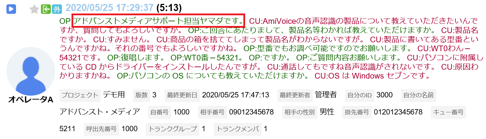

# 詳解 Communication Suite 機能編


## 目次

<!-- TOC depthFrom:1 depthTo:6 withLinks:1 updateOnSave:1 orderedList:0 -->

- [詳解 Communication Suite 機能編](#詳解-communication-suite-機能編)
	- [目次](#目次)
	- [序章 トレーニングにあたって](#序章-)
		- [トレーニングの目的](#目的)
		- [トレーニング中の諸注意](#中諸注意)
	- [第1章 OperatorAgent](#第1章-operatoragent)
		- [1-1. OperatorAgent のログイン](#1-1-operatoragent-)
			- [1-1-1. OperatorAgent でログインすることの意味](#1-1-1-operatoragent-意味)
			- [1-1-2. OperatorAgent のログインに関連する ControlCenter の詳細設定項目](#1-1-2-operatoragent-関連-controlcenter-詳細設定項目)
			- [1-1-3. プロジェクトの選択](#1-1-3-選択)
			- [1-1-4. 統合 Windows 認証](#1-1-4-統合-windows-認証)
			- [1-1-5. OperatorAgent 自動ログイン（統合 Windows 認証を利用しない）](#1-1-5-operatoragent-自動統合-windows-認証利用)
			- [1-1-6. 本項のまとめ](#1-1-6-本項)
		- [1-2. OperatorAgent のメイン画面](#1-2-operatoragent-画面)
			- [1-2-1.OperatorAgent メニュー](#1-2-1operatoragent-)
			- [1-2-2. 通話表示機能](#1-2-2-通話表示機能)
			- [1-2-3. 通話終了後の機能](#1-2-3-通話終了後機能)
			- [1-2-4. OperatorAgent の起動・終了時の動作](#1-2-4-operatoragent-起動終了時動作)
			- [1-2-5. OperatorAgent からのコマンド実行](#1-2-5-operatoragent-実行)
			- [1-2-6. コマンドラインからの OperatorAgent 操作](#1-2-6-operatoragent-操作)
			- [1-2-7. OperatorAgent のインストール](#1-2-7-operatoragent-)
	- [第2章 SpeechVisualizer](#第2章-speechvisualizer)
		- [2-1. SpeechVisualizer のログイン](#2-1-speechvisualizer-)
			- [2-1-1. SpeechVisualizer のログインに関連する ControlCenter の詳細設定項目](#2-1-1-speechvisualizer-関連-controlcenter-詳細設定項目)
			- [2-1-2. SpeechVisualizer へのログイン方法](#2-1-2-speechvisualizer-方法)
			- [2-1-3. SpeechVisualizer ログインタイムアウトについて](#2-1-3-speechvisualizer-)
		- [2-2. SpeechVisualizer ホーム画面](#2-2-speechvisualizer-画面)
		- [2-3. SpeechVisualizer 通話検索](#2-3-speechvisualizer-通話検索)
			- [2-3-1. 検索モジュールの通話アイコン（プロバイダ）](#2-3-1-検索通話)
		- [2-4. SpeechVisualizer 通話詳細](#2-4-speechvisualizer-通話詳細)
		- [2-5. SpeechVisualizer 座席表](#2-5-speechvisualizer-座席表)
			- [2-5-1. 座席モジュールについて](#2-5-1-座席)
			- [2-5-2. 通信仕様](#2-5-2-通信仕様)
			- [2-5-3. 座席モジュールの表示設定](#2-5-3-座席表示設定)
			- [2-5-4. 座席モジュールの表示設定](#2-5-4-座席表示設定)

<!-- /TOC -->
## 序章 トレーニングにあたって
 トレーニングの目的

- SI パートナー様及び Communication Suite ユーザ様に、Communication Suite の 各種機能を詳細に解説します。

### トレーニング中の諸注意
- 本トレーニングの受講資料及び内容を貴社外へ共有・配布することは禁止となります。
- 本トレーニングの内容の撮影・録音は原則として禁止となります。
- 一部、受講中の資料を補足した板書の内容などの撮影は可能ですが、講師の許可を得た上でお願い致します。
- 本資料の記載内容は、現時点（2020年03月 Communication Suite Ver3.6）での内容となります。  
  今後にリリースされるバージョンでは、記載内容が保証されない場合も生じます。

<div style="page-break-before:always"></div>

<hr/>

## 第1章 OperatorAgent

### 1-1. OperatorAgent のログイン
#### 1-1-1. OperatorAgent でログインすることの意味
1. ユーザアカウントの認証（ユーザID と パスワード）
2. ユーザアカウント権限のチェック
3. ユーザと通話（内線番号）の関連付け
4. 通話とプロジェクトの関連付け
5. クライアント PC を OperatorAgent ノードとして ControlCenter にレジスト  
	<br />
	[@fig:login] は、OperatorAgent の基本的なログイン画面となります。

{#fig:login width=400px}

#### 1-1-2. OperatorAgent のログインに関連する ControlCenter の詳細設定項目

No. | 設定項目名       | デフォルト値 | 内容 |
---:|------------------|--------------|------|
1   |  ユーザIDの保存 | false        | true の場合、最後にログイン成功した ユーザID を保存する |
2   |  パスワードの保存 | false        | true の場合、最後にログイン成功したパスワードを保存する |
3   |  自動ログイン | false        | true の場合、保存済みのユーザID とパスワード（と内線番号）で自動ログインする |
4   |  内線番号の指定 | false        | true の場合、ログインダイアログに内線番号入力欄を表示する |
5   |  内線番号の情報が必要かどうか | S        | R = 必須, S = サーバ版では必須, N = 入力しない |
6   |  内線番号の保存 | false        | true の場合、最後にログイン成功した内線番号を保存する |

: 詳細設定 設定分類 : OperatorAgent - ログイン {#tbl:table}  

 - 『内線番号の指定』 を **"true"** にすることで、ログインダイアログに内線番号入力欄が追加されます。（[@fig:naisenari]。VDI 等のシンクライアント環境で、クライアント PC と電話機を固定で紐付けできない場合に有効です。）  

{#fig:naisenari width=400px}

  - OperatorAgent のインストール時に内線番号を指定している場合には、指定番号が内線番号入力欄に表示されます。『内線番号の保存』 が **"false"** の場合も表示されます。）  
  変更すると、ログイン出来なくなったり、他の席の電話番号と紐付けされてしまうので注意してください。
  - 『内線番号の指定』 が **"false"** の場合でも、インストール時に内線番号が指定されていない場合で、かつ 『内線番号の情報が必要かどうか』 が "S" でかつサーバ版利用時 or "R" の場合には、内線番号入力欄が強制的に表示されます。
  - 『ユーザIDの保存』 が true の場合、ユーザIDは、  

    ```
    %USERPROFILE%/AppData/Local/Advanced_Media,_Inc/OperatorAgent.exe_StrongName_(長い文字列)/(バージョン番号)/user.config  
    ```
  の **LoginSettings/@LatestLoginUserId** に保存されます。 [^2] （この設定値は最後にログインに成功したユーザIDとなります。）

   - 『パスワードの保存』 が true の場合、ログインパスワードは、Windows の  
	 [コントロールパネル] → [ユーザー アカウント] → [資格情報マネージャー]  
  に自動入力されたユーザID に対応するパスワードが保存されます。（ [@fig:shikaku]。この設定値は最後にログインに成功したパスワードとなります。）  

{#fig:shikaku width=500px}  

   - 『内線番号の保存』 が true の場合、内線番号は、  

       ```
       %USERPROFILE%/AppData/Local/Advanced_Media,_Inc/OperatorAgent.exe_StrongName_(長い文字列)/(バージョン番号)/user.config  
       ```
  の **LoginSettings/@LatestLoginLineKey** に保存されます。（この設定値は最後にログインに成功した内線番号となります。）

[^2]:最後に

#### 1-1-3. プロジェクトの選択
- ログインするユーザが複数のプロジェクトに所属している場合には、ログインダイアログに続けてプロジェクト選択ダイアログが表示されます。([@fig:project])

{#fig:project width=400px}

#### 1-1-4. 統合 Windows 認証

 - 統合 Windows 認証機能を有効化している場合には、ログイン画面は表示されません。ただし、通常ログイン同様、ユーザが複数プロジェクトに所属していれば、[1-1-3. プロジェクトの選択](#1-1-3-選択) ： [@fig:project] のダイアログが表示されます。
 - インストール時に内線番号が指定されていない場合には、内線番号入力ダイアログ（[@fig:naisen]）が追加表示されます。  

{#fig:naisen width=400px}

- 統合 Windows 認証を利用するための Communication Suite 上の設定はありません。  
  ただし、IIS に追加の設定が必要です。  
	1. OS の "機能と役割の追加" から IIS - Web サーバ - セキュリティ 設定で **Windows 認証** を有効化してください。([@fig:role])
	2. IIS マネージャーの Web サイトの設定で、ControlCenter と SpeechVisualizer のそれぞれのサイトの認証の設定を以下の図と同様に変更します。（[@fig:siteconfig]）  

{#fig:role width=400px}

{#fig:siteconfig width=400px}

#### 1-1-5. OperatorAgent 自動ログイン（統合 Windows 認証を利用しない）
- [1-1-2. OperatorAgent のログイン機能に関連する ControlCenter の詳細設定項目](#1-1-2-operatoragent-機能関連-controlcenter-詳細設定項目)  ：  [@tbl:table] の 『自動ログイン』 が有効になっている場合には、統合 Windows 認証 を利用していなくてもログイン処理を省略可能です。  
	<br />  

	```plantuml
	@startuml
	skinparam {
	defaultFontName BIZ UDPゴシック
	}
	skinparam backgroundColor #fffacd
	skinparam activity  {
	BackgroundColor #afeeee
	BorderColor #000080
	}
	title アクティビティ図.1 [OA 自動ログイン判定]\n


	start
	:OperatorAgent 起動;
	if (内線番号の情報が必要かどうか) then (不要 ： 設定値『N』)
	else (\n必要)
		if (設定値 『S』 or 『R』) then (設定値『S』)
			if (サーバ版？) then (\nYES)
				if (内線番号) then (\n未入力)
					-ログインダイアログ表示
					end
				else (自動入力済)
				endif
			else (クライアント版)
			endif
		else (設定値『R』)
			if (内線番号) then (\n未入力)
				-ログインダイアログ表示
				end
			else (自動入力済)
			endif
		endif
	endif
	if (\nユーザIDとパスワードの両方が\n自動入力されている\n) then (YES)
		if (自動ログインの設定は有効か？) then (有効)
		else (\n無効)
		  -ログインダイアログ表示
			end
		endif
	else (いずれかもしくは両方が未入力)
		if (\nコマンドライン実行(※) で、引数により\nユーザIDとパスワードが設定されている\n) then (YES)
			if (自動ログインの設定は有効か？) then (有効)
			else (\n無効)
			  -ログインダイアログ表示
				end
			endif
		else (NO)
			-ログインダイアログ表示
			end
		endif
	endif
	#plum:自動ログイン実行;
	floating note right: ※ コマンドライン引数については \n 1-2-6. コマンドラインからの OperatorAgent 操作 \nを参照して下さい。
	@enduml
	```

	<br />
- [@tbl:oalogin] は、OperatorAgent の正常系ログインエラーをまとめたものです。（異常系は含んでいません。）

	No. | 事由                 | ログインダイアログのメッセージ       | デバッグログへの出力 |
---:|---------------------|------------------|--------------|
1   | ユーザID 誤り | OperatorAgent サービスにログインできませんでした | ステータス: 43031 ユーザID 'XXX'、またはパスワードが違います。 |
2   | パスワード誤り | OperatorAgent サービスにログインできませんでした | ステータス: 43031 ユーザID 'XXX'、またはパスワードが違います。 |
3   | 内線番号誤り | OperatorAgent サービスにログインできませんでした | ステータス: 42601 指定した内線番号 'NNN' は削除されたか、登録されていません。 |
4   | 所属プロジェクト無し | 所属するプロジェクトがありません | 出力無し|
5   | OperatorAgent の利用権限無し | OperatorAgent サービスにログインできませんでした | ステータス: 43207 権限のあるプロジェクトがありません。 |
6   | ユーザの有効期限切れ | OperatorAgent サービスにログインできませんでした | ステータス: 43031 ユーザID 'XXX'、またはパスワードが違います。 |
7   | ユーザの重複ログイン | このユーザは他の PC で利用中です | 43204 ユーザは別のホストからすでにログインしています。 |
8   | 内線番号の重複ログイン | OperatorAgent サービスにログインできませんでした | ステータス: 43205 指定された回線は現在使用されています。 |
9   | Communication Suite ユーザ未登録 | OperatorAgent サービスにログインできませんでした | このエラーは、IIS に入力されたユーザ名またはパスワードが無効であるか、または IIS がユーザを認証するのためにそのユーザ名およびパスワードを使用できないときに発生します。 |
10   | ライセンス違反 | OperatorAgent サービスにログインできませんでした | 【要確認】 ステータス: XXXXX ○○○。 |  

	: OperatorAgent のログイン失敗事由 {#tbl:oalogin}  

	※ 『ユーザID 誤り』、『パスワード誤り』 は **フォーム認証利用時のみ** のエラーとなります。  
	※ 『Communication Suite ユーザ未登録』 は **統合 Windows 認証利用時のみ** のエラーとなります。


#### 1-1-6. 本項のまとめ
- [ ] OperatorAgent でのログインに関わる設定項目について理解ができた。  
- [ ] OperatorAgent でのログインが単に認証しているだけでは無いことが理解できた。
- [ ] OperatorAgent の自動ログインについて理解ができた。  
- [ ] OperatorAgent にログインできないときに原因の切り分けができそうだ。

<div style="page-break-before:always"></div>

<hr/>

### 1-2. OperatorAgent のメイン画面
#### 1-2-1.OperatorAgent メニュー

  {#fig:mainblank width=600px}

  {#fig:oa_header width=600px  }

  1. OperatorAgent バージョン確認  
  画面の左上の OperatorAgent ロゴを右クリックすると表示されるメニュー（[@fig:logoclick]）から OperatorAgent のバージョンを確認することができます。（[@fig:oaversion]）  

  {#fig:logoclick width=400px}  

  {#fig:oaversion width=400px}  

  2. 通話リスト  
  指定した検索条件に適合する SpeechVisualizer の通話詳細へのリンクをリストアップします。[@tbl:oa_conlist] は、通話リストに関連する ControlCenter の詳細設定項目です。  

		No. | 設定分類                 | 設定項目名       | デフォルト値 | 内容 |
---:|---------------------|------------------|--------------|------|
1   | OperatorAgent - 通話 | 検索条件 | mine:* d:1d | 今日の自分の通話 |
2   | OperatorAgent - 通話 | 最大表示件数 | 20 | 上位 20 件まで |

		: OperatorAgent - 通話リストの設定 {#tbl:oa_conlist}  

		※ 検索条件の書式は SpeechVisualizer の通話検索条件と同じ書式が利用できます。  
		<br />
		[@tbl:svshort] は、OperatorAgent から、SpeechVisualizer の機能にリンクするための設定項目です。

		No. | 設定分類| 設定項目名                | 設定内容      |
		----:|---------------------|------------------|--------------|
		1   |OperatorAgent - Web| SpeechVisualizer を表示するウェブブラウザ| SpeechVisualizer を利用するウェブブラウザの実行ファイルのパスを指定  
		2   | 共通 - システム | SpeechVisualizer の URL | OperatorAgent からは、この URL にアクセスします。  

		: OperatorAgent SpeechVisualizerを表示するブラウザ設定 {#tbl:svshort}  

  3. マイクエリ  
SpeechVisualizer の通話検索機能で設定したマイクエリへのリンク（マイクエリの条件で検索した状態の検索画面へのリンク）をリストアップします。
 4. メッセージ  
 チャット機能です。  

    {width=50px}　
    オペレータ同士のチャットは禁止し、座席表モニタ中の SV とのチャットのみ許可したい場合には、ロールに  **『OperatorAgent からのメッセージ送信』** 権限（[@fig:role_message]） を付与しないでください。その場合、OperatorAgent からユーザを検索・指定しての能動的なメッセージ送信ができません。  
		権限がある場合（[@fig:message_authok]）には、宛先入力欄でユーザ検索・指定してのメッセージ送信ができますが、権限が無い場合には宛先を指定できない（[@fig:message_authng]）ため、能動的なメッセージ送信ができません。  
		権限が無い場合でも、座席表モニタ中の SV からの受信メッセージに対する返信は可能です。（[@fig:operatoragent_messagewindow]）また、SV とのチャット履歴が残っている間（受信後24時間以内）であれば、メッセージ受信履歴からの宛先指定が可能です。（[@fig:message_authngrireki]）

{#fig:role_message width=500px}  

{#fig:message_authok width=300px}  

{#fig:message_authng width=300px}  

{#fig:operatoragent_messagewindow width=400px}

{#fig:message_authngrireki width=300px}  


No. | 設定分類                 | 設定項目名       | デフォルト値 | 内容 |
---:|:--------------------|------------------|--------------|------|
1   | OperatorAgent - メッセージ | Enter キーでメッセージを送信 | true | false の場合には改行します |
2   | OperatorAgent - メッセージ | ヘルプ対応時にメッセージウインドウを自動的に開く | true | SV がヘルプ対応操作を行ったことがメッセージとして通知されます |  

: OperatorAgent - メッセージの詳細設定項目 {#tbl:oa_message_con}  


`メッセージの保存期間`  

  - メッセージは、通話中にも非通話時にも送受信が可能です。  
  - 通話中のメッセージ - 通話の属性情報として扱われます。通話データが削除されるタイミングで消去されます。
  - 非通話中のメッセージ - 単純チャット情報として扱われます。24時間後に消去されます。  

{width=50px}　**通話中のメッセージも非通話中のメッセージも閲覧する機能はありません。**  

5. お知らせ  
  ControlCenter のお知らせ管理で登録されたお知らせのリストです。

	No. | 設定分類                 | 設定項目名       | デフォルト値 | 内容 |
---:|:--------------------|:-----------------|------------:|:-----|
1   | OperatorAgent - お知らせ | 更新間隔 | 3600 | 単位は秒 |
2   | OperatorAgent - お知らせ | 最大表示件数 | 20 | 上位 20 件まで |

	: OperatorAgent - お知らせの詳細設定項目 {#tbl:oa_news_con}  

  6. コンディション（感情メータ）  

  {#fig:Condtiong width=300px}  

  - 直近1時間分の通話のオペレータ感情の **ポジティブ・ネガティブ（nemesysco.qa5.excitement）**  の平均値をメータ表示しています。左に振れると "ネガティブ"、右に振れると "ポジティブ" という判断になります。[@tbl:oa_condition_con]  はコンディションに関連する ControlCenter の詳細設定項目です。

	No. | 設定分類                 | 設定項目名       | デフォルト値 | 内容 |
---:|---------------------|------------------|--------------|------|
1   | OperatorAgent - 感情解析 | コンディションの表示 | true | false で表示しない |
2   | OperatorAgent - 感情解析 | コンディションのレッドゾーンの閾値 | 1.0 | 隠し項目 |
3| 共通 - 感情解析  | 感情解析の使用  | true  |  false = 感情解析に関するあらゆる UI を表示しない |  

	: OperatorAgent - コンディションの詳細設定項目 {#tbl:oa_condition_con}  

7. ログインユーザプロファイル  
 - ログインユーザ名表示部分をクリックするとプロフィール機能が利用できます。  

{#fig:logininfo width=300px}  

 - プロフィールタブ（[@fig:oa_profile]）  
ログイン情報の表示・画像の設定・削除・パスワード変更（関連する詳細設定項目は [@tbl:oa_pwchange_con]）が実施できます。  


{#fig:oa_profile width=300px}  

No. | 設定分類                 | 設定項目名       | デフォルト値 | 内容 |
---:|---------------------|------------------|--------------|------|
1   | 共通  - セキュリティ | パスワードのポリシー | 未定義 | パスワードのフォーマット定義 |
2   | 共通  - セキュリティ | パスワードの最小桁数 | 1 |  |

: OperatorAgent - パスワード変更の詳細設定項目 {#tbl:oa_pwchange_con}  

- 設定タブ（[@fig:oa_user_con]）  
ControlCenter の詳細設定で設定された OperatorAgent の振る舞いを個人用にカスタマイズできます。  
[@tbl:oa_user_con] は、表示項目と詳細設定項目の対応表です。

 {#fig:oa_user_con width=300px}  

No. | 設定タブ項目 | 設定分類                 | 設定項目名       |
----:|---------------------|------------------|--------------|
1   | 起動時にウィンドウを表示 | OperatorAgent - 起動時動作 | 起動時にウィンドウを表示状態に戻す |
2   | 閉じたときにタスクバーに表示しない | OperatorAgent - 全般 | 閉じたときにタスクバーに表示しない |
3   | 感情解析ポップアップを自動表示 | OperatorAgent - 通知メッセージ | 感情解析の自動表示 |
4   | 通話フィルタの通知時間 | OperatorAgent - 通知メッセージ | 通話フィルタの通知時間レベル |
5   | チャンネル名を含める | OperatorAgent - 通話全文コピー | コピー時にチャンネル名を含める |
6   | 発話開始時間を含める | OperatorAgent - 通話全文コピー | コピー時に開始時間を含める |
7   | 発話終端時間を含める | OperatorAgent - 通話全文コピー | 終了時間を含めるか |
8   | Enter キーで送信 | OperatorAgent - メッセージ | Enter キーでメッセージを送信 |

: OperatorAgent - ユーザ設定項目と詳細設定項目の対応 {#tbl:oa_user_con}  

<div style="page-break-before:always"></div>

<hr/>

#### 1-2-2. 通話表示機能

1. 通話内容ビュー  
OperatorAgent にログインした内線番号(モニタ内線番号)の通話の認識結果と関連する通話イベントを表示します。  

- 通話イベント  
通話イベント（[@tbl:callevent]）は ControlCenter から OperatorAgent へ通知されます。  

	No. | イベント | 詳細 | 参考 |
----:|---------|-------|---|
1 | 通話開始 | RealTimeRecorder でモニタ内線番号の通話開始を検出時に通知されます。 | [@fig:startobi]  
2 | 通話終了 | RealTimeRecorder でモニタ内線番号の通話終了を検出時に通知されます。 | [@fig:startobi]  
3 | 保留開始 | RealTimeRecorder でモニタ内線番号の録音中に保留開始を検出時に通知されます。 | [@fig:holdobi]  
4 | 保留解除 | RealTimeRecorder でモニタ内線番号の通話保留中、保留解除を検出時に通知されます。 | [@fig:startobi]  
5 | 通話切替 | RealTimeRecorder でモニタ内線番号の録音中、録音対象の RTP の MediaResource が切り替わったときに通知されます。 | [@fig:kirikaeobi]  

	: 通話イベントの種類 {#tbl:callevent}

{#fig:startobi width=500px}

{#fig:holdobi width=500px}

{#fig:kirikaeobi width=500px}  

<!-- 【要確認】{width=50px}  
OperatorAgent は Internet Explorer の設定を利用して通信します。  
インターネットオプションの設定でプロキシが設定されている場合、状態通知がブロックされます。  
対処としてプロキシの例外リストにWEBサーバ のIPアドレスを登録する方法があります。    -->

- 認識結果  
認識結果は StreamingRecognizer から OperatorAgent へ送信されます。  
通話内容は単語ごとにテキスト化され、順番に送信されますが、後から認識した単語によって既に表示されている単語が置き換わることもあります。発話単位で吹出で表現されます。発話の区切りは無音が一定時間以上（【要確認】 一定時間）継続することで行われます。（[@fig:hatuwa]）  


	<br/>  

	- 緑の吹出は、録音対象の電話機を主体として、送話音声の認識結果になります。送話側音声の認識は、認識オプション設定のオペレータタブに設定されたエンジンモードで処理されます。（[@fig:txengine]）  

		<br/>  

	- オレンジの吹出は、録音対象の電話機を主体として受話音声の認識結果となります。受話側音声の認識は、認識オプション設定のカスタマタブに設定されたエンジンモードで処理されます。（[@fig:rxengine]）  

 {#fig:hatuwa width=500px}  

 {#fig:txengine width=400px}  

 {#fig:rxengine width=400px}  

- 通話内容ビューの表示不具合のトラブルシューティング  


	<br/>  

	**区分 A ： 通話イベントが表示されない**  
　このケースは通話録音設定の不備か、スパンデータの不備による可能性が疑われます。（[@tbl:kubunA]）  

	<br/>  

	**区分 B ： 通話イベントのみ表示され、認識結果が表示されない**  
　このケースは通話録音・認識は正常に完了しているにも関わらず、 <br />　　**OperatorAgent と StreamingRecognizer 間の通信に不備がある** 可能性が疑われます。  
　ただし、各種設定の不備の可能性が無いわけではありません。

	<br />  

	**区分 C ： その他**  
　その他、よくある、通話内容表示不具合の例についてです。  

	No. | 原因| 対処 |
----:|---------|-------|
1 | RealTimeRecorder で通話録音ができていない | サーバ版であれば各種設定とパケットキャプチャの状況、クライアント版の場合には各種設定と録音デバイス関連を確認してください。  
2 | サーバ版の場合 OperatorAgent でログインしている内線番号と通話中の内線番号が一致していない | OperatorAgent ログイン時に設定する内線番号と通話する電話機の内線番号は一致させてください。  
3 | データベースの ServiceBroker が無効になっている | 有効化してください。  

	: 区分 A の主な原因と対処の目安 {#tbl:kubunA}

	No. | 原因| 対処 |
----:|---------|-------|
1 | OperatorAgent と StreamingRecognizer 間の接続が確立していない可能性があります。 | ノード管理で設定している、StreamingRecognizer の HTTP のポートに対して、OperatorAgent がアクセスできる状況にあるかを確認してください。  
2 | 認識オプションが未設定の可能性があります| 認識オプションの設定を実施してください。  
3 | 大規模な認識処理遅延が発生している可能性があります | 認識オプションの設定を実施してください。  

	: 区分 B の主な原因と対処の目安 {#tbl:kubunB}

	No. | 症状 | 原因| 対処 |
----:|---------|---|-------|
1 | クライアント版（コンバージャー録音）で、通話していないのに 『通話開始』 と 『通話終了』 繰り返し表示される | コンバージャーの調整不足です | 恐らく無音がとれない電話機なので、有音 + 短い通話録音を切り捨てる設定にしてください  
2 | クライアント版（コンバージャー録音）で、保留したタイミングで 『通話終了』 イベントが表示されてしまう | コンバージャー録音の性能限界の可能性があります | その時点のコンバージャー調整値では保留とオンフック状態の判別ができていません。調整によって解消する可能性もありますが、概ね IP  電話機の場合には保留とオンフックの判断はつかないようです。  
3 | 認識結果の表示が遅延する（業務開始直後、オペレータのみ） | クライアント認識版では顕著に現れる症状ですが、StreamingRecognizer が初回認識処理時に認識オプションに沿って、各種設定やエンジンモードのロードを行うため | 仕様かつ、1日の最初の通話でしか発生しませんので特に対処は必要ないですが  
4 | 認識結果の表示が遅延する（通話開始直後） | 通話冒頭の 30 秒間は、通話環境の音響を学習しています。エンジンモードの音響モデルの情報と環境の音響情報の乖離が激しい場合、認識負荷があがるため冒頭30秒程度オペレータの認識結果の表示が遅延することがあります。 | 無線 ヘッドセットを利用しているケースなどで起きがちです。その場合、有線ヘッドセットに変えるなどで症状が改善します。  

	: 区分 C の主な症状及び原因と対処の目安 {#tbl:kubunC}

  - 仕様となります。初回認識処理時にはテキスト化に利用するエンジンモードや  
  追加登録した辞書単語等の各種設定をダウンロードしているためです。


2. 通話情報ビュー   
通話中のオペレータの通話情報が表示されます。   
この情報は通話相手によって変わらない情報のみを表示します。（[@fig:callinfo] ）  
  `自分の電話番号`・・・自番号  
  `自分のID　　　`・・・エージェントID  

{#fig:callinfo width=300px}  

3. 通話相手ビュー  
 通話状態や通話相手の情報を表示します。   
この情報は通話相手ごとに作成されます。（[@fig:callpartner] ）  

 {#fig:callpartner width=250px}  

[@tbl:callb] は、通話情報ビュー、通話相手ビューの設定項目です。
ControlCenter の詳細設定に設定項目があります。

  No. | 設定タブ項目 | 設定項目名                | 設定内容      |
  ----:|---------------------|------------------|--------------|
  1   |OperatorAgent - 通話 | 表示する通話属性の一覧 | （通話属性識別名）＝（名称)で指定  

: OperatorAgent 表示する通話属性の設定 {#tbl:callb}  

[@tbl:callb2] は、表示する通話属性で利用可能な通話属性の一覧です。(通話プロバイダにより利用できる通話属性が異なります。)

 No. | 通話属性識別名 | 名称                | Amazon Connect	      | Avaya AES    | Avaya     | SIP CIC     | SIP CTstage    |SIP OAI     | SIP T-Server      |
 ----:|---------------------|------------------|--------------|--------------|--------------|--------------|--------------|--------------|--------------|
 1   |amivoice.common.description | 備考 |  |  |  |  |  |  |  |
 2   |amivoice.common.direction | 向き|〇|〇|〇|〇|〇|〇|〇|
 3   |amivoice.common.linetype | 通話回線種別 |  |〇|  |〇|〇|〇|〇|
 4   |amivoice.common.summary| 要約 |   |  |  |  |  |  |  |
 5   |amivoice.common.headline| 見出し |   |  |  |  |  |  |  |
 6   |amivoice.common.mark | マーク |   |  |  |  |  |  |  |
 7   |amivoice.common.operator.key | 自分の識別名 |〇|〇|  |〇|〇|  |  |
 8   |amivoice.common.operator.name| 自分の名称|〇|  |  |  |〇|  |  |
 9   |amivoice.common.operator.phonenumber| 自番号 |〇|〇|〇|〇|〇|〇|〇|
 10   |amivoice.common.operator.group| 自分の所属グループ |〇|  |  |  |〇|  |  |
 11   |amivoice.common.operator.hostname | 自分のホスト名 |   |  |  |  |〇|  |  |
 12   |amivoice.common.customer.key | 相手の識別名 |   |  |  |〇|〇|  |  |
 13   |amivoice.common.customer.name | 相手の名称 |   |  |  |  |〇|  |  |
 14   |amivoice.common.customer.phonenumber| 相手番号|〇|〇|〇|〇|〇|〇|〇|
 15   |amivoice.common.customer.gender | 相手の性別 |   |  |  |  |  |  |  |
 16  |amivoice.common.telephony.dialin.phonenumber | ダイヤルイン番号 |   |  |  |〇|〇|〇|  |
 17   |amivoice.common.telephony.called.phonenumber | 掛先番号 |  |〇|〇|  |  |  |  |
 18   |amivoice.common.telephony.alerting.phonenumber | 呼出先番号|   |〇|  |  |  |  |  |
 19   |amivoice.common.telephony.trunk.group | トランクグループ |  |〇|  |〇|〇|〇|〇|
 20   |amivoice.common.telephony.trunk.member| トランクメンバ|  |〇|  |  |  |〇|  |
 21   |amivoice.common.telephony.queue.phonenumber| 通話キュー番号|   |〇|  |〇|  |  |  |
 22   |amivoice.common.telephony.transfer.source.key | 転送元識別名 |   |  |  |  |〇|  |  |
 23   |amivoice.common.telephony.transfer.source.name | 転送元名称 |   |  |  |  |〇|〇|  |
 24   |amivoice.common.telephony.transfer.source.phonenumber | 転送元番号 |   |〇|  |  |〇|  |〇|
 25   |amivoice.common.telephony.transfer.destination.key| 転送先識別名 |   |  |  |  |〇|  |  |
 26   |amivoice.common.telephony.transfer.destination.name | 転送先名称 |   |  |  |  |〇|  |  |
 27   |amivoice.common.telephony.transfer.destination.phonenumber | 転送先番号 |   |〇|  |  |〇|〇|〇|
 28   |amivoice.common.telephony.monitoring.target.key | モニタリング対象識別名 |   |  |  |〇|  |  |  |
 29   |amivoice.common.telephony.monitoring.target.name| モニタリング対象名称 |   |  |  |〇|  |  |  |
 30   |amivoice.common.telephony.monitoring.target.phonenumber| モニタリング対象番号 |   |  |  |〇|  |  |  |
 31   |amivoice.common.telephony.monitoring.target.type | 	モニタリング種別  |   |  |  |〇|  |  |  |
 32   |amivoice.common.reference.global.id | グローバル参照用のID |〇|〇|  | 〇|〇|  |〇|
 33   |amivoice.common.reference.global.url | グローバル参照用のURL |   |  |  |  |  |  |  |
 34   |amivoice.common.reference.local.id| ローカル参照用のID |   |〇|  |〇|  |  |  |
 35   |amivoice.common.reference.local.url| ローカル参照用のURL |   |  |  |  |  |  |  |
 36   |amivoice.common.reference.site.id | サイト参照用のID|   |  |  |  |  |  |  |
 37   |amivoice.common.reference.site.url| サイト参照用のURL |   |  |  |  |  |  |  |
 38   |amivoice.common.reference.private.id| プライベート参照用のID |   |  |  |  |  |  |  |
 39   |amivoice.common.reference.private.url | プライベート参照用のURL |   |  |  |  |  |  |  |
 40   |amivoice.common.recording.limit| 録音制限時間到達 |   |  |  |  |  |  |  |
 41   |amivoice.common.recording.split| 録音分割 |   |  |  |  |  |  |  |
 42   |amivoice.common.recording.split.previous| 録音分割された直前の通話 |   |  |  |  |  |  |  |
 43   |amivoice.common.reference.recording.id | 録音区間参照用のID |   |  |  |  |  |  |  |
 44   |amivoice.common.reference.recording.url | 録音区間参照用のURL |   |  |  |  |  |  |  |
 45   |amivoice.common.telephony.distributing.phonenumber| 受電グループ番号|  |〇|  |  |  |  |  |
 46   |amivoice.common.telephony.ivr.duration| IVR 応対時間 |   |〇|  |  |  |  |  |
 47   |amivoice.common.telephony.queue.duration | 待ち時間 |   |〇|  |  |  |  |  |

: OperatorAgent 表示する通話属性で利用可能な通話属性一覧 {#tbl:callb2}  


{width=50px}  
相手の性別 は通話プロバイダから情報を取得するのではなく、性別識別用エンジンにて判断しています。   
[@tbl:seibetuenjin] は性別識別エンジンに関連する設定項目となり、ControlCenter/認識管理/認識オプション にあります。   

 No. | 設定タブ項目 | 設定項目名                | 内容      |
 ----:|---------------------|------------------|--------------|
 1   |カスタマタブ | 性別識別 | 性別識別を利用するかどうか   
 2   |カスタマタブ | 性別識別用エンジンモード | 性別識別用エンジンを登録
 3   |カスタマタブ | 性別識別の閾値| 性別識別の判定に使用する閾値   
 4   |カスタマタブ | 性別識別に使用する発話時間（最大） | 性別識別の判定に使用する発話時間の最大値   
 5   |カスタマタブ | 性別識別に使用する発話時間（最小） | 性別識別の判定に使用する発話時間の最小値

: カスタマ 性別識別用エンジン設定 {#tbl:seibetuenjin}  

オペレータ側は性別識別用エンジンで性別を判断していません。   
オペレータ側は ControlCenter/ユーザ管理/ ユーザごとのユーザ管理 - 詳細 設定の性別から判断しています。（ [@fig:usrprofile]）  

{#fig:usrprofile width=350px}  


4. 通話状態ビュー   
通話状態にあわせてアイコンや時間が変化します。（ [@fig:callstate]）  

{#fig:callstate width=250px}  

  `利用のヒント`  
通話状態に表示される時間はキャプチャサーバの時刻を参照しています。  

- 通話時間・・・録音開始 / 録音終了時刻から取得
- 保留・・・SIPまたはCTIイベントから取得

5. 通話フィルタビュー   
登録したキーワードがテキスト化された場合に様々なアクションを実行できる機能です。  （ [@fig:callfilter1]）  （ [@fig:callfilter2]）  

 {#fig:callfilter1 width=250px}  


 {#fig:callfilter2 width=250px}  


{width=50px}  
通話フィルタはリアルタイムでレスポンスを返すことを重視した設計となっており、発動条件は以下になります。  

- 登録したキーワードを検知したタイミング
- 認識結果が確定前（※）  
（※）前後の文字の繋がりにより、最終的に認識結果が変わる場合があります。

つまり、１つのセグメント（発話）が完了するまで通話フィルタの処理を待つわけではなく  
キーワードを検知したタイミングですぐに処理が実行されます。  

[@tbl:callfilter] は、通話フィルタの ControlCenter の詳細設定項目です。  

  No. | 設定タブ項目 | 設定項目名                | 内容      |
 ----:|---------------------|------------------|--------------|
 1   |OperatorAgent - 通知メッセージ |通話フィルタの通知時間の倍率 (短め) | 通話フィルタの通知時間に対して通話時間レベルの「短め」とする時間を倍率で指定   
 2   |OperatorAgent - 通知メッセージ | 通話フィルタの通知時間の倍率 (長め)| 通話フィルタの通知時間に対して通話時間レベルの「長め」とする時間を倍率で指定
 3   |OperatorAgent - 通知メッセージ | 通話フィルタの通知時間レベル| 通話フィルタの表示時間を「0（普通）」とした場合に「-1（短め）」に表示するか「1（長め）」に表示するかを指定  
 4   |OperatorAgent - 通知メッセージ | 通話フィルタの表示時間|通話フィルタ検出時の通知メッセージの表示時間（秒）  
 5   |OperatorAgent - 通知メッセージ | 一度に通知する通話フィルタの対象発話数| OperatorAgent起動時に、検出済みの通話フィルタが大量に表示されるのを防止する機能。「-1」を指定した場合、通話内でそれまで検知した全ての通話フィルタの通知メッセージを表示  
 6   |共通 - 通話フィルタインポート | 通話フィルタインポートリクエストタイムアウト| インポート失敗を防ぐことを目的とした機能。有効値は「120以上の整数」

: OperatorAgent 通話フィルタの設定 {#tbl:callfilter}  

- 通話フィルタのトラブルシューティング  
<br>
	**区分 A ： 発動条件となるキーワードがテキスト化されたが通話フィルタが起動しない**  
このケースは通話フィルタの設定や環境依存により発生している可能性が疑われます。

No. | 原因| 対処 |
----:|---------|-------|
1 | 通話フィルタに登録したコマンドに問題がある |登録したコマンドが Windows上で実行できるコマンドである必要があります。該当PCより「ファイル名を指定して実行」から登録したコマンドが実行できるか確認してください。  
2 | 通話フィルタの起動条件を満たしていない |フィルタの条件で、起動条件を指定しますが、キーワードがテキスト化された時に指定した条件を満たしているか確認してください。(対象話者、検出対象回線種別など）   
3 | 呼び出すファイルの拡張子が対応していない |該当PCのWindows上から呼び出すファイルが直接起動できるか確認ください。その他に既定のプログラム、アプリ、ブラウザなどに対象ファイルの拡張子を関連付けてください。

 6. ヘルプ    
OperatorAgent から SpeechVisualizer の座席表に登録したヘルプ要求理由でアラート通知する機能です。([@fig:helpb]）  

<div style="text-align:center">
 {#fig:helpb width=200px}  
</div>

  `利用上の注意`  
ヘルプを利用するには ControlCenter/モニタリング/ヘルプ要求理由管理、ヘルプ要求解除理由に登録が必要です。   
ヘルプ要求理由管理が登録されていない場合にはOperatorAgentの画面にヘルプボタンは表示されません。   

{width=50px}  
ヘルプ要求後のヘルプ解除は ControlCenter の設定で特定条件で自動終了することができます。  

- 通話前にヘルプ要求を実施、通話を開始した場合にヘルプ要求を自動解除
- 通話中にヘルプ要求を実施、通話終了後にヘルプ要求を自動解除


[@tbl:help] は、ヘルプに関する ControlCenter の詳細設定項目は以下です。

 No. | 設定分類| 設定項目名                | 内容      |
----:|---------------------|------------------|--------------|
1   |OperatorAgent - メッセージ | ヘルプ対応時にメッセージウインドウを自動的に開く | ヘルプ応答時にメッセージウインドウを自動的に開くかどうか   
2   |OperatorAgent - 通知メッセージ | ヘルプの解除理由選択の表示時間|ヘルプ要求の自動解除後にヘルプ解除理由を表示する時間    
3   |OperatorAgent - 通知メッセージ | ヘルプを案内する感情解析の通話重要度の閾値 |感情解析のポップアップ画面にヘルプボタンを表示する通話重要度の閾値  
4   |OperatorAgent - 通知メッセージ  |ヘルプ中のクローズ |ヘルプ中の通知メッセージをユーザがクローズできるかどうか
5   |OperatorAgent - 通知メッセージ  |ヘルプ中の表示 | ヘルプ要求時の通知メッセージを表示するかどうか
6   |OperatorAgent - 通話  |通話開始時にヘルプを解除する |通話開始時にヘルプ要求中だった場合、自動で解除するかどうか
7   |OperatorAgent - 通話  |通話終了時にヘルプを解除する |通話終了時にヘルプ要求中だった場合、解除するかどうか  

: OperatorAgent ヘルプ設定 {#tbl:help}  

7. 感情解析   
送話と受話側の発話内容をリアルタイムで感情に数値化して表示する機能です。  
感情解析は音声データをもとに解析を行っており、テキストデータを解析対象としていません。

- OperatorAgentの感情解析機能([@fig:emo0]) ([@fig:emo1])([@fig:emo２])([@fig:emo3])  

  {#fig:emo0 width=150px}

  {#fig:emo1 width=450px}

  {#fig:emo２ width=250px}

  {#fig:emo3 width=350px}  


[@tbl:emopop] は、ControlCenter の詳細設定項目で OperatorAgent で利用する「表示する感情」の設定項目となります。

No. | 設定分類| 設定項目名                | 設定内容      |
  ----:|---------------------|------------------|--------------|
  1   |OperatorAgent - 感情解析| 表示する感情（オペレータ）| 感情解析識別名I(パイプが表示できない【要確認】)label＝感情名 で指定   
  |   |   |   |  
  2   |OperatorAgent - 感情解析| 表示する感情（カスタマ） | 感情解析識別名I(パイプが表示できない【要確認】)label＝感情名 で指定 |  

: OperatorAgent の感情解析ポップアップ {#tbl:emopop}  


 `表示する感情の注意事項`   
 **「表示する感情」を変更する場合には詳細設定の 「保存する感情スコア」 の設定変更も必要です。   
 「保存する感情スコア」に設定されていない感情は感情の値が取得できず、対象感情が表示されません。**  

[@tbl:emoscore] は、保存する感情スコアの設定項目です。ControlCenter の詳細設定項目にあります。  

  No. | 設定分類| 設定項目名                | 設定内容      |
  ----:|---------------------|------------------|--------------|
  1   |共通 - 感情解析| 保存する感情スコア| （感情解析識別名）.（話者)で指定    

: 保存する感情スコア {#tbl:emoscore}  

 `保存する感情スコアの注意事項`   
**データベースのパフォーマンスの観点から、オペレータ、カスタマを含めて８つまでの感情に抑えて設計してください。  
  「保存する感情スコア」に設定した感情のみデータベース内に感情のサマリ値（最小/平均/最大/開始/終了）を保存します。  
	発話単位の感情値は「保存する感情スコア」の設定に関係なく、すべての感情を取得しており Emotion ファイルに保存されています。**  

[@tbl:emolist] は、「表示する感情」と「保存する感情スコア」で利用可能な感情一覧です。  

  No. | 感情解析識別名| 感情名                | 複合型| 説明 |
  ----:|---------------------|------------------|----------|---------|
  1   |nemesysco.qa5.angry      |怒り         |  |どのくらい怒っているかを示す値      |
  2   |nemesysco.qa5.concentration     |集中         |  |どのくらい集中しているかを示す値      |
  3   |nemesysco.qa5.embarrassment      |不快         |  |どのくらい不快に感じているかを示す値      |
  4   |nemesysco.qa5.excitement      |ポジティブ・ネガティブ |〇  |値が小さいい場合はネガティブ　値が大きい場合はポジティブを示す値      |
  5   |nemesysco.qa5.excitement.positive      |ポジティブ         |  |どのくらいポジティブかを示す値      |
  6   |nemesysco.qa5.excitement.negative      |ネガティブ         |  |どのくらいネガティブかを示す値      |
  7   |nemesysco.qa5.hesitation      |後悔・快適         |〇  |値が小さい場合は快適　値が大きい場合は後悔を示す値      |
	8   |nemesysco.qa5.hesitation.regret      |後悔         |  |どのくらい後悔していると感じているかを分析した値      |
  9   |nemesysco.qa5.hesitation.comfort      |快適         |  |どのくらい快適と感じているかを分析した値      |
  10   |nemesysco.qa5.imaginationactivity      |イメージ         |  |記憶や映像化された何かから記憶を思い出している事を示す値      |
  11   |nemesysco.qa5.intensivethinking      |思考         |  |集中して考えていることを示す値      |
  12   |nemesysco.qa5.content      |喜び         |  |どのくらい嬉しいかを示す値      |
  13   |nemesysco.qa5.savorarousalfactor      |興味         |  |会話に対する深い関心、覚醒要因を示す値      |
	14   |nemesysco.qa5.upset      |悲しみ         |  |どのくらい悲しいかを示す値      |
  15   |nemesysco.qa5.extremestate      |感情変化の極端さ         |  |感情活動が全体的にどのくらい極端かを示す値      |
  16   |nemesysco.qa5.stress      |恐怖         |  |どのくらい神経質になっているかを示す（ストレスを感じているか） 参考値：1～14 緊張・神経質 15以上 恐怖      |
  17   |nemesysco.qa5.uncertainty      | 確信無し・有り        |〇  |値が小さい場合は確信　値が大きい場合は不確かな発言として示す値 参考値：15未満 確信 15以上 不安・不確か |
  18   |nemesysco.qa5.uncertainty.uncertainty      |確信無し         |  |どのくらい不確かな発言かを示す値 |
  19   |nemesysco.qa5.uncertainty.certainty      |確信有り         |  |どのくらい確信がある発言かを示す値|
	20   |nemesysco.qa5.energy      |エネルギッシュ・疲労         |〇  |値が小さい場合は疲労　値が大きい場合は精力的であるかを示す値 参考値：1 飽きている・疲労　4未満 退屈・疲労　5～9 通常　10以上 精力的       |
  21   |nemesysco.qa5.energy.energetic      |エネルギッシュ         |  |どのくらい精力的かを示す値     |
  22  |nemesysco.qa5.energy.tired      |疲労         |  |どのくらい疲労しているかを示す値      |
  23   |nemesysco.qa5.brainpower      |脳活動のサマリ         |  |脳の感情的・論理的プロセスの全体的な概要。主に研究目的で使用される。      |
  24   |nemesysco.qa5.emotionalcognitiveratio      |感情的・論理的         |〇  |話題について感情的・論理的のどちらに基づいて話をしているかの全体的な概要。値が小さい場合は論理的、大きい場合は感情的を示す。      |
  25   |nemesysco.qa5.emotionalcognitiveratio.emotional      |感情的         |  |感情的に話をしているかを示す値      |
	26   |nemesysco.qa5.emotionalcognitiveratio.cognitive      |論理的         |  |論理的に話をしているかを示す値      |
  27   |nemesysco.qa5.amplitude      |思考深さ         |  |音量を示している値（利用実績なしのため、実用性不明）      |
  28  |nemesysco.qa5.voiceenergy      |音のエネルギー         |  |音の強さ（Energy）を示す値      |
  29   |nemesysco.qa5.voicevolume      |ボリューム         |  |「音のエネルギー」とは別の計算方法で算出した音の強さ(Volume)を示す値      |
  30   |nemesysco.qa5.anticipation      |期待         |  |期待・興味を示す値      |
  31   |nemesysco.qa5.dissatisfaction      |不満         |  |不満かどうかを示す値      |
	32   |nemesysco.qa5.callpriority      |通話重要度         |  |通話の中で重要と思われる箇所を複数の感情から算出して値を示す      |
  33   |nemesysco.qa5.agentscore      |エージェントスコア         |  |関連するいくつかの感情の要約を示す。値が大きいほど、変化の度合いが激しいことを示す。      |
  34  |nemesysco.qa5.emotionlevel      |感情レベル         |  |利用用途については検討中      |
  35   |nemesysco.qa5.logicallevel      |倫理的レベル         |  |利用用途については検討中      |
  36   |nemesysco.qa5.hesitantlevel      |困惑レベル         |  |利用用途については検討中      |
  37   |nemesysco.qa5.stresslevel      |緊張レベル         |  |利用用途については検討中      |
	38   |nemesysco.qa5.energeticlevel      |活動レベル         |  |利用用途については検討中      |
  39   |nemesysco.qa5.thinkinglevel      |思考レベル         |  |利用用途については検討中      |
  40  |nemesysco.qa5.passionlevel      |情熱レベル         |  |利用用途については検討中      |
  41   |nemesysco.qa5.concentrationlevel      |集中レベル         |  |利用用途については検討中      |
  42   |nemesysco.qa5.shylevel      |疑いレベル         |  |利用用途については検討中      |
  43   |nemesysco.qa5.anticipationlevel      |期待レベル         |  |利用用途については検討中      |

: 利用可能な感情一覧 {#tbl:emolist}

- 感情解析ライセンスの消費について  
  感情解析が利用可能な通話数には月ごとに上限があり、感情解析ライセンス数に依存します。  
  ライセンスの消費は Communication Suite が1通話とカウントした数だけ感情解析ライセンスが１つ消費されます。  
  消費したライセンスは月ごとにリセットされて 「0」 に戻ります。（月はじめ1日のAM9:00にリセット）  

  ライセンス数は ContronCenter / システム管理 / ライセンス状況 /感情解析ライセンス管理 で確認できます。（[@fig:kanjo]）  

{#fig:kanjo width=600px}  

　　「今月の感情解析通話数」は以下の計算式で算出されています。  
　　１内線あたり、月 3,000 通話がライセンス処理可能な契約となっています。  
　　例） 5 内線分のライセンス環境の場合  
　　１ヵ月あたり、5内線 × 3,000通話 = 15,000通話となります。  


　　１つの通話でも次のような条件下では1つ以上の感情解析ライセンスが消費されます。  
　　・ 保留により通話が分割された場合（保留前、保留後で２つライセンスを使用）  
　　・ 通話を転送した場合（転送元、転送先で２つライセンスを使用）  
　　・ 再認識を実施した通話（ConrtolCenter の認識オプションの設定で感情解析が有効な場合）  
　　・ 電話機のモニタ機能でモニタリング側の通話が録音される  
　　・ 「短い通話の録音キャンセル」機能によりキャンセルされた通話（CCの設定場所【要確認】）  
　　・ 「長い通話の分割」機能により分割された通話（CCの設定場所【要確認】）   


- 通話内で感情解析の対象とする範囲  
  １通話内で感情解析の対象とする範囲を設定することができます。設定はControlCenter / 認識オプション にあります。  


	No. | 設定タブ項目 | 設定項目名                | 設定内容      |説明      |
  ----:|---------------------|------------------|--------------|--------------|
  1   |オペレータ / カスタマ | 感情解析で無視する冒頭区間 |ミリ秒単位で設定 |感情解析の対象外とする冒頭区間を指定します。この区間内に通話が終了した場合には感情解析ライセンスが消費されません。アウトバウンド業務の通話を自動発信している場合などには留守電に繋がった場合でも感情解析ライセンスが消費されてしまいます。本設定を利用することで不要な通話を感情解析の対象外とすることが可能です。  
  2   |オペレータ / カスタマ | 感情解析の開始区間 |ミリ秒単位で設定 |感情解析が開始されてから開始区間の平均値を取得する区間を指定します。  
  3   |オペレータ / カスタマ | 感情解析の終了区間 |ミリ秒単位で設定|感情解析の終了区間の平均値を取得する区間を指定します。  

  **※感情解析の開始・終了区間はオペレータとカスタマで別の値を設定した場合は正しく動作しません。両方で同じ値で設定してご利用ください。**  


#### 1-2-3. 通話終了後の機能

 1. SpeechVisualizer ボタン  
OperatorAgent 上で表示されている通話の SpeechVisualizer の通話詳細画面を呼び出します。 ([@fig:opsv])  
Speech Visualizer ボタンは条件を満たすとボタンが活性化されます。（SpeechVisualizer 機能を呼び出すための各種設定は [@tbl:svshort]）  

 {#fig:opsv width=100px}  


No. | 条件内容
-:|---------
  1  | 【要確認】 ボタンが活性化する条件を詳し書く。通話のアップロードが完了していないとOA上で通話終了とならない？SRから音声ファイル無しでアップロード完了した場合や、認識結果のアップロードエラーになった場合でもリンクボタンは押せるのか？等。処理の流れも確認。

 2. 通話終了後に通話属性を設定する  
通話終了後に通話に紐づく通話属性を追加することができる機能です。  
通話終了後、([@fig:callp2])がポップアップ表示されて通話属性を登録することが可能です。通話リストからも登録できます。  

{#fig:callp2 width=450px}  


手動で通話属性を追加する項目は ConttrolCenter の詳細設定項目にあります。（@tbl:tuuwazokusei）

No. | 設定分類| 設定項目名                | 設定内容      |
----:|---------------------|------------------|--------------|
1   |OperatorAgent - 通話| 通話終了後に手動で通話属性を設定可能にする|True で手動通話属性の設定可能  
2  |共通 - 通話| 手動で設定可能な通話属性|手動で設定可能な通話属性を指定  

: 手動で追加する通話属性の設定 {#tbl:tuuwazokusei}

追加可能な通話属性は（[1-2-2. 通話表示機能　表 15: OperatorAgent 表示する通話属性で利用可能な通話属性一覧](#1-2-2. 通話表示機能) 参照。）  


#### 1-2-4. OperatorAgent の起動・終了時の動作  

1. OperatorAgent 起動時の処理  
- OperatorAgent の自動更新処理  
  OperatorAgent を起動すると、ログインダイアログが表示される前に自身のバージョンとサーバ側のバージョンの比較を行います。  
<br/>
  - OperatorAgent のバージョンがサーバのバージョンより古い場合には、自動的に更新処理が行われ OperatorAgent がサーバ側のバージョンに合わせてバージョンアップします。この更新処理はメジャーバージョンアップ時を除き、正常なバージョンアップが機能として保証されています。  
<br/>
  - OperatorAgent のバージョンがサーバのバージョンより新しい場合も同様に自動的に更新処理が行われ、 OperatorAgent がサーバ側のバージョンに合わせてバージョンダウンします。  
	    ただし、この更新処理は OperatorAgent の更新内容等によっては、正常なバージョンダウンが保証されない場合があります。（その場合には、一度 OperatorAgent をアンインストールして、古いバージョンの OperatorAgent を新規インストールしてください。）  
  自動バージョンダウン処理がサポートされるかどうかは、バージョンアップの内容次第です。切り戻し時の作業内容を検討する際には、リリースノートを確認するか、サポートへお問合せください。  
	<br />
	{width=50px}
  　自動更新では処理中に **Windows Script Host （WSH）** の vbs がいくつか実行されます。（[@tbl:vbslist]）  
	セキュリティソフトによって、WSH の実行が阻害されてしまう環境では、自動更新処理が正常に行われません。（インストーラによるインストールでもバージョンアップインストールでも、WSH は実行されます。）  

    No. | ファイル名 | 説明  |
    ----|---------------------|------------------|
 1   | moduleindexbuilder.vbs | バージョン毎にファイルのハッシュ値が**必ず変更になります**。 |
 2   | @301_RR_CTILink_RegAsm.vbs | バージョン毎にファイルのハッシュ値の変更はありませんが将来のバージョンで削除となる可能性はあります。 |
 3   | @341_RR_RemoveFiles.vbs | バージョン毎にファイルのハッシュ値の変更はありませんが将来のバージョンで削除となる可能性はあります。 |
 4   | @341_SR_RemoveFiles.vbs | バージョン毎にファイルのハッシュ値の変更はありませんが将来のバージョンで削除となる可能性はあります。 |
 5   | @352_SR_Web_RemoveFiles.vbs | バージョン毎にファイルのハッシュ値の変更はありませんが将来のバージョンで削除となる可能性はあります。 |
 6   | @Updater.vbs | ファイルが更新されていればハッシュ値も変更になります。 |

 	: OperatorAgent のアップデート時に実行される vbs のリスト {#tbl:vbslist}  

    **※ \@数字_モジュール_処理名.vbs のファイルは、特定の処理を行う (不要になったファイルの削除や、不具合修正のための処理とか) 為にあるので、以降のバージョンで追加になる可能性があります。**  

	<br/>  

	{width=50px}
		　OperatorAgent をコマンドラインから引数付きで起動することで自動更新を抑制できます。（[1-2-6. コマンドラインからの OperatorAgent 操作](#1-2-6-operatoragent-操作) 参照。）  

<br/>

- ライセンス引当  
    処理詳細は【要確認】  

<br />

- メインウィンドウの表示について  
メインウィンドウの表示は、 [@tbl:oa_window] の項目の設定値を判断して行われます。  
<br />
	- 初回起動  
    	1. `C:\Users\%UserName%\AppData\Local\Advanced_Media,_Inc` に設定ファイルが無ければ、初回起動時として動作します。  
    	2. 『初回起動時にウィンドウを表示状態にする』 の設定値を判断し、ウィンドウ表示を制御します。  
  - 通常起動  
	1. `C:\Users\%UserName%\AppData\Local\Advanced_Media,_Inc` に設定ファイルが有れば、通常起動として動作します。  
	2. 『起動時にウィンドウを表示状態に戻す』 の設定値を判断し、ウィンドウ表示を制御します。  
	3. 表示しない設定の場合、『閉じたときにタスクバーに表示しない』 の設定値を判断し、タスクバー or 通知領域に情報を表示します。  

	No. | 設定分類| 設定項目名                | デフォルト値  | 内容 |
----:|---------------------|------------------|------|----|
1   | OperatorAgent - 起動時動作 | 起動時にウィンドウを表示状態に戻す | true | OperatorAgent 起動毎に、終了時のウィンドウ状態に依存せずメインウィンドウを画面表示状態に戻します。false の場合には、OperatorAgent の終了時の状態を引き継ぎます。
2   | OperatorAgent - 起動時動作 | 初回起動時にウィンドウを表示状態にする | true | 初回起動時の メインウィンドウの表示状態を設定します。オペレータさんに基本的に画面を一度も見せたくない場合などに false 設定しておきます。  
3   | OperatorAgent - 全般 | 閉じたときにタスクバーに表示しない | False | true にするとメインウィンドウの　× ボタンでウィンドウを閉じたときに、通知領域にのみアイコンが表示されます。  

	: OperatorAgent のウィンドウ表示に関わる詳細設定項目 {#tbl:oa_window}  


	```plantuml
	@startuml
	skinparam {
	defaultFontName BIZ UDPゴシック
	}
	skinparam backgroundColor #fffacd
	skinparam activity  {
	BackgroundColor #afeeee
	BorderColor #000080
	}
	title アクティビティ図.2 [OA ウィンドウ表示判定]\n

	start;
	-[#black]-> OperatorAgent 起動;
	if (設定ファイルあり) then
	  -[#blue]-> True : 通常起動;
		if (\n起動時に\nウィンドウを表示状態に戻す\n) then
			-[#blue]-> \nTrue;
			:OperatorAgent ウィンドウ表示;
			-[#black]->
			end;
		endif
	else
	  -> False : 初回起動処理;
			if (\n初回起動時に\nウィンドウを表示状態にする\n) then
				-[#blue]-> \nTrue;
				:OperatorAgent ウィンドウ表示;
				-[#black]->
				end;
			endif
	endif
	if (\n閉じたときに\nタスクバーに表示しない\n) then
		-[#blue]-> \nTrue;
		:OperatorAgent を最小化し、\n通知領域に格納;
		-[#black]->
	else
		-> \nFalse;
		:OperatorAgent を\n最小化してタスクバー表示;
		-[#black]->
	endif
	-[#black]->
	end;
	@enduml
	```

2. OperatorAgent 終了時の処理  
  - ログオフ処理  
  ControlCenter にレジストされた、OperatorAgent のログイン情報（ユーザ・座席表の位置・内線番号との関連付け）などをリリースします。  
  OperatorAgent を VDI オプション付きでインストールしている場合には、ライセンスのリリースも実施します。

	<br />
	{width=50px}
　OperatorAgent を手動で終了せずに PC のシャットダウンを行った場合、PC がシャットダウンシーケンス開始を検出した OperatorAgent は自身も終了処理を実施します。さらに、終了処理が完了するまでの OS が完全にシャットダウンすることを待機させます。  
	ただし、OS 側でも各種終了処理が並行で実施されるため、OperatorAgent が ControlCenter と通信しログオフ処理を完了する前に OS の通信デバイスが停止している可能性があります。その場合、OperatorAgent のログイン情報が ControlCenter 上に残り続けます。  
ControlCenter は各 OperatorAgent の生存確認のための通信を実施しており、【要確認】  （[@tbl:oaping]） ControlCenter にレジストされた OperatorAgent のログイン情報はリリースされます。  
ControlCenter 上での OperatorAgent のログイン情報は、ControlCenter のモニタリングメニューの `『ログイン状況』` 機能で確認できます。  
SpeechVisualizer の座席表機能では、タイムアウトした OperatorAgent の座席にはタイムアウトアイコンが表示されます。([@fig:ismto])  
この状態は、該当座席に対して新たな OperatorAgent がログインすることで解消されます。それまではタイムアウト済みの OperatorAgent からのレジスト情報が表示され続けます。  

	{#fig:ismto width=250px}  

	No. | 設定項目名                | デフォルト値  | 内容 |
----:|------------------|------|----|
1   | データ送信最長間隔 | 90000（ミリ秒） | 【要確認】  
2   | 再接続間隔 | 60000（ミリ秒） | 【要確認】  
3   | 受信タイムアウト | 120000（ミリ秒） | 【要確認】  

	: 詳細設定 項目分類 『OperatorAgent - 状態通知』 {#tbl:oaping}

#### 1-2-5. OperatorAgent からのコマンド実行
  - OperatorAgent からは、詳細設定項目（[@tbl:oacommand]）を設定することで指定したタイミングでコマンドを実行することができます。

	No. | 設定項目名
	---:|------------------
	1   |  OperatorAgent起動時に実行するコマンド
	2   | OperatorAgent終了時に実行するコマンド
	3   | ログアウト直後に実行するコマンド
	4   | ログイン直後に実行するコマンド
	5   | 通話開始直後に実行するコマンド
	6   | 通話終了直後に実行するコマンド

	: OperatorAgent コマンド実行 {#tbl:oacommand}

      - コマンド は任意で指定可能で、  
        1. Exe ファイルなどのアプリケーション  
        2. Bat or Cmd などの実行可能ファイル  
        3. ファイル名 or フォルダパス  
        4. URL  

      	などを適宜指定します。  
				基本的には、Windows の 『ファイル名を指定して実行』 で上記を指定したときと同じ挙動になります。  
				この機能で保証されるのは、指定コマンドの実行であって、**期待した結果が得られるかどうかではありません**。  
  <br />
  - [@tbl:oacommand] から実行するコマンドには、以下の書式で通話から取得できる情報を付加することが可能です。  
  記述するフォーマットは以下の通りです。  

	```
	${'メインキー文字列', 'サブキー文字列', 'オプション'}
	```  

	通話関連情報の場合は、メインキーは 『call』 に固定されます。  

	```
	${call, 'サブキー'}
	```  

	通話情報の会話識別子をそのままコマンドの引数として使用したい場合は  

	```
	${call, Key}
	```  

	と記述します。  
	実際に コマンドとして利用するには、  

	```
	http://webserver/SpeechVisualizer/Detail.aspx?key=${call, Key}
	```  

	のように記述します。

	オプションに **_urlencode_** を指定すると、値が URLエンコードされます。(※一部例外あり)  

	```
	http://webserver/SpeechVisualizer/Detail.aspx?key=${call, Key, urlencode}
	```  

	{width=50px}
	　本機能では、`$` は特殊文字として予約されています。  
	コマンドの設定で `$` を文字として使用したい場合は、`\` でエスケープしてください。  
	同様に `"` や `\` も特殊文字ですので、文字として使用する場合は `\` でエスケープしてください。  
	<br />
	指定可能な **サブキー** は（[@tbl:commandsubkey]）の通りです。

	No. | サブキー名 | 置換される値 | [@tbl:callb2] との対応 | 備考
	---:|---------------|---|---|--
	1   |  Key | 会話識別子 | - |
	2   |  ConversationKey | 会話識別子 | - |
	3   |  ProjectName | プロジェクト名 | - |
	4   |  UserKey | ユーザID | - | Communication Suite へのログイン情報
	5   |  LineKey | 内線番号 | - |
	6   |  Date | 通話開始日時 | - | 日時系は、urlencode の指定ができません。代わりに [カスタム日時形式文字列](https://docs.microsoft.com/ja-jp/dotnet/standard/base-types/custom-date-and-time-format-strings?redirectedfrom=MSDN) の指定が可能です。<br />${call, StartDateTime, yyyy-MM-dd}
	7   |  StartDate | 通話開始日時 | - | 日時系
	8   |  StartDateTime | 通話開始日時 | - | 日時系
	9   |  EndDate | 通話終了日時 | - | 日時系
	10   |  EndDateTime | 通話終了日時 | - | 日時系
	11   |  Duration | 通話時間(秒) | - |
	12   |  HoldDuration | 累積保留時間(秒) | - |
	13   |  HoldCount | 保留回数 | - |
	14   |  DetailViewUrl | 詳細表示のURL | - |
	15   |  OperatorPhoneNumber | 自番号 | No.9 |
	16   |  OperatorPhoneLabel | 自分のID | No.8 | 電話基盤へのログイン情報
	17   |  OperatorGroup | 受電グループ | No.10 | 受電スキル
	18   |  OperatorHostName | 自分のホスト名 | No.11 | 【要確認】
	19   |  Direction | 通話の向き | No.2 |
	20   |  LineType | 通話種別 | No.3 |
	21   |  CustomerPhoneNumber | 相手番号 | No.14 |
	22   |  CustomerPhoneLabel | 相手の名称 | No.13 |
	23   |  TrunkGroup | トランクグループ | No.19 |
	24   |  TrunkMember | トランクメンバ | No.20 |
	25   |  CalledPhoneNumber | ダイヤル番号 | No.17 |
	26   |  AlertingPhoneNumber | 呼出先番号 | No.18 |
	27   |  QueuePhoneNumber | キュー番号 | No.21 |
	28   |  DialInPhoneNumber | ダイヤルイン番号 | No.16 |
	29   |  TransferSourcePhoneNumber | 転送元番号 | No.24 |
	30   |  TransferSourceLabel | 転送元名称 | No.23 |
	31   |  TransferDestinationPhoneNumber | 転送先番号 | No.27 |
	32   |  TransferDestinationLabel | 転送先名称 | No.26 |
	33   |  MonitoringType | モニタリング種別 | No.31 |
	34   |  MonitoringPhoneNumber | モニタリング対象の内線番号 | No.30 |
	35   |  MonitoringLabel | モニタリング対象の名称 | No.29 |
	36   |  GlobalReferenceId | グローバル参照用の ID | No.32 |
	37   |  GlobalReferenceUrl | グローバル参照用の URL | No.33 |
	38   |  LocalReferenceId | ローカル参照用の ID | No.34 |
	39   |  LocalReferenceUrl | ローカル参照用の URL | No.35 |
	40   |  SiteReferenceId | サイト参照用の ID | No.36 |
	41   |  SiteReferenceUrl | サイト参照用の URL | No.37 |
	42   |  PrivateReferenceId | プライベート参照用の ID | No.38 |
	43   |  PrivateReferenceUrl | プライベート参照用の URL | No.39 |   

	: サブキーの一覧 {#tbl:commandsubkey}  

	サブキーの指定に制限はありませんが、有用な値に置換できるかは利用している通話プロバイダと電話機基盤の設定によります。

#### 1-2-6. コマンドラインからの OperatorAgent 操作
- OperatorAgent は、コマンドラインから  

	```
	インストールパス\OperatorAgent.exe --オプション＝値（-オプション 値）
	```  
	のように起動（終了）できます。  
	[@tbl:oa-option] はコマンドラインで指定可能なオプションの一覧です。  

	No.| 内容 | オプション名 | 短いオプション名  
--:|---|---|--
1| ControlCenterの指定 | --server=[ControlCenterURL] | -s [ControlCenterURL]  
2| ユーザIDの指定 | --user=[ユーザID] | -u [ユーザID]  
3| パスワードの指定 | --password=[パスワード] | -p [パスワード]  
4| 内線番号の指定 | --line=[内線番号] | -l [内線番号]  
5| 自動アップデート禁止 | --disable-update |  
6| 言語の指定 | --culture=[カルチャ名(\<languagecode2>-\<country/regioncode2>)] |  
7| 起動中のOAを終了 | --exit |  

	: OperatorAgent のコマンドラインオプション {#tbl:oa-option}  

	{width=50px}  
	- 『ControlCenterの指定』 は、一時的に OperatorAgent の接続先を開発環境に向けたいときなどに利用します。  
	- 『ユーザIDの指定』 と 『パスワードの指定』 を同時に組合せることにより、統合 Windows 認証 を利用することなく自動ログインを可能にします。  
	- 『内線番号の指定』 は、一時的に設定済みの内線番号ではない電話機と組み合わせてテストするときなどに指定します。  
	- 『自動アップデートの禁止』 不具合があることがわかっている OperatorAgent に自動バージョンアップをさせたくない場合などに指定します。  
	- 『言語の指定』 【要確認】  
	- 『起動中のOAを終了』 は、端末の操作が著しく限定されている。かつ、端末シャットダウン時に実行中のアプリケーションの全終了が条件の環境で利用しています。

#### 1-2-7. OperatorAgent のインストール
- OperatorAgent は、インストーラを通常起動してウィザード形式で手動インストールする方法と、インストーラ実行時に引数付きで起動し自動インストールする方法と2種類のインストールがサポートされています。  
- 自動インストール時に引数指定するオプション（[@tbl:oainstalloption]）次第ではサイレントインストールが可能です。  

	No.| オプション | 内容  
	--:|---|--
	1 | /SILENT | インストールの進捗を示すウィンドウ以外表示されなくなります。 ウィザードによる指定が出来なくなるので、必要なオプションを指定する必要があります。  
	2 | /VERYSILENT | すべてのウィンドウが表示されなくなります。 ウィザードによる指定が出来なくなるので、必要なオプションを指定する必要があります。  
	3 | /SUPPRESSMSGBOXES | 表示されるメッセージボックスを抑制します。/SILENT または /VERYSILENT オプションを指定したときのみ効果があります。  
	4 | /LOG | インストールのログが、ユーザのテンポラリフォルダ内に作成されます。  
	5 | /LOG="filename" | インストールのログが、filename に指定されたファイルに作成されます。  
	6 | /NOCANCEL | キャンセルボタンと閉じるボタンがクリックできなくなります。/SILENT オプションと同時に指定すれば、インストール中にキャンセルされなくなります。  
	7 | /NORESTART | 再起動が必要の場合でも、再起動しなくなります。  
	8 | /RESTARTEXITCODE=exit_code | 再起動が必要な場合に返す終了コードを指定します。この指定が無いと 0 が返ります。 通常は /NORESTART オプションと共に使用します。  
	9 | /CLOSEAPPLICATIONS | OperatorAgent やコンバージャ調整ツールが起動している場合に、それらのアプリケーションを終了します。（以下 10 ～12 を指定しない場合この挙動となります。）  
	10 | /NOCLOSEAPPLICATIONS | OperatorAgent やコンバージャ調整ツールが起動している場合に、それらのアプリケーションを終了せずにインストールを試みます。  
	11 | /FORCECLOSEAPPLICATIONS | OperatorAgent やコンバージャ調整ツールが起動している場合に、それらのアプリケーションを強制的に終了します。  
	12 | /RESTARTAPPLICATIONS | インストーラが終了させたアプリケーションを、インストール完了後に起動します。 `/CLOSEAPPLICATIONS` オプションと共に使⽤します。  
	13 | /LOADINF="filename" | インストーラが、指定した filename より設定を読み込んで実行します。/SAVEINFO コマンドにより保存したファイルを使用できます。  
	14 | /SAVEINF="filename" | インストール中に指定した設定を filename に保存します。  
	15 | /DIR="x:\dirname" | インストール先のディレクトリを指定します。これは「インストール先の指定」画面のインストールフォルダに相当します。  
	16 | /GROUP="folder name" | プログラムグループを指定します。 これは「プログラムグループの指定」画面のプログラムグループ名に相当します。  
	17 | /NOICONS | プログラムグループを作成しなくなります。 これは「プログラムグループの指定」画面の「プログラムグループを作成しない」にチェックを入れるのに相当します。  
	18 | /TYPE=type_name | インストールするコンポーネントのセットを指定します。 これは「コンポーネントの選択」画面のコンボボックスによる選択に相当します。 指定できる値は [@tbl:oainstalltype] の通りです。  
	19 | /COMPONENTS="component_names" | インストールするコンポーネントを指定します。カンマ「,」で区切ることにより複数指定できます。 ここで指定されたコンポーネントだけがインストールされます。 これは「コンポーネントの選択」画面のチェックボックスによる選択に相当します。 指定できる値は [@tbl:oainstallcomponent] の通りです。  
	20 | /TASKS="task_names" | 実行するタスクを指定します。カンマ「,」で区切ることにより複数指定できます。 ここで指定されたタスクだけが実行されます。 これは「追加タスクの選択」画面のチェックボックスによる選択に相当します。 指定できる値は [@tbl:oainstalltasks] の通りです。  
	21 | /MERGETASKS="task_names" | 実行するタスクを指定します。カンマ「,」で区切ることにより複数指定できます。 /TASKS オプションと似ていますが、デフォルトでチェックされているタスクと、このオプションで指定されたタスクが実行されます。  
	22 | /LicenseNumber=license_number | ライセンス番号を指定します。 これは「ユーザ情報」画面の「ライセンス情報」に相当します。  
	23 | /InstallKey=install_key | インストールキーを指定します。 これは「ユーザ情報」画面の「インストールキー」に相当します。  
	24 | /LogPath=log_folder | Communication Suite のログの出力先のフォルダを指定します。 これは「ログ出力先の指定」画面の「ログ出力先」に相当します。  
	25 | /ControlCenterServerUrl=controlcenter_url | 接続する ControlCenter サーバのURLを指定します。 これは「サーバURLの指定」画⾯の「サーバURL」に相当します。 どのコンポーネントをインストールする場合でも必須となります。  
	26 | /NodeGroup=nodegroup_name | 使⽤するノードグループを指定します。 これは「ノードグループ名の指定」画⾯の「ノードグループ名」に相当します。 RealTimeRecorder または StreamingRecognizer をインストールする場合は必須となります。インストールするコンポーネントに RealTimeRecorder、StreamingRecognizer が含まれていない場合は無視されます。  
	27 | /LineNo=line_key | 端末で使⽤する内線番号を指定します。 これは「内線番号の指定」画⾯の「内線番号」に相当します。OperatorAgent をインストールせずに RealTimeRecorder または StreamingRecognizer をインストールする場合は必須となります。 インストールするコンポーネントに OperatorAgent、RealTimeRecorder、StreamingRecognizer が含まれていない場合は無視されます。  
	28 | /RDS=1 | RemoteDesktop を使った仮想環境3にインストールする場合に指定します。これにより、⾃動アップデートは動作しなくなり、OperatorAgent でログイン中のみ OperatorAgent のライセンスが消費されます。 インストールするコンポーネントに、RealTimeRecorder、StreamingRecognizer 等のクライアント録⾳、クライアント認識に関係するコンポーネントを含めることは出来ません。この引数を指定してインストールした場合、アップデートインストール時には必ずこの引数を指定してアップデートする必要があります。  
	29 | /VDI=1 | VDI を使った仮想環境にインストールする場合に指定します。これにより、通常通り⾃動アップデートは動作しますが、OperatorAgent でログイン中のみ OperatorAgent のライセンスが消費されます。 インストールするコンポーネントに、RealTimeRecorder、StreamingRecognizer 等のクライアント録⾳、クライアント認識に関係するコンポーネントを含めることは出来ません。この引数を指定してインストールした場合、アップデートインストール時には必ずこの引数を指定してアップデートする必要があります。  

	: OperatorAgent インストールオプション {#tbl:oainstalloption}

	No.| type_name | 内容  
	--:|---|--
	1 | full | フルインストールします。  
	2 | oa | OperatorAgent のみをインストールします。  
	3 | rc | コンバージャー版 OperatorAgent をインストールします。  
	4 | rp | クライアントパケットキャプチャ版 OperatorAgent をインストールします。  

	: OperatorAgent のインストールタイプ {#tbl:oainstalltype}

	No.| Component | 内容  
	--:|---|--
	1 | OperatorAgent | 全ての通話プロバイダで必要です。  
	2 | RealTimeRecorder | PCのサービスとして RealTimeRecorder をインストールします。クライアント版を利用する場合には必要です。  
	3 | RealTimeRecorder\Converger | 通話プロバイダで、音声デバイス方式でコンバージャーを利用する場合に必要です。具体的になにが行われるかは 【要確認】  
	4 | RealTimeRecorder\PacketCapture | 【要確認】  
	5 | RealTimeRecorder\PacketCapture\Avaya | 【要確認】  
	6 | RealTimeRecorder\CTILink | CTI 連携用の DLL をインストールします。  
	7 | StreamingRecognizer | PC のサービスとして StreamingRecognizer をインストールします。クライアント版を利用する場合には必要です。  
	8 | ConvergerTool | コンバージャー調整ツールをインストールします。  

	: OperatorAgent インストール時に選択可能なコンポーネント {#tbl:oainstallcomponent}

	No.| task_name | 内容  
	--:|---|--
	1 | DesktopIcon | デスクトップにアイコンを作成します。  
	2 | RegisterStartup | スタートアップに登録します。  

	: OperatorAgent インストールタスク {#tbl:oainstalltasks}

	{width=50px}　OperatorAgent は、⼀つの PC にインストールフォルダを変えて複数インストールすることが可能です。  
	PC に複数の OperatorAgent をインストールしている場合、コントロールパネルの 「アプリケーションの追加と削除 (プログラムと機能)」 からアンインストールできるのは、一番最後にインストールしたインスタンスだけです。それ以外のインスタンスをアンインストールする場合、 インストールフォルダ直下の `『uninstall\unins000.exe』` を実⾏してください。  
<br />
 - OperatorAgent インストーラ内で実行される **WSH**  
	[@tbl:vbslist] は、自動バージョン時に実行される vbs のリストですが、インストーラでインストールする場合には、[@tbl:vbslist] とは別に、`XsltExec.wsf` が実行されます。vbs ファイルではありませんが、内部で WSH を実行しているため、セキュリティソフトの仕様によっては実行がブロックされてしまい、正常なインストールができません。

	<div style="page-break-before:always"></div>

	<hr/>

## 第2章 SpeechVisualizer

### 2-1. SpeechVisualizer のログイン

#### 2-1-1. SpeechVisualizer のログインに関連する ControlCenter の詳細設定項目
  - [@tbl:svlogin] は、SpeechVisualizer のログインに関わる詳細設定項目です。設定分類は、**共通 - セキュリティ** となります。

	No. | 設定項目名       | デフォルト値 | 内容 |
	---:|------------------|--------------|------|
	1   |  ログイン状態の維持 | false        | ブラウザに保存された Cookie を永続化するための入力項目がログイン画面に追加される |  

	: 詳細設定 : SpeechVisualizer のログインに関わる設定 {#tbl:svlogin}  

	{width=50px}　『ログイン状態の維持』 を true に設定すると、ログイン画面に 『ブラウザを終了してもログインを維持する』 というチェックボックスが表示されます。その項目にチェックをつけてからログインするとこで、ユーザの Cookie が永続化されます。  
	永続化された状態では、ブラウザを終了してもログイン状態が維持され続けます。この状態を解除するには、SpeechVisualizer 画面のログオフボタンから手動で明示的なログオフ操作を行うか、ブラウザに保存された Cookie の情報を削除するか、ログイン情報が保存されているユーザのパスワードを変更する必要があります。  

#### 2-1-2. SpeechVisualizer へのログイン方法  
  1. フォーム認証  
	     SpeechVisualizer のログイン画面から手動で入力したログイン情報か、ブラウザに保存された有効期限内の Cookie の情報でログインします。（※ Cookie の情報を利用する場合には、ログイン画面は表示されません。）  
  2. 統合 Windows 認証  
	SpeechVisualizer の Web アプリケーショの認証設定で、**Windows 認証** が適切に有効化されている場合、ログイン画面は表示されず、自動的にログインします。
  3. OperatorAgent 連携  
  OperatorAgent の各種機能から SpeechVisualizer を呼び出します。（呼出のための設定は、[@tbl:svshort] を参照してください。）  
	このログイン方法では、手動ログイン操作は発生せずに自動でログイン処理が実施されますが、上記の2つと異なる第3 のログイン方法ではなく、実際には有効になっている 『フォーム認証』 か 『統合 Windows 認証』 いずれかのログインが裏側で実行されています。  
<br />

		```plantuml
		@startuml
		skinparam {
		defaultFontName BIZ UDPゴシック
		}
		skinparam backgroundColor #fffacd
		skinparam activity  {
		BackgroundColor #afeeee
		BorderColor #000080
		}
		title アクティビティ図.3 [SpeechVisualizer ログイン]\n

		start;
		-[#black]-> SpeechVisualizer にアクセス;
		if (\n認証 Cookie が有効期限内\n) then
		  -[#blue]-> Yes;
			:SpeechVisualizer 起動;
			-[#black]->
			end;
		else
		  -> No;
				if (\n統合 Windows 認証\n) then
					-[#blue]-> \nYes;
					:SpeechVisualizer 起動;
					-[#black]->
					end;
				else
				  -> \nNo;
				  :フォーム認証;
					-[#black]->
				endif
		endif
		if (\nOperatorAgent 連携起動\n) then
			-[#blue]-> \nYes;
		else
			-> \nNo;
			:ログイン画面表示 ＆ \n手動ログイン処理;
			-[#black]->
		endif
		-[#black]->
		:SpeechVisualizer 起動;
		-[#black]->
		end;
		@enduml
		```

#### 2-1-3. SpeechVisualizer ログインタイムアウトについて  
- [@tbl:svlogin] は、SpeechVisualizer のログインに関わる詳細設定項目です。設定分類は、

	No. | 設定項目名       | デフォルト値 | 内容 |
	---:|------------------|--------------|------|
	1   |  ブラウザログインタイムアウト | 1800        | 認証 Cookie の生存期間です
	2   |  ブラウザログインを継続するための通知間隔 | 20        | 座席表画面で 『ブラウザログインタイムアウト』 が発生しないようにするための設定値です |
	3   |  ログイン維持の通知間隔 | 180       | 【要確認】 no2 との違いが不明、OperatorAgent の項目？
	4   |  ログイン状況タイムアウト | 600        | 【要確認】  これも OperatorAgent 用の項目か？


### 2-2. SpeechVisualizer ホーム画面  
### 2-3. SpeechVisualizer 通話検索  
音声認識で保存した通話を検索する機能です。  通話検索に利用するプロバイダや検索条件について説明していきます。  

#### 2-3-1. 通話検索に利用する検索モジュールのプロバイダ
通話検索の条件として利用可能な検索モジュールのプロバイダ([@fig:provider])です。   
検索モジュールのプロバイダは ContorlCenter の詳細設定( [@tbl:provider0])より追加・削除が可能です。  

{#fig:provider width=600px}  


No. | 設定項目名       | 設定値 | 内容 |
---:|------------------|--------------|------|
1   |  検索モジュールのプロバイダ  | プロバイダ名を指定 ([@tbl:provider] 参照)        | 検索モジュールを提供するプロバイダのリストです。追加する際には各プロバイダを改行で区切ります。 |

: 表示する検索モジュールのプロバイダ設定 {#tbl:provider0}

No. | 検索条件       | プロバイダ名
---:|------------------|--------------|
1   |  プロジェクト 　　　　　　　　　 |ProjectCondition　　　　 |
2   |  検索対象の日付  | DateRangeCondition　　　　　　　　　|
3   |  検索対象の時間帯  | TimeRangeCondition |
4   |  時間  | DurationCondition |
5   |  保留時間  | HoldDurationCondition |
6   |  オペレータ  | OperatorCondition |
7   |  最終更新者  | EditorCondition|
8   |  電話番号  |TelCondition|
9   |  通話タグ  |TagCondition |
10   |  通話フィルタ  |FilterCondition|
11  |  通話の向き  | DirectionCondition |
12   |  相手の性別  | GenderCondition |
13   |  通話スコアリング  | ScoreCondition|
14   |  通話品質評価  |QualityEvaluationCondition |
15   |  ソート順  | SortCondition|
16   |  マイクエリ  | MyQueryPanel |
17  |  自分の通話  | MineCondition |
18  |  お気に入りの通話  |FavoriteCondition|
19  |  通話の操作履歴  | HistoryCondition|

: 選択可能な検索モジュールのプロバイダ一覧 {#tbl:provider}

**表示する検索モジュールのプロバイダに通話属性を追加することも可能です。  
追加する場合は [@tbl:provider3] の書式に合わせて登録してください。**

No. | 項目識別名       | 名称| 値 | 説明      |省略可否|
---:|------------------|--------------|------|------|------|
1   |  AttributeCondition | 接頭語        | なし| 項目を追加する際の定型文です。| ×|
2   |  prefixes| プレフィックス        | 文字列| 通話検索条件を識別する接頭語です。| ×|
3   |  attributes | 通話属性識別名        | 文字列 (注1)| 通話検索条件に追加する通話属性識別子です。| ×|
4   |  iconName | アイコン名        | 文字列 (注2)| 通話検索入力欄に表示するアイコン名です。| 〇|
5   |  lessQueryLabel | 入力文字数が少ないときに表示するラベル        |文字列| 通話検索条件入力欄にプレフィックスを入力した際に表示される説明文です。| 〇|
6   |  iconLabel | アイコンのラベル        | 文字列|話検索入力欄のアイコンをマウスオーバーした時に表示される名称です。(注3)| 〇|
7   |  autoCompleteLength | オートコンプリートを表示させるまでの文字数        | 整数| オートコンプリートが表示されるまでに入力する文字数です。| 〇|

: 追加する通話属性の書式 {#tbl:provider3}

各項目識別名は \| で区切ります。複数追加する場合は、改行区切り接頭語以外は順不同です。  

設定例） UCID を検索条件に追加する場合

```
AttributeCondition|prefixes=ucid|attributes=amivoice.common.reference.global.id|iconName=person1|lessQueryLabel=UCIDの一部を入力してください...|iconLabel=UCID|autoCompleteLength=0
```

検索モジュールのプロバイダ ( [@tbl:provider0]) に追加する場合には既存設定に追記する形で追加します。
```
ProjectCondition  
DateRangeCondition  
TimeRangeCondition  
・  
・  
・  
AttributeCondition|prefixes=ucid|attributes=amivoice.common.reference.global.id|iconName=person1|lessQueryLabel=UCIDの一部を入力してください...|iconLabel=UCID|autoCompleteLength=0
```


**(注1):通話属性識別名**  
通話属性識別名は CommunicationSuite 内で通話属性毎に設定されているユニークな識別名です。  
使用可能な通話属性については（[1-2-2. 通話表示機能　[@tbl:callb2] : OperatorAgent 表示する通話属性で利用可能な通話属性一覧](#1-2-2. 通話表示機能) 参照。）  を参照してください。  

**(注2):アイコン名**  
 [@tbl:icon1] は通話検索の画面で表示可能なアイコン一覧になります。

No. | 表示されるアイコン      | アイコンの種類| アイコン名   
---:|------------------|--------------|------|
1   | images/2-3-icon1.png 【アイコンの表示方法要確認】 | 人物        | person1|  
2   | images/2-3-icon2.png 【アイコンの表示方法要確認】   | 電話1       | tel1|  
3   | images/2-3-icon3.png 【アイコンの表示方法要確認】  | 電話2        | tel2|  
4   | images/2-3-icon4.png 【アイコンの表示方法要確認】  | 電話3        | tel3|  
5   | images/2-3-icon5.png 【アイコンの表示方法要確認】  |  星1        | star1|  
6   | images/2-3-icon6.png 【アイコンの表示方法要確認】   | 星2       | star2|  
7   | images/2-3-icon7.png 【アイコンの表示方法要確認】   | 吹き出し1        | balloon1|  
8   | images/2-3-icon8.png 【アイコンの表示方法要確認】  | 吹き出し2       | balloon2|  

: 表示するアイコン {#tbl:icon1}

**(注3):アイコンのラベル**  
複数の通話検索条件で同じアイコン名を指定した場合、通話検索条件入力欄で該当のアイコンをマウスオーバーした際に表示されるのは  
設定順が上のもののアイコンラベルとなります。複数の通話検索条件で同じアイコン名を指定した場合、該当のアイコンをクリックすることで  
通話検索条件のアイコンラベルが複数表示され、選択クリックすることで任意の通話検索条件を選択することができます。

<br>
**番号系の通話属性を追加する場合は、電話番号のプロバイダ名 \"TelCondition" に属性 ([@tbl:zokuseikey] ) を書式に合わせて追加してください。**  

**書式**  
電話番号のプロバイダ \" TelCondition \" の後に \" | \"を記述し、\" targets= \" の後に追加する属性を\" , \"区切りで列挙してください。  
明記しない場合(デフォルト)は \" \*all\*\,\*op\,cu\*\,line\ " が設定されている状態になっています。属性を追加する場合は、上記値も追記してください。  
\* を前か後ろに付けると、ワイルドカード扱いになり、前方一致、後方一致、中間一致になります。

設定例） 通話キュー番号を既存の検索条件に追加する場合

```
TelCondition|targets=*all*,*op,cu*,line,queue
```
No. | 属性       | 説明|
---:|------------------|--------------|
1   | all| 通常 検索        |   
2   | op| 自番号 検索      |
3   | cu | 相手番号 検索        |  
4   | line| 内線番号 検索       |   
5   | called | 掛先番号 検索        |  
6   | alerting | 呼出先番号 検索       |  
7   |  queue| 通話キュー番号 検索        |  
8   |  ts| 転送元番号 検索        |  
9   | td| 転送先番号 検索      |   

: 属性一覧 {#tbl:zokuseikey}


#### 2-3-2. 通話検索の条件
通話検索では通話の絞り込み条件や検索結果の並べ替え条件などを指定可能です。  
項目によって絞り込みで指定可能な条件が異なります。

**・ 複数指定による検索**  
複数指定可能な検索条件は [@tbl:kensaku] の通りです。

No. |検索条件       | プロバイダ名|
---:|------------------|--------------|
1   | プロジェクト|ProjectCondition         |   
2   | オペレータ| OperatorCondition      |
3   | 電話番号 |TelCondition         |  
4   | 通話タグ|TagCondition        |   
5   | 通話フィルタ |FilterCondition         |  
6   | 最終更新者|EditorCondition        |   

: 複数指定可能な検索条件 {#tbl:kensaku}

複数指定する場合は \" , "で区切ります。 複数指定での検索条件は AND 条件ではなく OR 条件となります。  
例） プロジェクトを複数指定する場合
```
p:プロジェクト名1,プロジェクト名2
```p:

**・ フリーワードによる検索**  
フリーワードによる検索は AND 条件 または OR 条件のどちらでも利用可能です。

例） AND 条件で指定する場合  
フリーワードごとにスペース（半角・全角不問）を入れて検索します。
```
トマト　リンゴ
```

例） OR 条件で指定する場合  
フリーワードの間にスペース（半角・全角不問） ＋OR を入れて検索します。
```
トマト or リンゴ
```

{width=50px}  
フリーワードの対象となる文字列は SQL Server 機能のワードブレーカーによって分割された単位が対象となります。  
例） 認識結果： 〇〇コールセンターの山田と申します。  

フリーワードで指定した条件|検索可否      | 理由|
---|------------------|--------------|
コールセンター | 〇|ワードブレーカーが「コールセンター」と区切るので、フリーワードの対象となります。           |
コールセンタ   | 〇| ステミング機能により、単語の末尾のあいまいさが吸収されてフリーワードの対象となります。      |
コール   | × |ワードブレーカーが「コールセンター」と区切ったのでフリーワードの対象外となります。         |  
センター   | × |ワードブレーカーが「コールセンター」と区切ったのでフリーワードの対象外となります。      |  


**・ NOT 検索 （指定した条件を含まないものを対象とする）**  
指定した条件の先頭に\" - "を付けることで 指定した条件を含まないものを対象とする検索が可能です。  
例） 特定のプロジェクト以外の通話を検索対象とする場合
```
p:-プロジェクト名1
```

例） フリーワードの条件でトマトは含むがリンゴを対象外とする場合　（注1）
```
トマト　-リンゴ
```

（注1）  
フリーワードでは NOT 検索のみが対象となる条件では利用できません。  
「トマト -リンゴ」のように検索対象と検索対象外の単語の組み合わせで利用可能です。  
日付や時間の検索条件については NOT 検索を利用することはできません。  

#### 2-3-3. 検索結果に表示する通話属性
検索結果に表示される通話に紐づく通話属性を追加で表示することが可能です。  
([@fig:kensakukekka])は検索結果に表示された通話に紐づいた通話属性です。

{#fig:kensakukekka width=850px}   

ContorlCenter の詳細設定に通話属性の設定項目があります。( [@tbl:tuuwazokusei0])   


No. | 設定分類       | 設定項目名 | 設定値 |
---:|-----------|------------|----------------|
1   |  SpeechVisualizer - 通話検索  | 検索結果に表示する追加の通話属性 |「通話属性識別名=名称」という形式で改行区切りで複数指定できます。 登録可能な通話属性識別名は（[1-2-2. 通話表示機能　表 15: OperatorAgent 表示する通話属性で利用可能な通話属性一覧](#1-2-2. 通話表示機能) 参照。） |  

: 検索結果に表示する通話属性の設定 {#tbl:tuuwazokusei0}

{width=50px}  
通話に紐づく通話属性は表示の有無に関係なく、通話に紐づいている通話属性をデータベース上に保存しています。  
通話属性を追加前に保存された通話に対しても、通話属性を追加することで取得していた属性情報が表示されます。  
**※通話属性は電話基盤、通話プロバイダ、コールシナリオなどの条件によって取得可否が決まります。  
どの通話属性が取得できるのかについては、導入環境で実際のコールシナリオを実施して確認することを推奨いたします。**  


#### 2-3-4. 検索結果に表示される認識結果  
検索結果には表示された通話に紐づく認識結果も表示されます。([@fig:kekka2])  

{#fig:kekka2 width=850px}  

表示される認識結果は特定の文言や不要語を非表示にする処理が入っており、該当の文字は除外されて表示されます。

除外対象の例）  
・いつもお世話になっております  
・お電話ありがとうございます  
・よろしくお願いいたします  
・失礼いたします  


### 2-4. SpeechVisualizer 通話詳細  
### 2-5. SpeechVisualizer 座席表

#### 2-5-1. 座席モジュールについて
座席モジュールには以下の2つの種類があります。  

1. 内線番号  
2. ユーザID

{width=50px}　ユーザID タイプの座席モジュールの使い所  
固定座席のコールセンターでは利用しても良いかもしれません。
メリットは、OperatorAgent にログインしていない状態でも、座席にユーザ名が表示されているので、レイアウトを把握しやすいことです。【要確認】 他にもいいとこあるのかな？

#### 2-5-2. 通信仕様

座席表の通信は、以下の仕様で行われます。

 - 座席表は、座席モジュールを配置することで機能します。（[@fig:seatmap]）  
座席のレイアウトは、拠点別・拠点-フロア別・拠点-フロア-業務別 などで準備しておいて、複数のモニタリングユーザで共有する運用を想定して機能実装しています。  
モニタリングユーザ毎にレイアウトを用意することによるシステム的な障害はありませんが、運用が煩雑になることは確かです。  
 - 座席モジュールは、それぞれが画面全体とは別に独立して通信を行います。画面に表示されているときのみ、画面に表示されている情報量に応じて通信を行います。  
 座席表をズームアウトすると、座席モジュールに表示できる情報種別・量は減ります。（非ピン留め状態では、テキストの遡りはできません。）  
 認識結果テキストも表示可能な情報分のみを通信し、テキストが表示されない大きさまでズームアウトした場合には、認識結果テキストの通信は行いません。（[@fig:seatsize]）  

	{width=50px}　座席レイアウトを作成する際には、座席モジュールは少し大きめに作成するのがコツです。利用環境に合わせる必要があるので、定量的な数値を示すことは難しいですが **デフォルトの拡大率にて1画面に座席モジュールが10個見える程度** が適正なサイズとなります。  
	目安として、[@fig:seatsize] を参考にレイアウトしてください。  

	1. 拡大率デフォルトで10席表示 : 左の画像（表示されるセグメントは5～6個程度）  
	1. 拡大率を2段階縮小して1画面20席表示 : 中央の画像（表示されるセグメントは１個）  
	1. 拡大率を5段階縮小して1画面30席以上の表示 : 右の画像（セグメントは表示不可）  

	座席モジュールが多数1画面に表示された状態で、各座席モジュールに表示される発話テキストの量が多いとブラウザの負荷があがり、`PC 全体の処理が重たくなる可能性があります。`   
 - 座席モジュールをピン留め状態にすると、継続している通話のテキスト全文を通信し取得します。（[@fig:seatclip]）  
ピン留め操作実施時の詳細設定項目は、 [@tbl:seatclip] です。  
 - アラートは座席モジュール上にのみ表示され、目視確認を行います。そのため、表示範囲外の座席モジュールのアラートは確認することができません。ただし、モニタリングリストを設定することにより有効化される 『通知リスト』 に対しては、表示範囲外の座席モジュールのアラートも通知されます。  
	{width=50px}　『通知リスト』 へ発報時に音声を再生することが可能です。発報音声に関する詳細設定は [@tbl:al] です。

	{#fig:seatmap width=700px}  

	{#fig:seatsize width=400px}

	{#fig:seatclip width=300px}

	No. | Source | Destination | Protocol | 内容
	---:|------------------|--------------|-------|-------
	1   | 座席表画面 | RealTimeRecorder  | RTSP | 音声モニタリングの通信です。デフォルトの通信ポートは 10554 ですが、`ノード管理 - ノード詳細 - RealTimeRecorder タブ` の 『ストリーミングポート番号』 を編集することで変更できます。関連する詳細設定は、 [@tbl:seatonsei] です。  
	2   | 座席表画面 | ControlCenter | HTTP | ブラウザタイムアウト延長のための通信です。 [2-1. SpeechVisualizer のログイン](#2-1-speechvisualizer-) の [@tbl:svlogin]の 『ブラウザログインを継続するための通知間隔』 で変更します。この仕組により、座席表画面を表示してあれば、タイムアウトすることはありません。ただし、PC が何らかの理由で通信が利用できない場合は例外となります。   
	3   | 座席表画面 | ControlCenter | HTTP | OperatorAgent がログイン状態の 『座席モジュール』 をピン留め状態にすることでメッセージを送信できます。関連設定は、[@tbl:seatmessage] です。  
	4   | 座席表画面 | ControlCenter | HTTP | 画面全体の状態変更通知（モニタリングリスト・通知リスト・メッセージ受信・Avaya ステータス関連）  
	5   | 座席モジュール | StreamingRecognizer | HTTP | テキストモニタリング  
	6   | 座席モジュール | ControlCenter | HTTP | テキストモニタリング  
	7   | 座席モジュール | ControlCenter | HTTP | 該当座席の状態変更通知（通話関連イベント、各種アラート、ヘルプ、フォロー情報）  

	No. | 設定分類 | 設定項目名       | デフォルト値 | 特記事項 |
	---:|---------|---------|--------------|------|
	1   | 座席表 - 詳細 | 音声のバッファ時間 | 0 |   
	2   | 座席表 - 詳細 | 音声モニタリングの連続再生 | false |   
	3   | 座席表 - 詳細 | 再生ボリューム | 50,50;1,1 |   

	: 座席表 - 音声モニタリング {#tbl:seatonsei}

	No. | 設定分類 | 設定項目名       | デフォルト値 | 特記事項 |
	---:|---------|---------|--------------|------|
	1   | 座席表 - 詳細 | Enter キーでメッセージを送信 | true |   

	: 座席表 - メッセージ {#tbl:seatmessage}

	No. | 設定分類 | 設定項目名       | デフォルト値 | 特記事項 |
	---:|---------|---------|--------------|------|
	1   | 座席表 - 詳細 | ピン留め時にメッセージパネルを開く | false |   
	2   | 座席表 - 詳細 | ピン留め時に認識結果パネルを開く | true |   

	: 座席モジュールをピン留めしたときの表示動作 {#tbl:seatclip}

	No. | 設定分類 | 設定項目名       | デフォルト値 | 特記事項 |
	---:|---------|---------|--------------|------|
	1   | 座席表 - 詳細 | 通知音（アラート） | ~/Resources/Notification/notification-alert.mp3 |   
	2   | 座席表 - 詳細 | 通知音（ヘルプ） | ~/Resources/Notification/notification-help.mp3  |   
	3   | 座席表 - 詳細 | 通知音（未読メッセージ） | ~/Resources/Notification/notification-message.mp3  |   

	: アラート発報時に再生する音声 {#tbl:al}

#### 2-5-3. 座席モジュールの表示設定

 - 座席モジュールは、通話中と非通話時の表示が  

#### 2-5-4. あ
