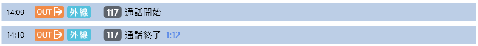
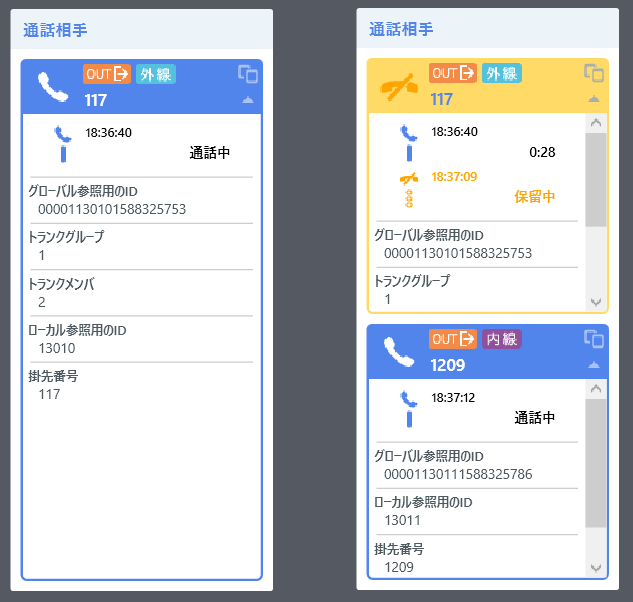
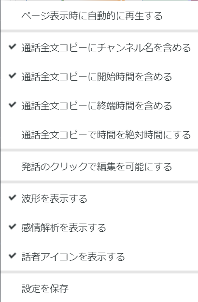
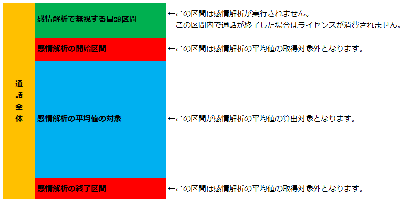

# 詳解 Communication Suite 機能編


## 目次

<!-- TOC START min:2 max:3 link:true asterisk:false update:true -->
- [目次](#目次)
- [序章 トレーニングにあたって](#序章-トレーニングにあたって)
	- [トレーニング中の諸注意](#トレーニング中の諸注意)
- [第1章 OperatorAgent](#第1章-operatoragent)
	- [1-1. OperatorAgent のログイン](#1-1-operatoragent-のログイン)
	- [1-2. OperatorAgent のメイン画面](#1-2-operatoragent-のメイン画面)
- [第2章 SpeechVisualizer](#第2章-speechvisualizer)
	- [2-1. SpeechVisualizer のログイン](#2-1-speechvisualizer-のログイン)
	- [2-2. SpeechVisualizer ホーム画面](#2-2-speechvisualizer-ホーム画面)
	- [2-3. SpeechVisualizer 通話検索](#2-3-speechvisualizer-通話検索)
	- [2-4. SpeechVisualizer 通話詳細](#2-4-speechvisualizer-通話詳細)
	- [2-5. SpeechVisualizer 座席表](#2-5-speechvisualizer-座席表)
- [第3章 ControlCenter](#第3章-controlcenter)
	- [3-1. ControlCenter のログイン](#3-1-controlcenter-のログイン)
	- [3-2. ControlCenter ホーム](#3-2-controlcenter-ホーム)
	- [3-3. ログイン状況](#3-3-ログイン状況)
	- [3-4. ノード管理](#3-4-ノード管理)
	- [3-5. 認識オプションの設定](#3-5-認識オプションの設定)
<!-- TOC END -->

## 序章 トレーニングにあたって
 トレーニングの目的

- SI パートナー様及び Communication Suite ユーザ様に、Communication Suite の 各種機能を詳細に解説します。

### トレーニング中の諸注意
- 本トレーニングの受講資料及び内容を貴社外へ共有・配布することは禁止となります。
- 本トレーニングの内容の撮影・録音は原則として禁止となります。
- 一部、受講中の資料を補足した板書の内容などの撮影は可能ですが、講師の許可を得た上でお願い致します。
- 本資料の記載内容は、現時点（2020年03月 Communication Suite Ver3.6）での内容となります。  
  今後にリリースされるバージョンでは、記載内容が保証されない場合も生じます。

<div style="page-break-before:always"></div>

<hr/>

## 第1章 OperatorAgent

### 1-1. OperatorAgent のログイン
#### 1-1-1. OperatorAgent でログインすることの意味  

1. ユーザアカウントの認証（ユーザID と パスワード）  
2. ユーザアカウント権限のチェック  
3. ユーザと通話（内線番号）の関連付け  
4. 通話とプロジェクトの関連付け  
5. クライアント PC を OperatorAgent ノードとして ControlCenter にレジスト  
	<br />
	[@fig:login] は、OperatorAgent の基本的なログイン画面となります。  

	{#fig:login width=400px}

#### 1-1-2. OperatorAgent のログインに関連する ControlCenter の詳細設定項目

No. | 設定項目名       | デフォルト値 | 内容 |
---:|------------------|--------------|------|
1   |  ユーザIDの保存 | false        | true の場合、最後にログイン成功した ユーザID を保存する |
2   |  パスワードの保存 | false        | true の場合、最後にログイン成功したパスワードを保存する |
3   |  自動ログイン | false        | true の場合、保存済みのユーザID とパスワード（と内線番号）で自動ログインする |
4   |  内線番号の指定 | false        | true の場合、ログインダイアログに内線番号入力欄を表示する |
5   |  内線番号の情報が必要かどうか | S        | R = 必須, S = サーバ版では必須, N = 入力しない |
6   |  内線番号の保存 | false        | true の場合、最後にログイン成功した内線番号を保存する |

: 詳細設定 設定分類 : OperatorAgent - ログイン {#tbl:table}  

- 『内線番号の指定』 を **"true"** にすることで、ログインダイアログに内線番号入力欄が追加されます。（[@fig:naisenari]。VDI 等のシンクライアント環境で、クライアント PC と電話機を固定で紐付けできない場合に有効です。）  

	{#fig:naisenari width=400px}  

- OperatorAgent のインストール時に内線番号を指定している場合には、指定番号が内線番号入力欄に表示されます。『内線番号の保存』 が **"false"** の場合も表示されます。）  
変更すると、ログイン出来なくなったり、他の席の電話番号と紐付けされてしまうので注意してください。
- 『内線番号の指定』 が **"false"** の場合でも、インストール時に内線番号が指定されていない場合で、かつ 『内線番号の情報が必要かどうか』 が "S" でかつサーバ版利用時 or "R" の場合には、内線番号入力欄が強制的に表示されます。
- 『ユーザIDの保存』 が true の場合、ユーザIDは、  

	```
	%USERPROFILE%/AppData/Local/Advanced_Media,_Inc/OperatorAgent.exe_StrongName_(長い文字列)/(バージョン番号)/user.config  
	```  

	の **LoginSettings/@LatestLoginUserId** に保存されます。 [^2] （この設定値は最後にログインに成功したユーザIDとなります。）

- 『パスワードの保存』 が true の場合、ログインパスワードは、Windows の  
`[コントロールパネル] → [ユーザー アカウント] → [資格情報マネージャー]`  
に自動入力されたユーザID に対応するパスワードが保存されます。（[@fig:shikaku]。この設定値は最後にログインに成功したパスワードとなります。）  

	{#fig:shikaku width=500px}  

- 『内線番号の保存』 が true の場合、内線番号は、  

	```
	%USERPROFILE%/AppData/Local/Advanced_Media,_Inc/OperatorAgent.exe_StrongName_(長い文字列)/(バージョン番号)/user.config  
	```  
	の **LoginSettings/@LatestLoginLineKey** に保存されます。（この設定値は最後にログインに成功した内線番号となります。）

[^2]:最後に

#### 1-1-3. プロジェクトの選択
- ログインするユーザが複数のプロジェクトに所属している場合には、ログインダイアログに続けてプロジェクト選択ダイアログが表示されます。([@fig:project])  

	{#fig:project width=400px}

#### 1-1-4. 統合 Windows 認証

- 統合 Windows 認証機能を有効化している場合には、ログイン画面は表示されません。ただし、通常ログイン同様、ユーザが複数プロジェクトに所属していれば、[1-1-3. プロジェクトの選択](#1-1-3-選択) ： [@fig:project] のダイアログが表示されます。  
- インストール時に内線番号が指定されていない場合には、内線番号入力ダイアログ（[@fig:naisen]）が追加表示されます。  

	{#fig:naisen width=400px}  

- 統合 Windows 認証を利用するための Communication Suite 上の設定はありません。  
ただし、IIS に追加の設定が必要です。  
	1. OS の "機能と役割の追加" から IIS - Web サーバ - セキュリティ 設定で **Windows 認証** を有効化してください。([@fig:role])
	2. IIS マネージャーの Web サイトの設定で、ControlCenter と SpeechVisualizer のそれぞれのサイトの認証の設定を以下の図と同様に変更します。（[@fig:siteconfig]）  

		{#fig:role width=400px}

		{#fig:siteconfig width=400px}

#### 1-1-5. OperatorAgent 自動ログイン（統合 Windows 認証を利用しない）
- [1-1-2. OperatorAgent のログイン機能に関連する ControlCenter の詳細設定項目](#1-1-2-operatoragent-機能関連-controlcenter-詳細設定項目)  ：  [@tbl:table] の 『自動ログイン』 が有効になっている場合には、統合 Windows 認証 を利用していなくてもログイン処理を省略可能です。  
	<br />  

	```plantuml
	@startuml
	skinparam {
	defaultFontName BIZ UDPゴシック
	}
	skinparam backgroundColor #fffacd
	skinparam activity  {
	BackgroundColor #afeeee
	BorderColor #000080
	}
	title アクティビティ図.1 [OA 自動ログイン判定]\n


	start
	:OperatorAgent 起動;
	if (内線番号の情報が必要かどうか) then (不要 ： 設定値『N』)
	else (\n必要)
		if (設定値 『S』 or 『R』) then (設定値『S』)
			if (サーバ版？) then (\nYES)
				if (内線番号) then (\n未入力)
					-ログインダイアログ表示
					end
				else (自動入力済)
				endif
			else (クライアント版)
			endif
		else (設定値『R』)
			if (内線番号) then (\n未入力)
				-ログインダイアログ表示
				end
			else (自動入力済)
			endif
		endif
	endif
	if (\nユーザIDとパスワードの両方が\n自動入力されている\n) then (YES)
		if (自動ログインの設定は有効か？) then (有効)
		else (\n無効)
		  -ログインダイアログ表示
			end
		endif
	else (いずれかもしくは両方が未入力)
		if (\nコマンドライン実行(※) で、引数により\nユーザIDとパスワードが設定されている\n) then (YES)
			if (自動ログインの設定は有効か？) then (有効)
			else (\n無効)
			  -ログインダイアログ表示
				end
			endif
		else (NO)
			-ログインダイアログ表示
			end
		endif
	endif
	#plum:自動ログイン実行;
	floating note right: ※ コマンドライン引数については \n 1-2-6. コマンドラインからの OperatorAgent 操作 \nを参照して下さい。
	@enduml
	```

	<br />
- [@tbl:oalogin] は、OperatorAgent の正常系ログインエラーをまとめたものです。（異常系は含んでいません。）

	No. | 事由                 | ログインダイアログのメッセージ       | デバッグログへの出力 |
---:|---------------------|------------------|--------------|
1   | ユーザID 誤り | OperatorAgent サービスにログインできませんでした | ステータス: 43031 ユーザID 'XXX'、またはパスワードが違います。 |
2   | パスワード誤り | OperatorAgent サービスにログインできませんでした | ステータス: 43031 ユーザID 'XXX'、またはパスワードが違います。 |
3   | 内線番号誤り | OperatorAgent サービスにログインできませんでした | ステータス: 42601 指定した内線番号 'NNN' は削除されたか、登録されていません。 |
4   | 所属プロジェクト無し | 所属するプロジェクトがありません | 出力無し|
5   | OperatorAgent の利用権限無し | OperatorAgent サービスにログインできませんでした | ステータス: 43207 権限のあるプロジェクトがありません。 |
6   | ユーザの有効期限切れ | OperatorAgent サービスにログインできませんでした | ステータス: 43031 ユーザID 'XXX'、またはパスワードが違います。 |
7   | ユーザの重複ログイン | このユーザは他の PC で利用中です | 43204 ユーザは別のホストからすでにログインしています。 |
8   | 内線番号の重複ログイン | OperatorAgent サービスにログインできませんでした | ステータス: 43205 指定された回線は現在使用されています。 |
9   | Communication Suite ユーザ未登録 | OperatorAgent サービスにログインできませんでした | このエラーは、IIS に入力されたユーザ名またはパスワードが無効であるか、または IIS がユーザを認証するのためにそのユーザ名およびパスワードを使用できないときに発生します。 |
10   | ライセンス違反 | OperatorAgent サービスにログインできませんでした | 【要確認】 ステータス: XXXXX ○○○。 |  

	: OperatorAgent のログイン失敗事由 {#tbl:oalogin}  

	※ 『ユーザID 誤り』、『パスワード誤り』 は **フォーム認証利用時のみ** のエラーとなります。  
	※ 『Communication Suite ユーザ未登録』 は **統合 Windows 認証利用時のみ** のエラーとなります。


#### 1-1-6. 本項のまとめ  
- [ ] OperatorAgent でのログインに関わる設定項目について理解ができた。  
- [ ] OperatorAgent でのログインが単に認証しているだけでは無いことが理解できた。  
- [ ] OperatorAgent の自動ログインについて理解ができた。  
- [ ] OperatorAgent にログインできないときに原因の切り分けができそうだ。  

<div style="page-break-before:always"></div>

<hr/>

### 1-2. OperatorAgent のメイン画面
#### 1-2-1.OperatorAgent メニュー
OpertorAgentのメニュー画面について解説いたします、[@fig:mainblank] はメイン画面、[@fig:oa_header] はOpertorAgentのメニューです。  

{#fig:mainblank width=600px}

{#fig:oa_header width=600px  }

1. OperatorAgent バージョン確認  
画面の左上の OperatorAgent ロゴを右クリックすると表示されるメニュー（[@fig:logoclick]）から OperatorAgent のバージョンを確認することができます。（[@fig:oaversion]）  

	{#fig:logoclick width=400px}  

	{#fig:oaversion width=400px}  

1. 通話リスト  
指定した検索条件に適合する SpeechVisualizer の通話詳細へのリンクをリストアップします。[@tbl:oa_conlist] は、通話リストに関連する ControlCenter の詳細設定項目です。  

	No. | 設定分類                 | 設定項目名       | デフォルト値 | 内容 |
	---:|---------------------|------------------|--------------|------|
	1   | OperatorAgent - 通話 | 検索条件 | mine:* d:1d | 今日の自分の通話 |
	2   | OperatorAgent - 通話 | 最大表示件数 | 20 | 上位 20 件まで |

	: OperatorAgent - 通話リストの設定 {#tbl:oa_conlist}  

	※ 検索条件の書式は SpeechVisualizer の通話検索条件と同じ書式が利用できます。  
	[@tbl:svshort] は、OperatorAgent から、SpeechVisualizer の機能にリンクするための設定項目です。

	No. | 設定分類| 設定項目名                | 設定内容      |
	----:|---------------------|------------------|--------------|
	1   |OperatorAgent - Web| SpeechVisualizer を表示するウェブブラウザ| SpeechVisualizer を利用するウェブブラウザの実行ファイルのパスを指定  
	2   | 共通 - システム | SpeechVisualizer の URL | OperatorAgent からは、この URL にアクセスします。  

	: OperatorAgent SpeechVisualizerを表示するブラウザ設定 {#tbl:svshort}  

1. マイクエリ  
SpeechVisualizer の通話検索機能で設定したマイクエリへのリンク（マイクエリの条件で検索した状態の検索画面へのリンク）をリストアップします。  

1. メッセージ  
チャット機能です。  

	{width=50px}　 オペレータ同士のチャットは禁止し、座席表モニタ中の SV とのチャットのみ許可したい場合には、ロールに  **『OperatorAgent からのメッセージ送信』** 権限（[@fig:role_message]） を付与しないでください。その場合、OperatorAgent からユーザを検索・指定しての能動的なメッセージ送信ができません。  

	{#fig:role_message width=500px}  

	権限がある場合（[@fig:message_authok]）には、宛先入力欄でユーザ検索・指定してのメッセージ送信ができますが、権限が無い場合には宛先を指定できない（[@fig:message_authng]）ため、能動的なメッセージ送信ができません。  

	{#fig:message_authok width=300px}  

	{#fig:message_authng width=300px}  

	権限が無い場合でも、座席表モニタ中の SV からの受信メッセージに対する返信は可能です。（[@fig:operatoragent_messagewindow]）また、SV とのチャット履歴が残っている間（受信後24時間以内）であれば、メッセージ受信履歴からの宛先指定が可能です。（[@fig:message_authngrireki]）

	{#fig:operatoragent_messagewindow width=400px}

	{#fig:message_authngrireki width=300px}  

	No. | 設定分類                 | 設定項目名       | デフォルト値 | 内容 |
	---:|:--------------------|------------------|--------------|------|
	1   | OperatorAgent - メッセージ | Enter キーでメッセージを送信 | true | false の場合には改行します |
	2   | OperatorAgent - メッセージ | ヘルプ対応時にメッセージウインドウを自動的に開く | true | SV がヘルプ対応操作を行ったことがメッセージとして通知されます |  

	: OperatorAgent - メッセージの詳細設定項目 {#tbl:oa_message_con}  


	{width=50px}　`メッセージの保存期間`  
	- メッセージは、通話中にも非通話時にも送受信が可能です。  
	- 通話中のメッセージ - 通話の属性情報として扱われます。通話データが削除されるタイミングで消去されます。
	- 非通話中のメッセージ - 単純チャット情報として扱われます。24時間後に消去されます。  

	{width=50px}　**通話中のメッセージも非通話中のメッセージも閲覧する機能はありません。**  

	<br />

1. お知らせ  
ControlCenter のお知らせ管理で登録されたお知らせのリストです。  

	No. | 設定分類                 | 設定項目名       | デフォルト値 | 内容 |
	---:|:--------------------|:-----------------|------------:|:-----|
	1   | OperatorAgent - お知らせ | 更新間隔 | 3600 | 単位は秒 |
	2   | OperatorAgent - お知らせ | 最大表示件数 | 20 | 上位 20 件まで |

	: OperatorAgent - お知らせの詳細設定項目 {#tbl:oa_news_con}  

1. コンディション（感情メータ）  

	{#fig:Condtiong width=300px}  

   	- 直近1時間分の通話のオペレータ感情の **ポジティブ・ネガティブ（nemesysco.qa5.excitement）**  の平均値をメータ表示しています。左に振れると "ネガティブ"、右に振れると "ポジティブ" という判断になります。[@tbl:oa_condition_con]  はコンディションに関連する ControlCenter の詳細設定項目です。

		No. | 設定分類                 | 設定項目名       | デフォルト値 | 内容 |
		---:|---------------------|------------------|--------------|------|
		1   | OperatorAgent - 感情解析 | コンディションの表示 | true | false で表示しない |
		2   | OperatorAgent - 感情解析 | コンディションのレッドゾーンの閾値 | 1.0 | 隠し項目 |
		3| 共通 - 感情解析  | 感情解析の使用  | true  |  false = 感情解析に関するあらゆる UI を表示しない |  

		: OperatorAgent - コンディションの詳細設定項目 {#tbl:oa_condition_con}  

1. ログインユーザプロファイル  
ログインユーザ名表示部分をクリックするとプロフィール機能が利用できます。  

	{#fig:logininfo width=300px}  

	- プロフィールタブ（[@fig:oa_profile]）  
ログイン情報の表示・画像の設定・削除・パスワード変更（関連する詳細設定項目は [@tbl:oa_pwchange_con]）が実施できます。  

		{#fig:oa_profile width=300px}  

		No. | 設定分類                 | 設定項目名       | デフォルト値 | 内容 |
		---:|---------------------|------------------|--------------|------|
		1   | 共通  - セキュリティ | パスワードのポリシー | 未定義 | パスワードのフォーマット定義 |
		2   | 共通  - セキュリティ | パスワードの最小桁数 | 1 |  |

		: OperatorAgent - パスワード変更の詳細設定項目 {#tbl:oa_pwchange_con}  

	- 設定タブ（[@fig:oa_user_con]）  
ControlCenter の詳細設定で設定された OperatorAgent の振る舞いを個人用にカスタマイズできます。  
[@tbl:oa_user_con] は、表示項目と詳細設定項目の対応表です。

		{#fig:oa_user_con width=300px}  

		No. | 設定タブ項目 | 設定分類                 | 設定項目名       |
		----:|---------------------|------------------|--------------|
		1   | 起動時にウィンドウを表示 | OperatorAgent - 起動時動作 | 起動時にウィンドウを表示状態に戻す |
		2   | 閉じたときにタスクバーに表示しない | OperatorAgent - 全般 | 閉じたときにタスクバーに表示しない |
		3   | 感情解析ポップアップを自動表示 | OperatorAgent - 通知メッセージ | 感情解析の自動表示 |
		4   | 通話フィルタの通知時間 | OperatorAgent - 通知メッセージ | 通話フィルタの通知時間レベル |
		5   | チャンネル名を含める | OperatorAgent - 通話全文コピー | コピー時にチャンネル名を含める |
		6   | 発話開始時間を含める | OperatorAgent - 通話全文コピー | コピー時に開始時間を含める |
		7   | 発話終端時間を含める | OperatorAgent - 通話全文コピー | 終了時間を含めるか |
		8   | Enter キーで送信 | OperatorAgent - メッセージ | Enter キーでメッセージを送信 |

		: OperatorAgent - ユーザ設定項目と詳細設定項目の対応 {#tbl:oa_user_con}  

<div style="page-break-before:always"></div>

<hr/>

#### 1-2-2. 通話表示機能

1. 通話内容ビュー  
OperatorAgent にログインした内線番号(モニタ内線番号)の通話の認識結果と関連する通話イベントを表示します。  

	- 通話イベント  
通話イベント（[@tbl:callevent]）は ControlCenter から OperatorAgent へ通知されます。  

		No. | イベント | 詳細 | 参考 |
		----:|---------|-------|---|
		1 | 通話開始 | RealTimeRecorder でモニタ内線番号の通話開始を検出時に通知されます。 | [@fig:startobi]  
		2 | 通話終了 | RealTimeRecorder でモニタ内線番号の通話終了を検出時に通知されます。 | [@fig:startobi]  
		3 | 保留開始 | RealTimeRecorder でモニタ内線番号の録音中に保留開始を検出時に通知されます。 | [@fig:holdobi]  
		4 | 保留解除 | RealTimeRecorder でモニタ内線番号の通話保留中、保留解除を検出時に通知されます。 | [@fig:startobi]  
		5 | 通話切替 | RealTimeRecorder でモニタ内線番号の録音中、録音対象の RTP の MediaResource が切り替わったときに通知されます。 | [@fig:kirikaeobi]  

		: 通話イベントの種類 {#tbl:callevent}

		{#fig:startobi width=500px}

		{#fig:holdobi width=500px}

		{#fig:kirikaeobi width=500px}  

	- 認識結果  
認識結果は StreamingRecognizer から OperatorAgent へ送信されます。  
通話内容は単語ごとにテキスト化され、順番に送信されますが、後から認識した単語によって既に表示されている単語が置き換わることもあります。発話単位で吹出で表現されます。発話の区切りは無音が一定時間以上（【要確認】 一定時間）継続することで行われます。（[@fig:hatuwa]）  

		{#fig:hatuwa width=500px}  

		- 緑の吹出は、録音対象の電話機を主体として、送話音声の認識結果になります。送話側音声は、認識オプション設定のオペレータタブに設定されたエンジンモードでテキスト化されます。（[@fig:txengine]）  

			{#fig:txengine width=400px}  

		- オレンジの吹出は、録音対象の電話機を主体として受話音声の認識結果となります。受話側音声は、認識オプション設定のカスタマタブに設定されたエンジンモードでテキスト化されます。（[@fig:rxengine]）  

			{#fig:rxengine width=400px}  

	- 通話内容ビューの表示不具合のトラブルシューティング  

  		1. 通話イベントが表示されない（**区分A**）  
このケースは通話録音設定の不備か、スパンデータの不備による可能性が疑われます。  

			No. | 原因| 対処 |
			----:|---------|-------|
			1 | RealTimeRecorder で通話録音ができていない | サーバ版であれば各種設定とパケットキャプチャの状況、クライアント版の場合には各種設定と録音デバイス関連を確認してください。  
			2 | サーバ版の場合 OperatorAgent でログインしている内線番号と通話中の内線番号が一致していない | OperatorAgent ログイン時に設定する内線番号と通話する電話機の内線番号は一致させてください。  
			3 | データベースの ServiceBroker が無効になっている | 有効化してください。  

			: 区分 A の主な原因と対処の目安 {#tbl:kubunA}

  		1. 通話イベントのみ表示され、認識結果が表示されない（**区分B**）  
このケースは通話録音・認識は正常に完了しているにも関わらず、**OperatorAgent と StreamingRecognizer 間の通信に不備がある** 可能性が疑われます。  
ただし、各種設定の不備が完全に否定されるわけではありません。

			No. | 原因| 対処 |
			-:|---------|------------|
			1 | OperatorAgent と StreamingRecognizer 間の接続が確立していない可能性があります。 | ノード管理で設定している、StreamingRecognizer の HTTP のポートに対して、OperatorAgent がアクセスできる状況にあるかを確認してください。  
			2 | 認識オプションが未設定の可能性があります| 認識オプションの設定を実施してください。  
			3 | 大規模な認識処理遅延が発生している可能性があります | 認識オプションの設定を実施してください。  

			: 区分 B の主な原因と対処の目安 {#tbl:kubunB}

  		1. その他（**区分C**）  
その他、よくある、通話内容表示不具合の例についてです。  

			No. | 症状 | 原因| 対処 |
			----:|---------|---|-------|
			1 | クライアント版（コンバージャー録音）で、通話していないのに 『通話開始』 と 『通話終了』 繰り返し表示される | コンバージャーの調整不足です | 恐らく無音がとれない電話機なので、有音 + 短い通話録音を切り捨てる設定にしてください  
			2 | クライアント版（コンバージャー録音）で、保留したタイミングで 『通話終了』 イベントが表示されてしまう | コンバージャー録音の性能限界の可能性があります | その時点のコンバージャー調整値では保留とオンフック状態の判別ができていません。調整によって解消する可能性もありますが、概ね IP  電話機の場合には保留とオンフックの判断はつかないようです。  
			3 | 認識結果の表示が遅延する（業務開始直後、オペレータのみ） | クライアント認識版では顕著に現れる症状ですが、StreamingRecognizer が初回認識処理時に認識オプションに沿って、各種設定やエンジンモードのロードを行うためです。 | 仕様であり、限定的にしか発生しませんので特に対処は必要はありません。気になるようであれば業務開始前にダミー通話を実施するようにしてください。  
			4 | 認識結果の表示が遅延する（通話開始直後） | 通話冒頭の 30 秒間は、通話環境の音響を学習しています。エンジンモードの音響モデルの情報と環境の音響情報の乖離が激しい場合、認識負荷があがるため冒頭30秒程度オペレータの認識結果の表示が遅延することがあります。 | 無線 ヘッドセットを利用しているケースなどで起きがちです。その場合、有線ヘッドセットに変えるなどで症状が改善します。  

			: 区分 C の主な症状及び原因と対処の目安 {#tbl:kubunC}

1. 通話情報ビュー  
[@fig:callinfo] は通話情報ビューで表示される情報です。  
この情報は通話相手によって変わらないオペレータ情報のみを表示します。  

	{#fig:callinfo width=250px}  

	No. | 表示情報 |説明                | 備考      |
	----:|---------------------|------------------|--------------|
	1   |自分の電話番号 | 通話属性の自番号から情報を表示します。 |自番号が取得可能な環境であればデフォルト設定で表示されます。  
	2   |自分のID |通話属性の自分の識別名から情報を表示します。 |[@tbl:callb] の設定で自分の識別名の登録が必要です。

	: 通話情報ビューの詳細 {#tbl:callview}  


1. 通話相手ビュー  
[@fig:callpartner] は通話相手ビューで表示される情報です。  
この情報は通話相手ごとに作成され、通話状態や通話相手の情報を表示します。   

	{#fig:callpartner width=500px}  

	[@tbl:callb] は、通話情報ビュー、通話相手ビューで表示する通話属性の設定項目です。  
	ControlCenter の詳細設定を編集して構成します。  

	No. | 設定タブ項目 | 設定項目名                | 設定内容      |
	----:|---------------------|------------------|--------------|
	1   |OperatorAgent - 通話 | 表示する通話属性の一覧 |[@tbl:callb2] の（通話属性識別名）＝（名称)で指定  

	: OperatorAgent 表示する通話属性の設定 {#tbl:callb}  


	表示する通話属性を追加する書式は以下です。複数追加する場合は、改行区切りで記述します。  
	追加例)  

	```
	amivoice.common.operator.key=自分の識別名
	amivoice.common.operator.phonenumber=自番号
	amivoice.common.customer.phonenumber=相手番号
	amivoice.common.customer.gender=相手の性別
	```


	[@tbl:callb2] は、表示する通話属性で利用可能な通話属性の一覧です。通話プロバイダにより表示できる通話属性が異なります。  
	標準に 〇 が付いているものはデフォルトで表示される通話属性です。  

	No. | 通話属性識別名 | 名称                | 標準 | Amazon Connect	      | Avaya AES    | Avaya     | SIP CIC     | SIP CTstage    |SIP OAI     | SIP T-Server      |
	----:|---------------------|------------------|--------------|--------------|--------------|--------------|--------------|--------------|--------------|
	1   |amivoice.common.description | 備考 ||   |  |  |  |  |  |  |
	2   |amivoice.common.direction | 向き|〇| 〇|〇|〇|〇|〇|〇|〇|
	3   |amivoice.common.linetype | 通話回線種別 |〇 |  |〇|  |〇|〇|〇|〇|
	4   |amivoice.common.summary| 要約 ||    |  |  |  |  |  |  |
	5   |amivoice.common.headline| 見出し | |   |  |  |  |  |  |  |
	6   |amivoice.common.mark | マーク| 〇 |   |  |  |  |  |  |  |
	7   |amivoice.common.operator.key | 自分の識別名 | |〇|〇|  |〇|〇|  |  |
	8   |amivoice.common.operator.name| 自分の名称|| 〇|  |  |  |〇|  |  |
	9   |amivoice.common.operator.phonenumber| 自番号|〇|〇|〇|〇|〇|〇|〇|〇|
	10   |amivoice.common.operator.group| 自分の所属グループ | |〇|  |  |  |〇|  |  |
	11   |amivoice.common.operator.hostname | 自分のホスト名|  |   |  |  |  |〇|  |  |
	12   |amivoice.common.customer.key | 相手の識別名|  |   |  |  |〇|〇|  |  |
	13   |amivoice.common.customer.name | 相手の名称|  |   |  |  |  |〇|  |  |
	14   |amivoice.common.customer.phonenumber| 相手番号|〇 |〇|〇|〇|〇|〇|〇|〇|
	15   |amivoice.common.customer.gender | 相手の性別|  |   |  |  |  |  |  |  |
	16  |amivoice.common.telephony.dialin.phonenumber | ダイヤルイン番号|  |   |  |  |〇|〇|〇|  |
	17   |amivoice.common.telephony.called.phonenumber | 掛先番号 | |  |〇|〇|  |  |  |  |
	18   |amivoice.common.telephony.alerting.phonenumber | 呼出先番号| |   |〇|  |  |  |  |  |
	19   |amivoice.common.telephony.trunk.group | トランクグループ|  |  |〇|  |〇|〇|〇|〇|
	20   |amivoice.common.telephony.trunk.member| トランクメンバ| |  |〇|  |  |  |〇|  |
	21   |amivoice.common.telephony.queue.phonenumber| キュー番号| |   |〇|  |〇|  |  |  |
	22   |amivoice.common.telephony.transfer.source.key | 転送元識別名 | |   |  |  |  |〇|  |  |
	23   |amivoice.common.telephony.transfer.source.name | 転送元名称|  |   |  |  |  |〇|〇|  |
	24   |amivoice.common.telephony.transfer.source.phonenumber | 転送元番号|  |   |〇|  |  |〇|  |〇|
	25   |amivoice.common.telephony.transfer.destination.key| 転送先識別名|  |   |  |  |  |〇|  |  |
	26   |amivoice.common.telephony.transfer.destination.name | 転送先名称 | |   |  |  |  |〇|  |  |
	27   |amivoice.common.telephony.transfer.destination.phonenumber | 転送先番号 | |   |〇|  |  |〇|〇|〇|
	28   |amivoice.common.telephony.monitoring.target.key | モニタリング対象識別名|  |   |  |  |〇|  |  |  |
	29   |amivoice.common.telephony.monitoring.target.name| モニタリング対象名称|  |   |  |  |〇|  |  |  |
	30   |amivoice.common.telephony.monitoring.target.phonenumber| モニタリング対象番号|  |   |  |  |〇|  |  |  |
	31   |amivoice.common.telephony.monitoring.target.type | 	モニタリング種別|   |   |  |  |〇|  |  |  |
	32   |amivoice.common.reference.global.id | グローバル参照用のID|  |〇|〇|  | 〇|〇|  |〇|
	33   |amivoice.common.reference.global.url | グローバル参照用のURL|  |   |  |  |  |  |  |  |
	34   |amivoice.common.reference.local.id| ローカル参照用のID|  |   |〇|  |〇|  |  |  |
	35   |amivoice.common.reference.local.url| ローカル参照用のURL|  |   |  |  |  |  |  |  |
	36   |amivoice.common.reference.site.id | サイト参照用のID| |   |  |  |  |  |  |  |
	37   |amivoice.common.reference.site.url| サイト参照用のURL|  |   |  |  |  |  |  |  |
	38   |amivoice.common.reference.private.id| プライベート参照用のID|  |   |  |  |  |  |  |  |
	39   |amivoice.common.reference.private.url | プライベート参照用のURL|  |   |  |  |  |  |  |  |
	40   |amivoice.common.recording.limit| 録音制限時間到達|  |   |  |  |  |  |  |  |
	41   |amivoice.common.recording.split| 録音分割|  |   |  |  |  |  |  |  |
	42   |amivoice.common.recording.split.previous| 録音分割された直前の通話|  |   |  |  |  |  |  |  |
	43   |amivoice.common.reference.recording.id | 録音区間参照用のID|  |   |  |  |  |  |  |  |
	44   |amivoice.common.reference.recording.url | 録音区間参照用のURL|  |   |  |  |  |  |  |  |
	45   |amivoice.common.telephony.distributing.phonenumber| 受電グループ番号| |  |〇|  |  |  |  |  |
	46   |amivoice.common.telephony.ivr.duration| IVR 応対時間|  |   |〇|  |  |  |  |  |
	47   |amivoice.common.telephony.queue.duration | 待ち時間|  |   |〇|  |  |  |  |  |

	: OperatorAgent 表示する通話属性で利用可能な通話属性一覧 {#tbl:callb2}  

	{width=50px}　相手の性別 は通話プロバイダから情報を取得するのではなく、性別識別用エンジンにて判断しています。  

	<br />

	[@tbl:seibetuenjin] は性別識別エンジンに関連する設定項目となり、ControlCenter/認識管理/認識オプション にあります。   

	No. | 設定タブ項目 | 設定項目名                | 内容      |
	----:|---------------------|------------------|--------------|
	1   |カスタマタブ | 性別識別 | 性別識別を利用するかどうか   
	2   |カスタマタブ | 性別識別用エンジンモード | 性別識別用エンジンを登録
	3   |カスタマタブ | 性別識別の閾値| 性別識別の判定に使用する閾値   
	4   |カスタマタブ | 性別識別に使用する発話時間（最大） | 性別識別の判定に使用する発話時間の最大値   
	5   |カスタマタブ | 性別識別に使用する発話時間（最小） | 性別識別の判定に使用する発話時間の最小値

	: カスタマ 性別識別用エンジン設定 {#tbl:seibetuenjin}  

	オペレータ側は性別識別用エンジンで性別を判断していません。   
	オペレータ側は ControlCenter/ユーザ管理/ ユーザごとのユーザ管理 - 詳細 設定の性別から判断しています。（ [@fig:usrprofile]）  

	{#fig:usrprofile width=350px}  


1. 通話状態ビュー   
通話状態にあわせてアイコンや時間が変化します。（ [@fig:callstate]）  

	{#fig:callstate width=250px}  

	`利用のヒント`  
	通話状態に表示される時間はキャプチャサーバの時刻を参照しています。  

	- 通話時間・・・録音開始 / 録音終了時刻から取得
	- 保留・・・SIPまたはCTIイベントから取得

1. 通話フィルタビュー（[@fig:callfilter1]） と 通話フィルタの通知（[@fig:callfilter2]）  

	{#fig:callfilter1 width=250px}  

	{#fig:callfilter2 width=250px}  

	{width=50px}　通話フィルタはリアルタイムでレスポンスを返すことを重視した設計となっており、発動条件は以下になります。  

	- 登録したキーワードを検知したタイミング
	- 【要確認】 認識結果が確定前  
前後の文字の繋がりにより、最終的に認識結果が変わる場合があります。
つまり、１つのセグメント（発話）が完了するまで通話フィルタの処理を待つわけではなく、キーワードを検知したタイミングですぐに処理が実行されます。  

	<br />

	[@tbl:callfilter] は、通話フィルタの ControlCenter の詳細設定項目です。  

	No. | 設定タブ項目 | 設定項目名                | 内容      |
	----:|---------------------|------------------|--------------|
	1   |OperatorAgent - 通知メッセージ |通話フィルタの通知時間の倍率 (短め) | 通話フィルタの通知時間に対して通話時間レベルの「短め」とする時間を倍率で指定   
	2   |OperatorAgent - 通知メッセージ | 通話フィルタの通知時間の倍率 (長め)| 通話フィルタの通知時間に対して通話時間レベルの「長め」とする時間を倍率で指定
	3   |OperatorAgent - 通知メッセージ | 通話フィルタの通知時間レベル| 通話フィルタの表示時間を「0（普通）」とした場合に「-1（短め）」に表示するか「1（長め）」に表示するかを指定  
	4   |OperatorAgent - 通知メッセージ | 通話フィルタの表示時間|通話フィルタ検出時の通知メッセージの表示時間（秒）  
	5   |OperatorAgent - 通知メッセージ | 一度に通知する通話フィルタの対象発話数| OperatorAgent起動時に、検出済みの通話フィルタが大量に表示されるのを防止する機能。「-1」を指定した場合、通話内でそれまで検知した全ての通話フィルタの通知メッセージを表示  
	6   |共通 - 通話フィルタインポート | 通話フィルタインポートリクエストタイムアウト| インポート失敗を防ぐことを目的とした機能。有効値は「120以上の整数」

	: OperatorAgent 通話フィルタの設定 {#tbl:callfilter}  

	<br />

	{width=50px}　通話フィルタの発動条件となるキーワードがテキスト化されたのに、通話フィルタが起動しない場合、[@tbl:filtertrouble] を参考にシューティングしてください。

	No. | 原因| 対処 |
	----:|---------|-------|
	1 | 通話フィルタに登録したコマンドに問題がある |登録したコマンドが Windows上で実行できるコマンドである必要があります。該当PCより「ファイル名を指定して実行」から登録したコマンドが実行できるか確認してください。  
	2 | 通話フィルタの起動条件を満たしていない |フィルタの条件で、起動条件を指定しますが、キーワードがテキスト化された時に指定した条件を満たしているか確認してください。(対象話者、検出対象回線種別など）   
	3 | 呼び出すファイルの拡張子が対応していない |該当PCのWindows上から呼び出すファイルが直接起動できるか確認ください。その他に既定のプログラム、アプリ、ブラウザなどに対象ファイルの拡張子を関連付けてください。

	: 通話フィルタのトラブルシューティング {#tbl:filtertrouble}

1. ヘルプ  
OperatorAgent から SpeechVisualizer の座席表に登録したヘルプ要求理由でアラート通知する機能です。([@fig:helpb]）  

	{#fig:helpb width=200px}  

	`利用上の注意`  
	ヘルプを利用するには ControlCenter/モニタリング/ヘルプ要求理由管理、ヘルプ要求解除理由に登録が必要です。  
	ヘルプ要求理由管理が登録されていない場合にはOperatorAgentの画面にヘルプボタンは表示されません。  

	<br />

	{width=50px}　ヘルプ要求後のヘルプ解除は ControlCenter の設定で特定条件で自動終了することができます。  
	- 通話前にヘルプ要求を実施、通話を開始した場合にヘルプ要求を自動解除
	- 通話中にヘルプ要求を実施、通話終了後にヘルプ要求を自動解除

	<br />

	[@tbl:help] は、ヘルプに関する ControlCenter の詳細設定項目は以下です。

	No. | 設定分類| 設定項目名                | 内容      |
	----:|---------------------|------------------|--------------|
	1   |OperatorAgent - メッセージ | ヘルプ対応時にメッセージウインドウを自動的に開く | ヘルプ応答時にメッセージウインドウを自動的に開くかどうか   
	2   |OperatorAgent - 通知メッセージ | ヘルプの解除理由選択の表示時間|ヘルプ要求の自動解除後にヘルプ解除理由を表示する時間    
	3   |OperatorAgent - 通知メッセージ | ヘルプを案内する感情解析の通話重要度の閾値 |感情解析のポップアップ画面にヘルプボタンを表示する通話重要度の閾値  
	4   |OperatorAgent - 通知メッセージ  |ヘルプ中のクローズ |ヘルプ中の通知メッセージをユーザがクローズできるかどうか
	5   |OperatorAgent - 通知メッセージ  |ヘルプ中の表示 | ヘルプ要求時の通知メッセージを表示するかどうか
	6   |OperatorAgent - 通話  |通話開始時にヘルプを解除する |通話開始時にヘルプ要求中だった場合、自動で解除するかどうか
	7   |OperatorAgent - 通話  |通話終了時にヘルプを解除する |通話終了時にヘルプ要求中だった場合、解除するかどうか  

	: OperatorAgent ヘルプ設定 {#tbl:help}  

1. 感情解析  
送話と受話側の発話内容をリアルタイムで感情に数値化して表示する機能です。  
感情解析は音声データをもとに解析を行っており、テキストデータを解析対象としていません。

	- OperatorAgentの感情解析機能([@fig:emo0]) ([@fig:emo1])([@fig:emo２])([@fig:emo3])  

		{#fig:emo0 width=150px}

		{#fig:emo1 width=450px}

		{#fig:emo２ width=250px}

		{#fig:emo3 width=350px}  


		[@tbl:emopop] は、ControlCenter の詳細設定項目で OperatorAgent で利用する「表示する感情」の設定項目となります。

		No. | 設定分類| 設定項目名                | 設定内容      |
		----:|---------------------|------------------|--------------|
		1   |OperatorAgent - 感情解析| 表示する感情（オペレータ）| 感情解析識別名 \| label＝感情名 で指定  
		2   |OperatorAgent - 感情解析| 表示する感情（カスタマ） | 感情解析識別名 \| label＝感情名 で指定 |  

		: OperatorAgent の感情解析ポップアップ {#tbl:emopop}  

	- 表示する感情の注意事項  
「表示する感情」を変更する場合には詳細設定の 「保存する感情スコア」 の設定変更も必要です。  
**「保存する感情スコア」に設定されていない感情は感情の値が取得できず、対象感情が表示されません。**  

		[@tbl:emoscore] は、保存する感情スコアに関する ControlCenter の詳細設定項目です。  

		No. | 設定分類| 設定項目名                | 設定内容      |
		----:|---------------------|------------------|--------------|
		1   |共通 - 感情解析| 保存する感情スコア| （感情解析識別名）.（話者)で指定    

		: 保存する感情スコア {#tbl:emoscore}  

	- 保存する感情スコアの注意事項  
**データベースのパフォーマンスの観点から、オペレータ、カスタマを含めて８つまでの感情に抑えて設計してください。**  
「保存する感情スコア」に設定した感情のみデータベース内に感情のサマリ値（最小/平均/最大/開始/終了）を保存します。  

		<br />

		{width=50px}　発話単位の感情値は「保存する感情スコア」の設定に関係なく、すべての感情を取得しており Emotion ファイルに保存されています。  

		<br />

		[@tbl:emolist] は、「表示する感情」と「保存する感情スコア」で利用可能な感情一覧です。  

		No. | 感情解析識別名| 感情名                | 複合型| 説明 |
		----:|---------------------|------------------|----------|---------|
		1   |nemesysco.qa5.angry      |怒り         |  |どのくらい怒っているかを示す値      |
		2   |nemesysco.qa5.concentration     |集中         |  |どのくらい集中しているかを示す値      |
		3   |nemesysco.qa5.embarrassment      |不快         |  |どのくらい不快に感じているかを示す値      |
		4   |nemesysco.qa5.excitement      |ポジティブ・ネガティブ |〇  |値が小さいい場合はネガティブ　値が大きい場合はポジティブを示す値      |
		5   |nemesysco.qa5.excitement.positive      |ポジティブ         |  |どのくらいポジティブかを示す値      |
		6   |nemesysco.qa5.excitement.negative      |ネガティブ         |  |どのくらいネガティブかを示す値      |
		7   |nemesysco.qa5.hesitation      |後悔・快適         |〇  |値が小さい場合は快適　値が大きい場合は後悔を示す値      |
		8   |nemesysco.qa5.hesitation.regret      |後悔         |  |どのくらい後悔していると感じているかを分析した値      |
		9   |nemesysco.qa5.hesitation.comfort      |快適         |  |どのくらい快適と感じているかを分析した値      |
		10   |nemesysco.qa5.imaginationactivity      |イメージ         |  |記憶や映像化された何かから記憶を思い出している事を示す値      |
		11   |nemesysco.qa5.intensivethinking      |思考         |  |集中して考えていることを示す値      |
		12   |nemesysco.qa5.content      |喜び         |  |どのくらい嬉しいかを示す値      |
		13   |nemesysco.qa5.savorarousalfactor      |興味         |  |会話に対する深い関心、覚醒要因を示す値      |
		14   |nemesysco.qa5.upset      |悲しみ         |  |どのくらい悲しいかを示す値      |
		15   |nemesysco.qa5.extremestate      |感情変化の極端さ         |  |感情活動が全体的にどのくらい極端かを示す値      |
		16   |nemesysco.qa5.stress      |恐怖         |  |どのくらい神経質になっているかを示す（ストレスを感じているか） 参考値：1～14 緊張・神経質 15以上 恐怖      |
		17   |nemesysco.qa5.uncertainty      | 確信無し・有り        |〇  |値が小さい場合は確信　値が大きい場合は不確かな発言として示す値 参考値：15未満 確信 15以上 不安・不確か |
		18   |nemesysco.qa5.uncertainty.uncertainty      |確信無し         |  |どのくらい不確かな発言かを示す値 |
		19   |nemesysco.qa5.uncertainty.certainty      |確信有り         |  |どのくらい確信がある発言かを示す値|
		20   |nemesysco.qa5.energy      |エネルギッシュ・疲労         |〇  |値が小さい場合は疲労　値が大きい場合は精力的であるかを示す値 参考値：1 飽きている・疲労　4未満 退屈・疲労　5～9 通常　10以上 精力的       |
		21   |nemesysco.qa5.energy.energetic      |エネルギッシュ         |  |どのくらい精力的かを示す値     |
		22  |nemesysco.qa5.energy.tired      |疲労         |  |どのくらい疲労しているかを示す値      |
		23   |nemesysco.qa5.brainpower      |脳活動のサマリ         |  |脳の感情的・論理的プロセスの全体的な概要。主に研究目的で使用される。      |
		24   |nemesysco.qa5.emotionalcognitiveratio      |感情的・論理的         |〇  |話題について感情的・論理的のどちらに基づいて話をしているかの全体的な概要。値が小さい場合は論理的、大きい場合は感情的を示す。      |
		25   |nemesysco.qa5.emotionalcognitiveratio.emotional      |感情的         |  |感情的に話をしているかを示す値      |
		26   |nemesysco.qa5.emotionalcognitiveratio.cognitive      |論理的         |  |論理的に話をしているかを示す値      |
		27   |nemesysco.qa5.amplitude      |思考深さ         |  |音量を示している値（利用実績なしのため、実用性不明）      |
		28  |nemesysco.qa5.voiceenergy      |音のエネルギー         |  |音の強さ（Energy）を示す値      |
		29   |nemesysco.qa5.voicevolume      |ボリューム         |  |「音のエネルギー」とは別の計算方法で算出した音の強さ(Volume)を示す値      |
		30   |nemesysco.qa5.anticipation      |期待         |  |期待・興味を示す値      |
		31   |nemesysco.qa5.dissatisfaction      |不満         |  |不満かどうかを示す値      |
		32   |nemesysco.qa5.callpriority      |通話重要度         |  |通話の中で重要と思われる箇所を複数の感情から算出して値を示す      |
		33   |nemesysco.qa5.agentscore      |エージェントスコア         |  |関連するいくつかの感情の要約を示す。値が大きいほど、変化の度合いが激しいことを示す。      |
		34  |nemesysco.qa5.emotionlevel      |感情レベル         |  |利用用途については検討中      |
		35   |nemesysco.qa5.logicallevel      |倫理的レベル         |  |利用用途については検討中      |
		36   |nemesysco.qa5.hesitantlevel      |困惑レベル         |  |利用用途については検討中      |
		37   |nemesysco.qa5.stresslevel      |緊張レベル         |  |利用用途については検討中      |
		38   |nemesysco.qa5.energeticlevel      |活動レベル         |  |利用用途については検討中      |
		39   |nemesysco.qa5.thinkinglevel      |思考レベル         |  |利用用途については検討中      |
		40  |nemesysco.qa5.passionlevel      |情熱レベル         |  |利用用途については検討中      |
		41   |nemesysco.qa5.concentrationlevel      |集中レベル         |  |利用用途については検討中      |
		42   |nemesysco.qa5.shylevel      |疑いレベル         |  |利用用途については検討中      |
		43   |nemesysco.qa5.anticipationlevel      |期待レベル         |  |利用用途については検討中      |

		: 利用可能な感情一覧 {#tbl:emolist}

	- 感情解析ライセンスの消費について  
感情解析が利用可能な通話数には月ごとに上限があり、感情解析ライセンス数に依存します。  
ライセンスの消費は Communication Suite が1通話とカウントした数だけ感情解析ライセンスが１つ消費されます。  
消費したライセンスは月ごとにリセットされて 「0」 に戻ります。（月はじめ1日のAM9:00にリセット）  
ライセンス数は ContronCenter / システム管理 / ライセンス状況 /感情解析ライセンス管理 で確認できます。（[@fig:kanjo]）  

		{#fig:kanjo width=600px}  

		{width=50px} 「感情解析ライセンス数」 の算出式  
		【要確認】 RealTimeRecorder ライセンス数 1 につき、 3,000 回の感情解析処理 / 月 で算出されます。  
		例） 5 内線分のライセンス環境の場合  
		5内線 × 3,000回 = 15,000回の感情解析処理が可能となります。  

		<br />

		{width=50px}　感情解析ライセンスの消費タイミング  
		-  保留により通話が分割された場合（保留前、保留後で計2ライセンスを消費）  
		-  通話を転送した場合（転送元、転送先で計2ライセンスを消費）  
		-  再認識を実施した通話（ConrtolCenter の認識オプションの設定で感情解析が有効な場合）  
		-  電話機のモニタ機能を利用時、モニタ実施電話機の音声が通話と録音される場合  
		-  「短い通話の録音キャンセル」機能によりキャンセルされた通話（CCの設定場所【要確認】）  
		-  「長い通話の分割」機能により分割された通話（CCの設定場所【要確認】）   

	- 通話内で感情解析の対象とする範囲  
1通話内で感情解析の対象とする範囲をControlCenter の認識オプションの設定で制御することができます。（3-5 認識オプション参照）  

#### 1-3. 通話終了後の機能

 1. SpeechVisualizer ボタン  
OperatorAgent 上で表示されている通話の SpeechVisualizer の通話詳細画面を呼び出します。 ([@fig:opsv])  
Speech Visualizer ボタンは条件を満たすとボタンが活性化されます。（SpeechVisualizer 機能を呼び出すための各種設定は [@tbl:oasv] です。  

 	{#fig:opsv width=100px}  

	No. | 条件内容
	-:|---------
	1  | 【要確認】 ボタンが活性化する条件を詳し書く。通話のアップロードが完了していないとOA上で通話終了とならない？SRから音声ファイル無しでアップロード完了した場合や、認識結果のアップロードエラーになった場合でもリンクボタンは押せるのか？等。処理の流れも確認。

	: OperatorAgent の SpeechVisualizer ボタン有効化 {#tbl:oasv}

2. 通話終了後に通話属性を設定する  
通話終了後に通話に紐づく通話属性を追加することができる機能です。  
通話終了後、[@fig:callp2] がポップアップ表示されて通話属性を登録することが可能です。通話リストからも登録できます。  

	{#fig:callp2 width=450px}  

	手動で通話属性を追加するための詳細設定項目は、@tbl:tuuwazokusei を参照してください。

	No. | 設定分類| 設定項目名                | 設定内容      |
	----:|---------------------|------------------|--------------|
	1   |OperatorAgent - 通話| 通話終了後に手動で通話属性を設定可能にする|True で手動通話属性の設定可能  
	2  |共通 - 通話| 手動で設定可能な通話属性|手動で設定可能な通話属性を指定  

	: 手動で追加する通話属性の設定 {#tbl:tuuwazokusei}

	追加可能な通話属性は（[1-2-2. 通話[@tbl:callb2]: OperatorAgent 表示する通話属性で利用可能な通話属性一覧](#1-2-2. 通話表示機能) 参照。）  


#### 1-4. OperatorAgent の起動・終了時の動作  

1. OperatorAgent 起動時の処理  
	- OperatorAgent の自動更新処理  
OperatorAgent を起動すると、ログインダイアログが表示される前に自身のバージョンとサーバ側のバージョンの比較を行います。  
	- OperatorAgent のバージョンがサーバのバージョンより古い場合には、自動的に更新処理が行われ OperatorAgent がサーバ側のバージョンに合わせてバージョンアップします。この更新処理はメジャーバージョンアップ時を除き、正常なバージョンアップが機能として保証されています。  
	- OperatorAgent のバージョンがサーバのバージョンより新しい場合も同様に自動的に更新処理が行われ、 OperatorAgent がサーバ側のバージョンに合わせてバージョンダウンします。  
ただし、この更新処理は OperatorAgent の更新内容等によっては、正常なバージョンダウンが保証されない場合があります。（その場合には、一度 OperatorAgent をアンインストールして、古いバージョンの OperatorAgent を新規インストールしてください。）  
自動バージョンダウン処理がサポートされるかどうかは、バージョンアップの内容次第です。切り戻し時の作業内容を検討する際には、リリースノートを確認するか、サポートへお問合せください。  

		<br />

		{width=50px} 　自動更新では処理中に **Windows Script Host （WSH）** の vbs がいくつか実行されます。（[@tbl:vbslist]）  
		セキュリティソフトによって、WSH の実行が阻害されてしまう環境では、自動更新処理が正常に行われません。（インストーラによるインストールでもバージョンアップインストールでも、WSH は実行されます。）  

		No. | ファイル名 | 説明  |
		----|---------------------|------------------|
		1   | moduleindexbuilder.vbs | バージョン毎にファイルのハッシュ値が**必ず変更になります**。 |
		2   | @301_RR_CTILink_RegAsm.vbs | バージョン毎にファイルのハッシュ値の変更はありませんが将来のバージョンで削除となる可能性はあります。 |
		3   | @341_RR_RemoveFiles.vbs | バージョン毎にファイルのハッシュ値の変更はありませんが将来のバージョンで削除となる可能性はあります。 |
		4   | @341_SR_RemoveFiles.vbs | バージョン毎にファイルのハッシュ値の変更はありませんが将来のバージョンで削除となる可能性はあります。 |
		5   | @352_SR_Web_RemoveFiles.vbs | バージョン毎にファイルのハッシュ値の変更はありませんが将来のバージョンで削除となる可能性はあります。 |
		6   | @Updater.vbs | ファイルが更新されていればハッシュ値も変更になります。 |

		: OperatorAgent のアップデート時に実行される vbs のリスト {#tbl:vbslist}  

		※ **\@数字_モジュール_処理名.vbs** のファイルは、特定の処理を行う (不要になったファイルの削除や、不具合修正のための処理とか) 為にあるので、以降のバージョンで追加になる可能性があります。  

		<br/>  

		{width=50px}　OperatorAgent をコマンドラインから引数付きで起動することで自動更新を抑制できます。（[1-6. コマンドラインからの OperatorAgent 操作](#1-6. コマンドラインからの OperatorAgent 操作) 参照。）  

		<br/>

	- ライセンス引当  
	処理詳細は【要確認】  
	- メインウィンドウの表示について  
メインウィンドウの表示は、 [@tbl:oa_window] の項目の設定値を判断して行われます。  
		- 初回起動  
			1. `C:\Users\%UserName%\AppData\Local\Advanced_Media,_Inc` に設定ファイルが無ければ、初回起動時として動作します。  
			2. 『初回起動時にウィンドウを表示状態にする』 の設定値を判断し、ウィンドウ表示を制御します。  
		- 通常起動  
			1. `C:\Users\%UserName%\AppData\Local\Advanced_Media,_Inc` に設定ファイルが有れば、通常起動として動作します。  
			2. 『起動時にウィンドウを表示状態に戻す』 の設定値を判断し、ウィンドウ表示を制御します。  
			3. 表示しない設定の場合、『閉じたときにタスクバーに表示しない』 の設定値を判断し、タスクバー or 通知領域に情報を表示します。  

		No. | 設定分類| 設定項目名                | デフォルト値  | 内容 |
		----:|---------------------|------------------|------|----|
		1   | OperatorAgent - 起動時動作 | 起動時にウィンドウを表示状態に戻す | true | OperatorAgent 起動毎に、終了時のウィンドウ状態に依存せずメインウィンドウを画面表示状態に戻します。false の場合には、OperatorAgent の終了時の状態を引き継ぎます。
		2   | OperatorAgent - 起動時動作 | 初回起動時にウィンドウを表示状態にする | true | 初回起動時の メインウィンドウの表示状態を設定します。オペレータさんに基本的に画面を一度も見せたくない場合などに false 設定しておきます。  
		3   | OperatorAgent - 全般 | 閉じたときにタスクバーに表示しない | False | true にするとメインウィンドウの　× ボタンでウィンドウを閉じたときに、通知領域にのみアイコンが表示されます。  

		: OperatorAgent のウィンドウ表示に関わる詳細設定項目 {#tbl:oa_window}  


		```plantuml
		@startuml
		skinparam {
		defaultFontName BIZ UDPゴシック
		}
		skinparam backgroundColor #fffacd
		skinparam activity  {
		BackgroundColor #afeeee
		BorderColor #000080
		}
		title アクティビティ図.2 [OA ウィンドウ表示判定]\n

		start;
		-[#black]-> OperatorAgent 起動;
		if (設定ファイルあり) then
		  -[#blue]-> True : 通常起動;
			if (\n起動時に\nウィンドウを表示状態に戻す\n) then
				-[#blue]-> \nTrue;
				:OperatorAgent ウィンドウ表示;
				-[#black]->
				end;
			endif
		else
		  -> False : 初回起動処理;
				if (\n初回起動時に\nウィンドウを表示状態にする\n) then
					-[#blue]-> \nTrue;
					:OperatorAgent ウィンドウ表示;
					-[#black]->
					end;
				endif
		endif
		if (\n閉じたときに\nタスクバーに表示しない\n) then
			-[#blue]-> \nTrue;
			:OperatorAgent を最小化し、\n通知領域に格納;
			-[#black]->
		else
			-> \nFalse;
			:OperatorAgent を\n最小化してタスクバー表示;
			-[#black]->
		endif
		-[#black]->
		end;
		@enduml
		```

1. OperatorAgent 終了時の処理  
	- ログオフ処理  
ControlCenter にレジストされた、OperatorAgent のログイン情報（ユーザ・座席表の位置・内線番号との関連付け）などをリリースします。  
OperatorAgent を VDI オプション付きでインストールしている場合には、ライセンスのリリースも実施します。

		<br />

		{width=50px}OperatorAgent を手動で終了せずに PC のシャットダウンを行った場合、PC のシャットダウンシーケンス開始を検出した OperatorAgent は自身も終了処理を実施します。さらに、終了処理が完了するまで OS が完全にシャットダウンすることを待機させます。  
		ただし、OS 側でも各種終了処理が並行で実施されるため、OperatorAgent が ControlCenter と通信しログオフ処理を完了する前に OS の通信デバイスが停止している可能性があります。その場合、OperatorAgent のログイン情報が ControlCenter 上に残り続けます。  
		ControlCenter は各 OperatorAgent の生存確認のための通信を実施しており、【要確認】  （[@tbl:oaping]） ControlCenter にレジストされた OperatorAgent のログイン情報はリリースされます。  
		ControlCenter 上での OperatorAgent のログイン情報は、ControlCenter のモニタリングメニューの `『ログイン状況』` 機能で確認できます。  
		SpeechVisualizer の座席表機能では、タイムアウトした OperatorAgent の座席にはタイムアウトアイコンが表示されます。([@fig:ismto])  
		この状態は、該当座席に対して新たな OperatorAgent がログインすることで解消されます。それまではタイムアウト済みの OperatorAgent からのレジスト情報が表示され続けます。  

		{#fig:ismto width=250px}  

		No. | 設定項目名                | デフォルト値  | 内容 |
		----:|------------------|------|----|
		1   | データ送信最長間隔 | 90000（ミリ秒） | 【要確認】  
		2   | 再接続間隔 | 60000（ミリ秒） | 【要確認】  
		3   | 受信タイムアウト | 120000（ミリ秒） | 【要確認】  

		: 詳細設定 項目分類 『OperatorAgent - 状態通知』 {#tbl:oaping}

#### 1-5. OperatorAgent からのコマンド実行
- OperatorAgent からは、詳細設定項目（[@tbl:oacommand]）を設定することで指定したタイミングでコマンドを実行することができます。

	No. | 設定項目名
	---:|------------------
	1   |  OperatorAgent起動時に実行するコマンド
	2   | OperatorAgent終了時に実行するコマンド
	3   | ログアウト直後に実行するコマンド
	4   | ログイン直後に実行するコマンド
	5   | 通話フィルタの検出時に実行するコマンド
	6   | 通話フィルタの手動コマンド実行後に実行するコマンド
	7   | 通話開始直後に実行するコマンド
	8   | 通話終了直後に実行するコマンド

	: OperatorAgent コマンド実行 {#tbl:oacommand}

- コマンド は任意で指定可能で、  
	1. Exe ファイルなどのアプリケーション  
	2. Bat or Cmd などの実行可能ファイル  
	3. ファイル名 or フォルダパス  
	4. URL  

	などを適宜指定します。  
	基本的には、Windows の 『ファイル名を指定して実行』 で上記を指定したときと同じ挙動になります。  
	この機能で保証されるのは、指定コマンドの実行であって、**期待した結果が得られるかどうかではありません**。

	<br />

- [@tbl:oacommand] から実行するコマンドには、以下の書式で通話から取得できる情報を付加することが可能です。
記述するフォーマットは以下の通りです。  

	```
	${'メインキー文字列', 'サブキー文字列', 'オプション'}
	```  

	通話関連情報の場合は、メインキーは 『call』 に固定されます。  

	```
	${call, 'サブキー'}
	```  

	通話情報の会話識別子をそのままコマンドの引数として使用したい場合は  

	```
	${call, Key}
	```  

	と記述します。  
	実際に コマンドとして利用するには、  

	```
	http://webserver/SpeechVisualizer/Detail.aspx?key=${call, Key}
	```  

	のように記述します。

	オプションに **_urlencode_** を指定すると、値が URLエンコードされます。(※一部例外あり)  

	```
	http://webserver/SpeechVisualizer/Detail.aspx?key=${call, Key, urlencode}
	```  

	{width=50px}
	　本機能では、`$` は特殊文字として予約されています。  
	コマンドの設定で `$` を文字として使用したい場合は、`\` でエスケープしてください。  
	同様に `"` や `\` も特殊文字ですので、文字として使用する場合は `\` でエスケープしてください。  
	<br />
	指定可能な **サブキー** は（[@tbl:commandsubkey]）の通りです。

	No. | サブキー名 | 置換される値 | [@tbl:callb2] との対応 | 備考
	---:|---------------|---|---|--
	1   |  Key | 会話識別子 | - |
	2   |  ConversationKey | 会話識別子 | - |
	3   |  ProjectName | プロジェクト名 | - |
	4   |  UserKey | ユーザID | - | Communication Suite へのログイン情報
	5   |  LineKey | 内線番号 | - |
	6   |  Date | 通話開始日時 | - | 日時系は、urlencode の指定ができません。代わりに [カスタム日時形式文字列](https://docs.microsoft.com/ja-jp/dotnet/standard/base-types/custom-date-and-time-format-strings?redirectedfrom=MSDN) の指定が可能です。<br />${call, StartDateTime, yyyy-MM-dd}
	7   |  StartDate | 通話開始日時 | - | 日時系
	8   |  StartDateTime | 通話開始日時 | - | 日時系
	9   |  EndDate | 通話終了日時 | - | 日時系
	10   |  EndDateTime | 通話終了日時 | - | 日時系
	11   |  Duration | 通話時間(秒) | - |
	12   |  HoldDuration | 累積保留時間(秒) | - |
	13   |  HoldCount | 保留回数 | - |
	14   |  DetailViewUrl | 詳細表示のURL | - |
	15   |  OperatorPhoneNumber | 自番号 | No.9 |
	16   |  OperatorPhoneLabel | 自分のID | No.8 | 電話基盤へのログイン情報
	17   |  OperatorGroup | 受電グループ | No.10 | 受電スキル
	18   |  OperatorHostName | 自分のホスト名 | No.11 | 【要確認】
	19   |  Direction | 通話の向き | No.2 |
	20   |  LineType | 通話種別 | No.3 |
	21   |  CustomerPhoneNumber | 相手番号 | No.14 |
	22   |  CustomerPhoneLabel | 相手の名称 | No.13 |
	23   |  TrunkGroup | トランクグループ | No.19 |
	24   |  TrunkMember | トランクメンバ | No.20 |
	25   |  CalledPhoneNumber | ダイヤル番号 | No.17 |
	26   |  AlertingPhoneNumber | 呼出先番号 | No.18 |
	27   |  QueuePhoneNumber | キュー番号 | No.21 |
	28   |  DialInPhoneNumber | ダイヤルイン番号 | No.16 |
	29   |  TransferSourcePhoneNumber | 転送元番号 | No.24 |
	30   |  TransferSourceLabel | 転送元名称 | No.23 |
	31   |  TransferDestinationPhoneNumber | 転送先番号 | No.27 |
	32   |  TransferDestinationLabel | 転送先名称 | No.26 |
	33   |  MonitoringType | モニタリング種別 | No.31 |
	34   |  MonitoringPhoneNumber | モニタリング対象の内線番号 | No.30 |
	35   |  MonitoringLabel | モニタリング対象の名称 | No.29 |
	36   |  GlobalReferenceId | グローバル参照用の ID | No.32 |
	37   |  GlobalReferenceUrl | グローバル参照用の URL | No.33 |
	38   |  LocalReferenceId | ローカル参照用の ID | No.34 |
	39   |  LocalReferenceUrl | ローカル参照用の URL | No.35 |
	40   |  SiteReferenceId | サイト参照用の ID | No.36 |
	41   |  SiteReferenceUrl | サイト参照用の URL | No.37 |
	42   |  PrivateReferenceId | プライベート参照用の ID | No.38 |
	43   |  PrivateReferenceUrl | プライベート参照用の URL | No.39 |   

	: サブキーの一覧 {#tbl:commandsubkey}  

	サブキーの指定に制限はありませんが、有用な値に置換できるかは利用している通話プロバイダと電話機基盤の設定によります。

#### 1-6. コマンドラインからの OperatorAgent 操作
- OperatorAgent は、コマンドラインから  

	```
	インストールパス\OperatorAgent.exe --オプション＝値（-オプション 値）
	```  
	のように起動（終了）できます。  
	[@tbl:oa-option] はコマンドラインで指定可能なオプションの一覧です。  

	No.| 内容 | オプション名 | 短いオプション名  
	--:|---|---|--
	1| ControlCenterの指定 | --server=[ControlCenterURL] | -s [ControlCenterURL]  
	2| ユーザIDの指定 | --user=[ユーザID] | -u [ユーザID]  
	3| パスワードの指定 | --password=[パスワード] | -p [パスワード]  
	4| 内線番号の指定 | --line=[内線番号] | -l [内線番号]  
	5| 自動アップデート禁止 | --disable-update |  
	6| 言語の指定 | --culture=[カルチャ名(\<languagecode2>-\<country/regioncode2>)] |  
	7| 起動中のOAを終了 | --exit |  

	: OperatorAgent のコマンドラインオプション {#tbl:oa-option}  

	{width=50px}  
	- 『ControlCenterの指定』 は、一時的に OperatorAgent の接続先を開発環境に向けたいときなどに利用します。  
	- 『ユーザIDの指定』 と 『パスワードの指定』 を同時に組合せることにより、統合 Windows 認証 を利用することなく自動ログインを可能にします。  
	- 『内線番号の指定』 は、一時的に設定済みの内線番号ではない電話機と組み合わせてテストするときなどに指定します。  
	- 『自動アップデートの禁止』 不具合があることがわかっている OperatorAgent に自動バージョンアップをさせたくない場合などに指定します。  
	- 『言語の指定』 【要確認】  
	- 『起動中のOAを終了』 は、端末の操作が著しく限定されている。かつ、端末シャットダウン時に実行中のアプリケーションの全終了が条件の環境で利用しています。

#### 1-7. OperatorAgent のインストール
- OperatorAgent は、インストーラを通常起動してウィザード形式で手動インストールする方法と、インストーラ実行時に引数付きで起動し自動インストールする方法と2種類のインストールがサポートされています。  
- 自動インストール時に引数指定するオプション（[@tbl:oainstalloption]）次第ではサイレントインストールが可能です。  

	No.| オプション | 内容  
	--:|---|--
	1 | /SILENT | インストールの進捗を示すウィンドウ以外表示されなくなります。 ウィザードによる指定が出来なくなるので、必要なオプションを指定する必要があります。  
	2 | /VERYSILENT | すべてのウィンドウが表示されなくなります。 ウィザードによる指定が出来なくなるので、必要なオプションを指定する必要があります。  
	3 | /SUPPRESSMSGBOXES | 表示されるメッセージボックスを抑制します。/SILENT または /VERYSILENT オプションを指定したときのみ効果があります。  
	4 | /LOG | インストールのログが、ユーザのテンポラリフォルダ内に作成されます。  
	5 | /LOG="filename" | インストールのログが、filename に指定されたファイルに作成されます。  
	6 | /NOCANCEL | キャンセルボタンと閉じるボタンがクリックできなくなります。/SILENT オプションと同時に指定すれば、インストール中にキャンセルされなくなります。  
	7 | /NORESTART | 再起動が必要の場合でも、再起動しなくなります。  
	8 | /RESTARTEXITCODE=exit_code | 再起動が必要な場合に返す終了コードを指定します。この指定が無いと 0 が返ります。 通常は /NORESTART オプションと共に使用します。  
	9 | /CLOSEAPPLICATIONS | OperatorAgent やコンバージャ調整ツールが起動している場合に、それらのアプリケーションを終了します。（以下 10 ～12 を指定しない場合この挙動となります。）  
	10 | /NOCLOSEAPPLICATIONS | OperatorAgent やコンバージャ調整ツールが起動している場合に、それらのアプリケーションを終了せずにインストールを試みます。  
	11 | /FORCECLOSEAPPLICATIONS | OperatorAgent やコンバージャ調整ツールが起動している場合に、それらのアプリケーションを強制的に終了します。  
	12 | /RESTARTAPPLICATIONS | インストーラが終了させたアプリケーションを、インストール完了後に起動します。 `/CLOSEAPPLICATIONS` オプションと共に使⽤します。  
	13 | /LOADINF="filename" | インストーラが、指定した filename より設定を読み込んで実行します。/SAVEINFO コマンドにより保存したファイルを使用できます。  
	14 | /SAVEINF="filename" | インストール中に指定した設定を filename に保存します。  
	15 | /DIR="x:\dirname" | インストール先のディレクトリを指定します。これは「インストール先の指定」画面のインストールフォルダに相当します。  
	16 | /GROUP="folder name" | プログラムグループを指定します。 これは「プログラムグループの指定」画面のプログラムグループ名に相当します。  
	17 | /NOICONS | プログラムグループを作成しなくなります。 これは「プログラムグループの指定」画面の「プログラムグループを作成しない」にチェックを入れるのに相当します。  
	18 | /TYPE=type_name | インストールするコンポーネントのセットを指定します。 これは「コンポーネントの選択」画面のコンボボックスによる選択に相当します。 指定できる値は [@tbl:oainstalltype] の通りです。  
	19 | /COMPONENTS="component_names" | インストールするコンポーネントを指定します。カンマ「,」で区切ることにより複数指定できます。 ここで指定されたコンポーネントだけがインストールされます。 これは「コンポーネントの選択」画面のチェックボックスによる選択に相当します。 指定できる値は [@tbl:oainstallcomponent] の通りです。  
	20 | /TASKS="task_names" | 実行するタスクを指定します。カンマ「,」で区切ることにより複数指定できます。 ここで指定されたタスクだけが実行されます。 これは「追加タスクの選択」画面のチェックボックスによる選択に相当します。 指定できる値は [@tbl:oainstalltasks] の通りです。  
	21 | /MERGETASKS="task_names" | 実行するタスクを指定します。カンマ「,」で区切ることにより複数指定できます。 /TASKS オプションと似ていますが、デフォルトでチェックされているタスクと、このオプションで指定されたタスクが実行されます。  
	22 | /LicenseNumber=license_number | ライセンス番号を指定します。 これは「ユーザ情報」画面の「ライセンス情報」に相当します。  
	23 | /InstallKey=install_key | インストールキーを指定します。 これは「ユーザ情報」画面の「インストールキー」に相当します。  
	24 | /LogPath=log_folder | Communication Suite のログの出力先のフォルダを指定します。 これは「ログ出力先の指定」画面の「ログ出力先」に相当します。  
	25 | /ControlCenterServerUrl=controlcenter_url | 接続する ControlCenter サーバのURLを指定します。 これは「サーバURLの指定」画⾯の「サーバURL」に相当します。 どのコンポーネントをインストールする場合でも必須となります。  
	26 | /NodeGroup=nodegroup_name | 使⽤するノードグループを指定します。 これは「ノードグループ名の指定」画⾯の「ノードグループ名」に相当します。 RealTimeRecorder または StreamingRecognizer をインストールする場合は必須となります。インストールするコンポーネントに RealTimeRecorder、StreamingRecognizer が含まれていない場合は無視されます。  
	27 | /LineNo=line_key | 端末で使⽤する内線番号を指定します。 これは「内線番号の指定」画⾯の「内線番号」に相当します。OperatorAgent をインストールせずに RealTimeRecorder または StreamingRecognizer をインストールする場合は必須となります。 インストールするコンポーネントに OperatorAgent、RealTimeRecorder、StreamingRecognizer が含まれていない場合は無視されます。  
	28 | /RDS=1 | RemoteDesktop を使った仮想環境3にインストールする場合に指定します。これにより、⾃動アップデートは動作しなくなり、OperatorAgent でログイン中のみ OperatorAgent のライセンスが消費されます。 インストールするコンポーネントに、RealTimeRecorder、StreamingRecognizer 等のクライアント録⾳、クライアント認識に関係するコンポーネントを含めることは出来ません。この引数を指定してインストールした場合、アップデートインストール時には必ずこの引数を指定してアップデートする必要があります。  
	29 | /VDI=1 | VDI を使った仮想環境にインストールする場合に指定します。これにより、通常通り⾃動アップデートは動作しますが、OperatorAgent でログイン中のみ OperatorAgent のライセンスが消費されます。 インストールするコンポーネントに、RealTimeRecorder、StreamingRecognizer 等のクライアント録⾳、クライアント認識に関係するコンポーネントを含めることは出来ません。この引数を指定してインストールした場合、アップデートインストール時には必ずこの引数を指定してアップデートする必要があります。  

	: OperatorAgent インストールオプション {#tbl:oainstalloption}

	No.| type_name | 内容  
	--:|---|--
	1 | full | フルインストールします。  
	2 | oa | OperatorAgent のみをインストールします。  
	3 | rc | コンバージャー版 OperatorAgent をインストールします。  
	4 | rp | クライアントパケットキャプチャ版 OperatorAgent をインストールします。  

	: OperatorAgent のインストールタイプ {#tbl:oainstalltype}

	No.| Component | 内容  
	--:|---|--
	1 | OperatorAgent | 全ての通話プロバイダで必要です。  
	2 | RealTimeRecorder | PCのサービスとして RealTimeRecorder をインストールします。クライアント版を利用する場合には必要です。  
	3 | RealTimeRecorder\Converger | 通話プロバイダで、音声デバイス方式でコンバージャーを利用する場合に必要です。具体的になにが行われるかは 【要確認】  
	4 | RealTimeRecorder\PacketCapture | 【要確認】  
	5 | RealTimeRecorder\PacketCapture\Avaya | 【要確認】  
	6 | RealTimeRecorder\CTILink | CTI 連携用の DLL をインストールします。  
	7 | StreamingRecognizer | PC のサービスとして StreamingRecognizer をインストールします。クライアント版を利用する場合には必要です。  
	8 | ConvergerTool | コンバージャー調整ツールをインストールします。  

	: OperatorAgent インストール時に選択可能なコンポーネント {#tbl:oainstallcomponent}

	No.| task_name | 内容  
	--:|---|--
	1 | DesktopIcon | デスクトップにアイコンを作成します。  
	2 | RegisterStartup | スタートアップに登録します。  

	: OperatorAgent インストールタスク {#tbl:oainstalltasks}

	{width=50px}　OperatorAgent は、⼀つの PC にインストールフォルダを変えて複数インストールすることが可能です。  
	PC に複数の OperatorAgent をインストールしている場合、コントロールパネルの 「アプリケーションの追加と削除 (プログラムと機能)」 からアンインストールできるのは、一番最後にインストールしたインスタンスだけです。それ以外のインスタンスをアンインストールする場合、 インストールフォルダ直下の `『uninstall\unins000.exe』` を実⾏してください。  
	<br />
- OperatorAgent インストーラ内で実行される **WSH**  
	[@tbl:vbslist] は、自動バージョン時に実行される vbs のリストですが、インストーラでインストールする場合には、[@tbl:vbslist] とは別に、`XsltExec.wsf` が実行されます。vbs ファイルではありませんが、内部で WSH を実行しているため、セキュリティソフトの仕様によっては実行がブロックされてしまい、正常なインストールができません。

	<div style="page-break-before:always"></div>

	<hr/>

## 第2章 SpeechVisualizer

### 2-1. SpeechVisualizer のログイン

#### 2-1-1. SpeechVisualizer のログインに関連する ControlCenter の詳細設定項目
  - [@tbl:svlogin] は、SpeechVisualizer のログインに関わる詳細設定項目です。設定分類は、**共通 - セキュリティ** となります。

	No. | 設定項目名       | デフォルト値 | 内容 |
	---:|------------------|--------------|------|
	1   |  ログイン状態の維持 | false        | ブラウザに保存された Cookie を永続化するための入力項目がログイン画面に追加される |  

	: 詳細設定 : SpeechVisualizer のログインに関わる設定 {#tbl:svlogin}  

	{width=50px}　『ログイン状態の維持』 を true に設定すると、ログイン画面に 『ブラウザを終了してもログインを維持する』 というチェックボックスが表示されます。その項目にチェックをつけてからログインするとこで、ユーザの Cookie が永続化されます。  
	永続化された状態では、ブラウザを終了してもログイン状態が維持され続けます。この状態を解除するには、SpeechVisualizer 画面のログオフボタンから手動で明示的なログオフ操作を行うか、ブラウザに保存された Cookie の情報を削除するか、ログイン情報が保存されているユーザのパスワードを変更する必要があります。  

#### 2-1-2. SpeechVisualizer へのログイン方法  
  1. フォーム認証  
	     SpeechVisualizer のログイン画面から手動で入力したログイン情報か、ブラウザに保存された有効期限内の Cookie の情報でログインします。（※ Cookie の情報を利用する場合には、ログイン画面は表示されません。）  
  2. 統合 Windows 認証  
	SpeechVisualizer の Web アプリケーショの認証設定で、**Windows 認証** が適切に有効化されている場合、ログイン画面は表示されず、自動的にログインします。
  3. OperatorAgent 連携  
  OperatorAgent の各種機能から SpeechVisualizer を呼び出します。（呼出のための設定は、[@tbl:svshort] を参照してください。）  
	このログイン方法では、手動ログイン操作は発生せずに自動でログイン処理が実施されますが、上記の2つと異なる第3 のログイン方法ではなく、実際には有効になっている 『フォーム認証』 か 『統合 Windows 認証』 いずれかのログインが裏側で実行されています。  
<br />

		```plantuml
		@startuml
		skinparam {
		defaultFontName BIZ UDPゴシック
		}
		skinparam backgroundColor #fffacd
		skinparam activity  {
		BackgroundColor #afeeee
		BorderColor #000080
		}
		title アクティビティ図.3 [SpeechVisualizer ログイン]\n

		start;
		-[#black]-> SpeechVisualizer にアクセス;
		if (\n認証 Cookie が有効期限内\n) then
		  -[#blue]-> Yes;
			:SpeechVisualizer 起動;
			-[#black]->
			end;
		else
		  -> No;
				if (\n統合 Windows 認証\n) then
					-[#blue]-> \nYes;
					:SpeechVisualizer 起動;
					-[#black]->
					end;
				else
				  -> \nNo;
				  :フォーム認証;
					-[#black]->
				endif
		endif
		if (\nOperatorAgent 連携起動\n) then
			-[#blue]-> \nYes;
		else
			-> \nNo;
			:ログイン画面表示 ＆ \n手動ログイン処理;
			-[#black]->
		endif
		-[#black]->
		:SpeechVisualizer 起動;
		-[#black]->
		end;
		@enduml
		```

#### 2-1-3. SpeechVisualizer ログインタイムアウトについて  
- [@tbl:svloginto] は、SpeechVisualizer のログインタイムアウトに関わる詳細設定項目です。設定分類は全て、『共通 - セキュリティ』 です。

	No. | 設定項目名       | デフォルト値 | 内容 |
	---:|------------------|--------------|------|
	1   |  ブラウザログインタイムアウト | 1800        | 認証 Cookie の生存期間です
	2   |  ブラウザログインを継続するための通知間隔 | 20        | 座席表画面で 『ブラウザログインタイムアウト』 が発生しないようにするための設定値です |
	3   |  ログイン維持の通知間隔 | 180       | 【要確認】 no2 との違いが不明、OperatorAgent の項目？
	4   |  ログイン状況タイムアウト | 600        | 【要確認】  これも OperatorAgent 用の項目か？

	: SpeechVisualizer ブラウザログインタイムアウト {#tbl:svloginto}

### 2-2. SpeechVisualizer ホーム画面  
- SpeechVisualizer ホーム画面の詳細設定項目は、[@tbl:svhomepara] です。

No. | 設定分類 | 設定項目名       | 設定値 |内容
---:|------------------|--------------|------|--
1  | SpeechVisualizer - ホーム | ホームモジュールのプロバイダ |  2-2-1 参照 | ホーム画面にガジェットを提供します。  
2  | SpeechVisualizer - ホーム | ホーム画面のレイアウト (配置情報)  | 2-2-2 参照 | ガジェット名と設定項目をもとに配置情報を指定します。 |  
3   | SpeechVisualizer - ホーム   | ホームモジュールの自動再読込間隔  | 600000 |各ホームモジュールが自動で再読込を行う場合の間隔の設定します。単位は「ミリ秒」、有効値「1以上の整数」を指定。 |
4   | SpeechVisualizer - ホーム | 感情の遷移モジュールに表示する感情スコア |  2-2-3 参照 | 『感情の遷移』ガジェットに表示する感情を指定。   |
5   | SpeechVisualizer - ホーム  |重要な通話モジュールに表示するグラフの色   |   | <font color="red">未実装の機能の設定項目のため、変更しないでください。</font>   |
6  | SpeechVisualizer - ホーム | 通話一覧モジュールに表示する感情スコア  | 2-2-3 参照 | 『感情解析結果の表示』の設定を有するガジェット名に表示する感情を指定。   |

: ホームモジュールと詳細設定との対応 {#tbl:svhomepara}

#### 2-2-1. ホーム画面のガジェットとプロバイダ

- ホーム画面に表示する、ガジェットを提供するのが 『プロバイダ』 です。  
[@tbl:svhomepara] の『ホームモジュールのプロバイダ』 の設定書式は以下です。

	```
	Profile
	Link
	Announcement
	・・・中略・・・
	Score
	QualityEvaluationTemplate
	AgentSkill
	```

	プロバイダ名を改行区切りで記述します。  設定可能なプロバイダ名は [@tbl:homeprovider] を参照してください。

	No. | ガジェット名       | プロバイダ名 | デフォルトでの画面配置 |内容 |
	---:|------------------|--------------|------|------|
	1 |プロフィール |Profile |〇|自分のプロフィールを表示します。|
	2 |リンク |Link |〇|リンクの一覧を表示します。|
	3 |お知らせ |Announcement |〇|お知らせの一覧を表示します。|
	4 |自分の通話 |MyRecentConversation |〇|自分の通話の一覧を表示します。|
	5 |自分の通話(IN) |MyRecentConversation ||自分のINBOUND通話の一覧を表示します。|
	6 |自分の通話(OUT) |MyRecentConversation ||自分のOUTBOUND通話の一覧を表示します。|
	7 |所属プロジェクトの通話 |ProjectRecentConversation |〇|自分が所属しているプロジェクトの通話の一覧を表示します。|
	8 |所属プロジェクトの通話(IN) |ProjectRecentConversation ||自分が所属しているプロジェクトのINBOUND通話の一覧を表示します。|
	9 |所属プロジェクトの通話(OUT) |ProjectRecentConversation ||自分が所属しているプロジェクトのOUTBOUND通話の一覧を表示します。|
	10 |自分が最近再生した通話 |RecentHistory |〇|自分が再生した通話の一覧を表示します。|
	11 |自分が最近参照した通話 |RecentHistory |〇|自分が参照した通話の一覧を表示します。|
	12 |自分が最近編集した通話 |RecentHistory |〇|自分が編集した通話の一覧を表示します。|
	13 |自分の通話に対する最近のコメント |RecentComment |〇|自分の通話に対するコメントの一覧を表示します。|
	14 |自分が最近投稿したコメント |RecentComment ||自分が通話に対して投稿したコメントの一覧を表示します。|
	15 |お気に入り |Favorite |〇|自分のお気に入りの通話を表示します。|
	16 |評価の遷移 |RatingCurve |〇|自分の通話に対する評価グラフを表示します。|
	17 |感情の遷移 |EmotionCurve ||任意のユーザの感情グラフを表示します。|
	18 |マイクエリ |MyQuery ||任意のマイクエリを検索条件にして取得した通話の一覧を表示します。|
	19 |通話スコアリング |Score ||任意の通話スコアリングが適応された通話の一覧を表示します。|
	20 |通話品質評価テンプレート |QualityEvaluationTemplate ||任意の通話品質評価テンプレートによって評価された通話の一覧を表示します。|
	21 |スキル |AgentSkill ||任意のスキルに関連する情報をグラフ化したものを表示します。|
	22 | 重要な通話 |HighCallPriorityConversation ||<font color="red">未実装のプロバイダのため指定しないでください。</font> |

	: モジュールとプロバイダの対応 {#tbl:homeprovider}


#### 2-2-2. ホーム画面のレイアウト情報

- ホーム画面のガジェット配置を設定できます。

	[@tbl:svhomepara] の『ホーム画面のレイアウト (配置情報)』 の設定書式は以下です。

	```
	Profile,Link,RatingCurve,Announcement;MyRecent,RecentComment,Favorite;ProjectRecent,MyRecentViewHistory,MyRecentPlayHistory,MyRecentEditHistory
	```
	[@fig:home_defaultlayout] は上記のデフォルト設定の状態で初回ログインしたユーザのガジェットレイアウトです。

	{#fig:home_defaultlayout width=700px}

	記載されたガジェットは右から順にホーム画面右側の上部から配置されます。複数のガジェットを配置する場合は`,`で区切りで記述します。ガジェットは一つ前のガジェットの下部に追加されていきます。`;`で区切ることで1つ左に列を追加することができます(最大3列まで)。

	配置情報で使われるガジェット名は[@tbl:homeprovider]で記載したプロバイダ名と一部内容が異なります。設定可能なガジェット名は[@tbl:layoutgadget]を参照してください。

	No. | ガジェット名       | プロバイダ名 | レイアウト設定上のガジェット名 |
	---:|------------------|--------------|------|
	1 |プロフィール | Profile | Profile |
	2 |リンク | Link | Link |
	3 |お知らせ | Announcement | Announcement |
	4 |自分の通話 | MyRecentConversation | MyRecent |
	5 |自分の通話(IN) | MyRecentConversation | MyRecentInbound |
	6 |自分の通話(OUT) | MyRecentConversation | MyRecentOutbound |
	7 |所属プロジェクトの通話 | ProjectRecentConversation | ProjectRecent |
	8 |所属プロジェクトの通話 (IN) | ProjectRecentConversation | ProjectRecentInbound |
	9 |所属プロジェクトの通話 (OUT) | ProjectRecentConversation | ProjectRecentOutbound |
	10 |自分が最近再生した通話 | RecentHistory | MyRecentPlayHistory |
	11 |自分が最近参照した通話 | RecentHistory | MyRecentViewHistory |
	12 |自分が最近編集した通話 | RecentHistory | MyRecentEditHistory |
	13 |自分の通話に対する最近のコメント | RecentComment | RecentComment |
	14 |自分が最近投稿したコメント | RecentComment | RecentPostComment |
	15 |お気に入り | Favorite | Favorite |
	16 |評価の遷移 | RatingCurve | RatingCurve |
	17 |感情の遷移 | EmotionCurve | emotionCurve |
	18 |マイクエリ | MyQuery | MyQuery |
	19 |通話スコアリング | Score | Score |
	20 |通話品質評価テンプレート |QualityEvaluationTemplate | QualityEvaluation |
	21 |スキル |AgentSkill | AgentSkill |

	: レイアウト設定上のガジェット名とプロバイダ名の一覧 {#tbl:layoutgadget}


	{width=50px}　『ホーム画面のレイアウト (配置情報)』の設定で配置の対象となるのは『ホームモジュールのプロバイダ』で設定した『プロバイダ』のガジェットのみです。『プロバイダ』に追加済みでも『マイクエリ』ガジェットは SpeechVisualizer のマイクエリ機能、『通話スコアリング』、『通話品質評価テンプレート』、『スキル』ガジェットについてはそれぞれ ControlCenter で設定済みの場合のみ表示されます。

	<br />

	{width=50px}　『ホーム画面のレイアウト (配置情報)』はシステム全体のデフォルト設定とユーザごとの個人設定が有ります。ユーザがホーム画面の設定・レイアウト変更を行うまでは、デフォルト設定が適用されます。設定・レイアウト変更を行った際に、ユーザごとの個人設定が作成され、個人設定の内容が優先されるようになります。個人設定は、ユーザが設定・レイアウト変更を行った場合のみ更新されます。

	<br />

	{width=50px}　ガジェットは、固有のプロパティを持っています。レイアウト時にプロパティの設定値を指定することも可能です。各ガジェットの固有のプロパティと書式情報は後述いたします。
	『マイクエリ』、『通話スコアリング』、『通話品質評価テンプレート』、『スキル』ガジェットはガジェット名の後に`-`と数字を記載して表示したい項目を指定する必要があります。それぞれ作成した項目順に1から割り当てられます。

	<br />

	1. プロフィール〈Profile〉 【[@fig:home_profile]】  
『Profile』はレイアウト時に以下の書式で、2つのプロパティについて定義することができます。

		```
		Profile::0
		```
		{#fig:home_profile width=400px}  

		No. | 設定項目      | デフォルトの設定 |設定内容
		---:|------|------------------|-  |    
		1  | 【要確認】  | 未設定  | 【要確認】  |    
		2  |自動更新の有効化   | 0  |0:無効化,1:有効化   |   

		: プロフィールガジェットの書式説明 {#tbl:svhomeprofile}  

 	1. リンク〈Link〉  
リンクガジェットはレイアウト時のプロパティはありません。

 	1. お知らせ〈Announcement〉 【[@fig:home_info]】  
『Announcement』はレイアウト時に以下の書式で、2つのプロパティについて定義することができます。

		```
		Announcement:5:0
		```

		{#fig:home_info width=500px}

		No. | 設定項目      | デフォルトの設定 |設定内容|
		---:|------|------------------|-  |   
		1  |表示件数の選択   |  5 | UI上は5,10,20件から選択、詳細設定では1~20件で設定可能です。  |    
		2  |既読のお知らせの表示   | 0  |0:表示しない,1:表示する   |   
  	:お知らせガジェットの書式説明 {#tbl:svhomeinfo}

 	1. 自分の通話〈MyRecent〉【[@fig:home_myrecent]】  
『MyRecent』はレイアウト時に以下の書式で、6つのプロパティについて定義することができます。

		```
		MyRecent:5:0::::1
		```

		{#fig:home_myrecent width=500px}

		No. | 設定項目      | デフォルトの設定 |設定内容|
		---:|------|------------------|-  |   
		1  |表示件数の選択   |  5 | UI上は5,10,20件から選択、詳細設定では1~20件で設定可能です。  |    
		2  |自動更新の有効化   | 0  | 0:無効化,1:有効化   |   
		3  |【要確認】   | 未設定  | 【要確認】  
		4  |【要確認】   | 未設定  | 【要確認】    
		5  |【要確認】   | 未設定  | 【要確認】
		6  |感情解析結果の表示   | 1  | 0:表示しない,1:表示する   |   
		:自分の通話ガジェットの書式説明 {#tbl:svhomemyrecent}


 	1. 自分の通話(IN) 〈MyRecentInbound〉【[@fig:home_myrecentinbound]】  
『MyRecentInbound』はレイアウト時に以下の書式で、6つのプロパティについて定義することができます。

		```
		MyRecentInbound:5:0::::1
		```

		{#fig:home_myrecentinbound width=400px}

		No. | 設定項目      | デフォルトの設定 |設定内容|
		---:|------|------------------|-  |     
		1  |表示件数の選択   |  5 | UI上は5,10,20件から選択、詳細設定では1~20件で設定可能です。  |    
		2  |自動更新の有効化   | 0  |0:無効化,1:有効化   |   
		3  |【要確認】   | 未設定  | 【要確認】  
		4  |【要確認】   | 未設定  | 【要確認】    
		5  |【要確認】   | 未設定  | 【要確認】
		6  |感情解析結果の表示   | 1  |0:表示しない,1:表示する   |   
		:自分の通話(IN)ガジェットの書式説明 {#tbl:svhomemyrecentinbound}

 	1. 自分の通話(OUT) 〈MyRecentOutbound〉【[@fig:home_myrecentoutbound]】  
『MyRecentOutbound』はレイアウト時に以下の書式で、6つのプロパティについて定義することができます。

		```
		MyRecentOutbound:5:0::::1
		```

		{#fig:home_myrecentoutbound width=400px}

		No. | 設定項目      | デフォルトの設定 |設定内容|
		---:|------|------------------|-  |   
		1  |表示件数の選択   |  5 | UI上は5,10,20件から選択、詳細設定では1~20件で設定可能です。  |    
		2  |自動更新の有効化   | 0  |0:無効化,1:有効化   |   
		3  |【要確認】   | 未設定  | 【要確認】  
		4  |【要確認】   | 未設定  | 【要確認】    
		5  |【要確認】   | 未設定  | 【要確認】
		6  |感情解析結果の表示   | 1  |0:表示しない,1:表示する   |   
		:自分の通話(OUT)ガジェットの書式説明 {#tbl:svhomemyrecentoutbound}

 	1. 所属プロジェクトの通話〈ProjectRecent〉【[@fig:home_projectrecent]】  
『ProjectRecent』はレイアウト時に以下の書式で、6つのプロパティについて定義することができます。

		```
		ProjectRecent:5:0:::1:1
		```

		{#fig:home_projectrecent width=400px}

		No. | 設定項目      | デフォルトの設定 |設定内容|
		---:|------|------------------|-  |    
		1  |表示件数の選択   |  5 | UI上は5,10,20件から選択、詳細設定では1~20件で設定可能です。  |    
		2  |自動更新の有効化   | 0  |0:無効化,1:有効化   |   
		3  |【要確認】   | 未設定  | 【要確認】     
		4  |【要確認】   | 未設定  | 【要確認】
		5  |カラムの表示   |1|1:オペレータ名で表示,2:内線番号で表示   |  
		6  |感情解析結果の表示   | 1  |0:表示しない,1:表示する   |   
		:所属プロジェクトの通話ガジェットの書式説明 {#tbl:svhomeprojectrecent}


 	1. 所属プロジェクトの通話(IN)〈ProjectRecentInbound〉【[@fig:home_projectrecentinbound]】  
『ProjectRecentInbound』はレイアウト時に以下の書式で、6つのプロパティについて定義することができます。

		```
		ProjectRecentInbound:5:0:::1:1
		```

		{#fig:home_projectrecentinbound width=400px}

		No. | 設定項目      | デフォルトの設定 |設定内容|
		---:|------|------------------|-  |   
		1  |表示件数の選択   |  5 | UI上は5,10,20件から選択、詳細設定では1~20件で設定可能です。  |    
		2  |自動更新の有効化   | 0  |0:無効化,1:有効化   |   
		3  |【要確認】   | 未設定  | 【要確認】    
		4  |【要確認】   | 未設定  | 【要確認】
		5  |カラムの表示   |1|1:オペレータ名で表示,2:内線番号で表示   |  
		6  |感情解析結果の表示   | 1  |0:表示しない,1:表示する   |   
		:所属プロジェクトの通話(IN)ガジェットの書式説明 {#tbl:svhomeprojectrecentInbound}

 	1. 所属プロジェクトの通話(OUT)〈ProjectRecentOutbound〉【[@fig:home_projectrecentoutbound]】  
『ProjectRecentOutbound』はレイアウト時に以下の書式で、6つのプロパティについて定義することができます。

		```
		ProjectRecentOutbound:5:0:::1:1
		```

		{#fig:home_projectrecentoutbound width=400px}

		No. | 設定項目      | デフォルトの設定 |設定内容|
		---:|------|------------------|-  |   
		1   |表示件数の選択   |  5 | UI上は5,10,20件から選択、詳細設定では1~20件で設定可能です。  |    
		2  |自動更新の有効化   | 0  |0:無効化,1:有効化   |   
		3   |【要確認】   | 未設定  | 【要確認】     
		4   |【要確認】   | 未設定  | 【要確認】
		5   |カラムの表示   | 1 |1:オペレータ名で表示,2:内線番号で表示   |  
		6  |感情解析結果の表示   | 1  |0:表示しない,1:表示する   |   
		:所属プロジェクト(OUT)の通話ガジェットの書式説明 {#tbl:svhomeprojectrecentoutbound}

 	1. 自分が最近再生した通話 〈MyRecentPlayHistory〉【[@fig:home_myrecentplayhistory]】  
『MyRecentPlayHistory』はレイアウト時に以下の書式で、6つのプロパティについて定義することができます。

		```
		MyRecentPlayHistory:5:0:::1:1
		```

		{#fig:home_myrecentplayhistory width=400px}

		No. | 設定項目      | デフォルトの設定 |設定内容|
		---:|------|------------------|-  |   
		1  |表示件数の選択   |  5 | UI上は5,10,20件から選択、詳細設定では1~20件で設定可能です。  |    
		2  |自動更新の有効化   | 0  | 0:無効化,1:有効化   |     
		3  |【要確認】   | 未設定  | 【要確認】    
		4  |【要確認】   | 未設定  | 【要確認】
		5  |カラムの表示   | 1 | 1:オペレータ名で表示,2:内線番号で表示 |  
		6  |感情解析結果の表示   | 1  | 0:表示しない,1:表示する   |  
		:自分が最近再生した通話ガジェットの書式説明 {#tbl:svhomemyrecentplayhistory}

 	1. 自分が最近参照した通話 〈MyRecentViewHistory〉【[@fig:home_myrecentviewhistory]】  
『MyRecentViewHistory』はレイアウト時に以下の書式で、6つのプロパティについて定義することができます。  

		```
		MyRecentViewHistory:5:0:::1:1
		```

		{#fig:home_myrecentviewhistory width=400px}

		No. | 設定項目      | デフォルトの設定 |設定内容|
		---:|------|------------------|-  |    
		1  |表示件数の選択   |  5 | UI上は5,10,20件から選択、詳細設定では1~20件で設定可能です。  |    
		2  |自動更新の有効化   | 0  |0:無効化,1:有効化   |    
		3  |【要確認】   | 未設定  | 【要確認】     
		4  |【要確認】   | 未設定  | 【要確認】
		5  |カラムの表示   |1|1:オペレータ名で表示,2:内線番号で表示  |  
		6  |感情解析結果の表示   | 1  |0:表示しない,1:表示する   |  
		:自分が最近参照した通話ガジェットの書式説明 {#tbl:svhomemyrecentviewhistory}

 	1. 自分が最近編集した通話 〈MyRecentEditHistory〉【[@fig:home_myrecentedithistory]】  
『MyRecentEditHistory』はレイアウト時に以下の書式で、6つのプロパティについて定義することができます。  

		```
		MyRecentEditHistory:5:0:::1:1
		```

		{#fig:home_myrecentedithistory width=400px}

		No. | 設定項目      | デフォルトの設定 |設定内容|
		---:|------|------------------|-  |   
		1  |表示件数の選択   |  5 | UI上は5,10,20件から選択、詳細設定では1~20件で設定可能です。  |    
		2  |自動更新の有効化   | 0  |0:無効化,1:有効化   |     
		3  |【要確認】   | 未設定  | 【要確認】    
		4  |【要確認】   | 未設定  | 【要確認】
		5  |カラムの表示   |1|1:オペレータ名で表示,2:内線番号で表示 |  
		6  |感情解析結果の表示   | 1  |0:表示しない,1:表示する   |  
		:自分が最近編集した通話ガジェットの書式説明 {#tbl:svhomemyrecentedithistory}

 	1. 自分の通話に対する最近のコメント 〈RecentComment〉【[@fig:home_recentcomment]】  
『RecentComment』はレイアウト時に以下の書式で、3つのプロパティについて定義することができます。  

		```
		RecentComment:5:0:
		```

		{#fig:home_recentcomment width=400px}

		No. | 設定項目      | デフォルトの設定 |設定内容|
		---:|------|------------------|-  |   
		1  |表示件数の選択   |  5 | UI上は5,10,20件から選択、詳細設定では1~20件で設定可能です。  |    
		2  |自動更新の有効化   | 0  |0:無効化,1:有効化   |     
		3   |【要確認】   | 未設定  | 【要確認】|   
		:自分の通話に対する最近のコメントガジェットの書式説明 {#tbl:svhomerecentcomment}


 	1. 自分が最近投稿したコメント 〈RecentPostComment〉【[@fig:home_recentpostcomment]】  
『RecentPostComment』はレイアウト時に以下の書式で、3つのプロパティについて定義することができます。  

		```
		RecentPostComment:5:1:0
		```

		{#fig:home_recentpostcomment width=400px}

		No. | 設定項目      | デフォルトの設定 |設定内容|
		---:|------|------------------|-  |   
		1  |表示件数の選択   |  5 | UI上は5,10,20件から選択、詳細設定では1~20件で設定可能です。  |    
		2  |自動更新の有効化   | 0  |0:無効化,1:有効化   |     
		3  |カラムの表示   |1|1:オペレータ名で表示,2:内線番号で表示 |   
		:自分が最近参照した通話ガジェットの書式説明 {#tbl:svhomerecentpostcomment}

 	1. お気に入り 〈Favorite〉【[@fig:home_favorite]】  
『Favorite』はレイアウト時に以下の書式で、2つのプロパティについて定義することができます。  

		```
		Favorite:1:1
		```

		{#fig:home_favorite width=400px}

		No. | 設定項目      | デフォルトの設定 |設定内容|
		---:|------|------------------|-  |   
		1  |カラムの表示   |1|1:オペレータ名で表示,2:内線番号で表示 |   
		2  |感情解析結果の表示   | 1  |0:表示しない,1:表示する    |  
		:お気に入りガジェットの書式説明 {#tbl:svhomefavorite}

 	1. 評価の遷移  〈RatingCurve〉【[@fig:home_ratingcurve]】  
『RatingCurve』はレイアウト時に以下の書式で、3つのプロパティについて定義することができます。  

		```
		RatingCurve:6:M:1
		```

		{#fig:home_ratingcurve width=400px}

		No. | 設定項目      | デフォルトの設定 |設定内容|
		---:|------|------------------|-  |   
		1  |表示するX軸スケール(数値)   |6|UIで選択した場合は5,6,7,10,12,14のいずれかになります。詳細設定では任意の数字を指定が可能です。 |   
		2  |表示するX軸スケール(単位)   | M  |D:日,W:週,M:月    |  
		3  | ガジェットの大きさ | 1  |1:狭い,2:普通,3:広い   |  
		:評価の遷移ガジェットの書式説明 {#tbl:svhomeratingcurve}

		{width=50px}　『評価の遷移』で扱う「評価点数」は通話詳細から通話に対してコメントをつける際に設定できる点数(星の数)です。グラフにはX軸スケール単位内の(評価点数合計 ÷ 評価件数)で算出される1.0～5.0までの評価点数の平均値が表示されます。

 	1. 感情の遷移 〈emotionCurve〉【[@fig:home_emotioncurve]】  
『emotionCurve』はレイアウト時に以下の書式で、4つのプロパティについて定義することができます。  

		```
		emotionCurve:6:H:1:user01%2user02%2C・・・
		```

		{#fig:home_emotioncurve width=400px}

		No. | 設定項目      | デフォルトの設定 |設定内容|
		---:|------|------------------|-  |   
		1  |表示する横軸スケール(数値)   |6|UIで選択した場合は12,14のどちらかになります。詳細設定では任意の数字で指定が可能です。 |   
		2  |表示する横軸スケール(単位)   | H  |H:時,D:日    |  
		3  |自動更新の有効化   | 0  |0:無効化,1:有効化    |  
		4  |ユーザID   |   |感情の推移を確認したいユーザのIDを記載します。複数ユーザを設定する場合には、ユーザIDの間に`%2C`と記載します。   |  
		:感情の遷移ガジェットの書式説明 {#tbl:svhomeemotioncurve}

 	1. マイクエリ 〈MyQuery〉【[@fig:home_myquery]】  
『MyQuery』はレイアウト時に以下の書式で、6つのプロパティについて定義することができます。  

		```
		MyQuery-1:5:0:::1:1
		```

		{#fig:home_myquery width=400px}

		No. | 設定項目      | デフォルトの設定 |設定内容|
		---:|------|------------------|-  |    
		1   |表示件数の選択   |  5 | UI上は5,10,20件から選択、詳細設定では1~20件で設定可能です。  |    
		2  |自動更新の有効化   | 0  |0:無効化,1:有効化   |     
		3   |【要確認】   | 未設定  | 【要確認】    
		4   |【要確認】   | 未設定  | 【要確認】
		5   |カラムの表示   |1|1:オペレータ名で表示,2:内線番号で表示 |  
		6  |感情解析結果の表示   | 1  |0:表示しない,1:表示する   |  
		:マイクエリガジェットの書式説明 {#tbl:svhomemyquery}


 	1. 通話スコアリング 〈Score〉【[@fig:home_score]】  
『Score』はレイアウト時に以下の書式で、6つのプロパティについて定義することができます。  

		```
		Score-1:5:0:1::1:1
		```

		{#fig:home_score width=400px}

		No. | 設定項目      | デフォルトの設定 |設定内容|
		---:|------|------------------|-  |    
		1  |表示件数の選択   |  5 | UI上は5,10,20件から選択、詳細設定では1~20件で設定可能です。  |    
		2  |自動更新の有効化   | 0  |0:無効化,1:有効化   |     
		3  |対象期間   | 1  |UI上は今日のみ(1) 、昨日から(2)、過去7日（7）のみ。詳細設定では任意の数字で指定が可能です。   
		4  |【要確認】   | 未設定  | 【要確認】
		5  |カラムの表示   |1|1:オペレータ名で表示,2:内線番号で表示 |  
		6  |感情解析結果の表示   | 1  |0:表示しない,1:表示する   |  
		:通話スコアリングガジェットの書式説明 {#tbl:svhomescore}

 	1. 通話品質評価テンプレート 〈QualityEvaluation〉【[@fig:home_qualityevaluation]】  
『QualityEvaluation』はレイアウト時に以下の書式で、6つのプロパティについて定義することができます。  

		```
		QualityEvaluation-1:5:0:1:1:1:1
		```

		{#fig:home_qualityevaluation width=400px}

		No. | 設定項目      | デフォルトの設定 |設定内容|
		---:|------|------------------|-  |    
		1  |表示件数の選択   |  5 | UI上は5,10,20件から選択、詳細設定では1~20件で設定可能です。  |    
		2  |自動更新の有効化   | 0  |0:無効化,1:有効化   |     
		3  |対象期間   | 1  |UI上は今日のみ(1) 、昨日から(2)、過去7日（7）のみ。詳細設定では任意の数字で指定が可能です。   
		4  |ソート条件   | 1  |1:得点の高い順,2:得点の低い順
		5  |カラムの表示   |1|1:オペレータ名で表示,2:内線番号で表示 |  
		6  |感情解析結果の表示   | 1  |0:表示しない,1:表示する   |  
		:通話品質評価テンプレートガジェットの書式説明 {#tbl:svhomequalityevaluation}

 	1. スキル 〈MyRecentEditHistory〉【[@fig:home_agentskill]】  
『AgentSkill』はレイアウト時に以下の書式で、1つのプロパティについて定義することができます。  

		```
		AgentSkill-1:1
		```

		No. | 設定項目      | デフォルトの設定 |設定内容
		---:|------|------------------|-  |    
		1  |自動更新の有効化   | 0  |0:無効化,1:有効化   |   

		: スキルガジェットの書式説明 {#tbl:svhomeagentskill}

		{#fig:home_agentskill width=400px}

#### 2-2-3. ホーム画面での感情解析表示
- 感情が使用されているガジェットは、表示する感情を詳細設定から設定することができます。
[@tbl:svhomepara] の『感情の遷移モジュールに表示する感情スコア』『通話一覧モジュールに表示する感情スコア』 の設定書式は以下です。

	```
	nemesysco.qa5.callpriority.op.max
	nemesysco.qa5.excitement.positive.op.avg
	nemesysco.qa5.energy.energetic.op.avg
	```
	表示したい感情スコア識別名と設定値を改行区切りで記述します。
	感情スコア識別名については、[1-2-2. 通話表示機能　[@tbl:emoscore]: 保存する感情スコア](#1-2-2. 通話表示機能) を参照してください。**表示可能な感情スコアは『保存する感情スコア』に定義された感情のみです。**
	定義されていない感情スコアを設定した場合は無視されます。

	設定可能な値は 最大値(max),最小値（min）,平均値(ave),開始値(start),終了値(end)の5つです。

	デフォルトで用意されている配色とラベル名を変更したい場合は以下の設定書式が使用できます。

	```
	感情スコア識別名|color=6桁のHTMLカラーコード|label=ラベル名称
	例：nemesysco.qa5.angry.op.max|color=FF0000|label=OPの怒り(最大値)
	```
	デフォルトで定義されているラベル名称とカラーコードは [@tbl:emocolor] を参照してください。。

	No. |ラベル名称 |対応するHTMLカラーコード |デフォルトの色
	---:|------|------------------|-  |
	1 |怒り |FF0000 |<font color="#FF0000">■</font>
	2 |集中 |1E90FF |<font color="#1E90FF">■</font>
	3 |不快 |000000 |<font color="#000000">■</font>
	4 |ポジティブ・ネガティブ |996600 |<font color="#996600">■</font>
	5 |ポジティブ |EF5611 |<font color="#EF5611">■</font>
	6 |ネガティブ |2A4496 |<font color="#2A4496">■</font>
	7 |後悔・快適 |666600 |<font color="#666600">■</font>
	8 |後悔 |333300 |<font color="#333300">■</font>
	9 |快適 |F41C40 |<font color="#F41C40">■</font>
	10 |イメージ |6666FF |<font color="#6666FF">■</font>
	11 |思考 |0033FF |<font color="#0033FF">■</font>
	12 |喜び |FF66CC |<font color="#FF66CC">■</font>
	13 |興味 |99CC00 |<font color="#99CC00">■</font>
	14 |悲しみ |00CC99 |<font color="#00CC99">■</font>
	15 |感情変化の極端さ |6600CC |<font color="#6600CC">■</font>
	16 |恐怖 |000099 |<font color="#000099">■</font>
	17 |確信無し・有り |CC3300 |<font color="#CC3300">■</font>
	18 |確信無し |3366CC |<font color="#3366CC">■</font>
	19 |確信有り |990000 |<font color="#990000">■</font>
	20 |エネルギッシュ・疲労 |FCC800 |<font color="#FCC800">■</font>
	21 |エネルギッシュ |EA2700 |<font color="#EA2700">■</font>
	22 |疲労 |003366 |<font color="#003366">■</font>
	23 |脳活動のサマリ |FFFF00 |<font color="#FFFF00">■</font>
	24 |感情的・論理的 |33CC33 |<font color="#33CC33">■</font>
	25 |感情的 |660066 |<font color="#660066">■</font>
	26 |論理的 |006666 |<font color="#006666">■</font>
	27 |思慮深さ |D9D9D9 |<font color="#D9D9D9">■</font>
	28 |音のエネルギー |FFE025 |<font color="#FFE025">■</font>
	29 |ボリューム |FFB689 |<font color="#FFB689">■</font>
	30 |期待 |FF7F00 |<font color="#FF7F00">■</font>
	31 |不満 |666666 |<font color="#666666">■</font>
	32 |通話重要度 |008000 |<font color="#008000">■</font>
	33 |エージェントスコア |D9D9D9 |<font color="#D9D9D9">■</font>
	34 |感情レベル |A9D08E |<font color="#A9D08E">■</font>
	35 |論理的レベル |9BC2E6 |<font color="#9BC2E6">■</font>
	36 |困惑レベル |1E90FF |<font color="#1E90FF">■</font>
	37 |緊張レベル |FFE699 |<font color="#FFE699">■</font>
	38 |活動レベル |FF6565 |<font color="#FF6565">■</font>
	39 |思考レベル |97E4FF |<font color="#97E4FF">■</font>
	40 |情熱レベル |DE0000 |<font color="#DE0000">■</font>
	41 |集中レベル |8497B0 |<font color="#8497B0">■</font>
	42 |疑いレベル |BF8F00 |<font color="#BF8F00">■</font>
	43 |期待レベル |FFCCFF |<font color="#FFCCFF">■</font>
	:ラベル名称とカラーコードの対応 {#tbl:emocolor}
### 2-3. SpeechVisualizer 通話検索  
Communication Suite の通話検索は、検索条件 UI に各種条件を設定するのではなく、検索モジュールを操作し、検索クエリを生成し、通話を検索する仕様となっています。

- 検索モジュール  
検索クエリを作るための通話検索画面の UI です。 『プロバイダ』 を組み合わせて構成します。（[@fig:provider]、[@fig:provider2]）  

- プロバイダ  
検索モジュールに機能を提供します。以下の3種類のプロバイダが存在します。  
	1. 検索条件  
検索クエリに、検索条件を追加します。
	2. 検索結果のソート条件  
検索クエリに、検索結果のソート条件を追加します。
	3. マイクエリパネル  
よく利用する検索クエリをお気に入り登録します。

	{#fig:provider width=600px}  

	{#fig:provider2 width=200px}  

#### 2-3-1. 検索モジュールのプロバイダ  

- 検索モジュールのプロバイダは、ControlCenter 詳細設定の [@tbl:provider0] の項目を編集して構成します。  

	No. | 設定項目名       | 設定値 | 内容 |
	-:|---------|---------|---------------|
	1   |  検索モジュールのプロバイダ  | 下記書式参照  | 検索モジュールを提供するプロバイダを一定書式で記述します。利用可能なプロバイダは [@tbl:provider] を参照してください。
	: 表示する検索モジュールのプロバイダ設定 {#tbl:provider0}

	検索モジュールのプロバイダは以下の書式（利用するプロバイダを改行区切り）で記述します。  

	```
	ProjectCondition  
	DteRangeCondition  
	TimeRangeCondition  
	DurationCondition  
	```

	{width=50px}　設定で、上から記述した順番通りに検索モジュール上にプロバイダアイコンが左から右へ並んで表示されます。  
	設定値として記述しなかったプロバイダはアイコンが非表示となり、該当項目の検索クエリも利用できません。  

	No. | 検索条件       | プロバイダ名| 検索クエリ （半角・全角不問）
	-:|-----|-------|----------------------------|
	1   |  プロジェクト  |ProjectCondition|p
	2   |  検索対象の日付  | DateRangeCondition|d
	3   |  検索対象の時間帯  | TimeRangeCondition |t
	4   |  通話時間  | DurationCondition |ct
	5   |  保留時間  | HoldDurationCondition |hold
		6   |  オペレータ  | OperatorCondition |op
		7   |  最終更新者  | EditorCondition|ed
		8   |  電話番号  |TelCondition|tel
		9   |  通話タグ  |TagCondition |tag
		10   |  通話フィルタ  |FilterCondition|f
		11  |  通話の向き  | DirectionCondition |cd
		12   |  相手の性別  | GenderCondition |ge
		13   |  通話スコアリング  | ScoreCondition|score
		14   |  通話品質評価  |QualityEvaluationCondition |qe
		15   |  ソート順  | SortCondition|[@tbl:keylist] 並び順で利用可能な検索クエリの一覧を参照
		16   |  マイクエリ  | MyQueryPanel |
		17  |  自分の通話  | MineCondition |
		18  |  お気に入りの通話  |FavoriteCondition|
		19  |  通話の操作履歴  | HistoryCondition|

	: デフォルト設定の検索モジュールのプロバイダ一覧 {#tbl:provider}  

	- 通話属性を検索プロバイダに追加する  
		書式は以下です。各項目識別名は \| で区切ります。接頭語以外は順不同です。  
		例）Avaya の ユニバーサルコール ID を検索条件に追加  

		```
		AttributeCondition|prefixes=ucid|attributes=amivoice.common.reference.global.id|iconName=person1|lessQueryLabel=UCIDの一部を入力してください...|iconLabel=UCID|autoCompleteLength=0
		```

		通話属性プロバイダの書式の各項目は[@tbl:provider3] の通りです。 『アイコン名』に関しては、
	表 64 で補足します。

		No. | 識別名       | 名称| 値 | 説明      |省略可否|
		---:|------------------|--------------|------|------|------|
		1   |  AttributeCondition | 接頭語        | なし| 項目を追加する際の定型文です。| ×|
		2   |  attributes | 通話属性識別名        | 文字列 | 通話検索条件に追加する通話属性識別子です。通話属性識別名は CommunicationSuite 内で通話属性毎に設定されているユニークな識別名です。使用可能な通話属性については（[1-2-2.　[@tbl:callb2] : OperatorAgent 表示する通話属性で利用可能な通話属性一覧](#1-2-2. 通話表示機能) 参照。）  を参照してください。【要確認】追加できる通話属性とそうでないもの  | ×|
		3   |  prefixes| プレフィックス        | 文字列| 通話検索条件を識別するクエリ文字列です。| ×|
		4   |  iconName | アイコン名        | 文字列| 検索プロバイダとして表示するアイコンを [@tbl:icon1] から指定します。 | 〇|
		5   |  lessQueryLabel | 説明文        |文字列| 通話検索条件入力欄にプレフィックスを入力した際に表示される説明文です。| 〇|
		6   |  iconLabel | アイコンラベル        | 文字列|話検索入力欄のアイコンをマウスオーバーした時に表示される名称です。複数の通話検索条件で同じアイコン名を指定した場合、通話検索条件入力欄で該当のアイコンをマウスオーバーした際に表示されるのは設定順が上のものがアイコンラベルとなります。複数の通話検索条件で同じアイコン名を指定した場合、該当のアイコンをクリックすることで通話検索条件のアイコンラベルが複数表示されて選択クリックすることで任意の通話検索条件を選択することができます。| 〇|
		7   |  autoCompleteLength | オートコンプリートを表示させるまでの文字数        | 整数| オートコンプリートが表示されるまでに入力する文字数です。値を 0 にすると指定した通話属性で紐づいている値が最大15件自動表示されます。| 〇|

		: 追加する通話属性の書式 {#tbl:provider3}

		No. | 利用可能なアイコン      | アイコンの種類| アイコン名
		---:|------------------|--------------|------|
		1   |　　　 {#fig:aaa width=20px} | 人物        | person1|
		2   |　　　 {#fig:aaa width=20px} | 電話1       | tel1|
		3   |　　　 {#fig:aaa width=20px} | 電話2        | tel2|
		4   |　　　 {#fig:aaa width=20px} | 電話3        | tel3|
		5   |　　　 {#fig:aaa width=20px} |  星1        | star1
		6   |　　　 {#fig:aaa width=20px} | 星2       | star2|
		7   |　　　 {#fig:aaa width=20px}  | 吹き出し1        | balloon1|
		8   |　　　 {#fig:aaa width=20px} | 吹き出し2       | balloon2|

		: 利用可能なアイコン {#tbl:icon1}

		{width=50px}　通話属性を検索モジュールに追加する際、同じアイコン名（iconName）を指定すると、検索モジュール上では一つのアイコンでまとめて表示されます。  
	例） Avaya の ユニバーサルコール ID と コール ID を一つのアイコンにまとめた場合 (検索モジュールのイメージは [@fig:denwa2] を参照してください。)  

		```
		AttributeCondition| iconName=tel1 | prefixes=ucid   | attributes=amivoice.common.reference.global.id | lessQueryLabel=UCIDの一部を入力してください...  | iconLabel=UCID
		AttributeCondition| iconName=tel1 | prefixes=callid | attributes=amivoice.common.reference.local.id  | lessQueryLabel=CALLIDの一部を入力してください...| iconLabel=CALLID
		```
		{#fig:denwa2 width=300px}  

	- デフォルトプロバイダ 『電話番号』 をカスタマイズする  
	『電話番号』 プロバイダに、通話属性を追加する場合にはより簡単な書式で指定が可能です。  

		```
		TelCondition | targets=*all*,*op,cu*,line*,queue*
		```

		『TelCondition』 に `target` プロパティを指定し、利用する通話属性を `,` 区切りで列挙します。 `target` に指定可能な通話属性は、[@tbl:zokuseikey] を参照してください。  
		TelCondition のみを記述した場合、

		```
		TelCondition | targets=*all*,*op,cu*,line*
		```
		として表示されます。  

		{#fig:denwa1 width=300px}  

		{width=50px}　target に 指定した通話属性に `*` を付加すると、付加する位置により前方一致（line\*）、後方一致（\*line）、部分一致（\*line\*） で検索できるようになります。  

		No. | 属性       | 検索条件|利用可否| [@tbl:callb2] 通話属性識別名との対比
		---:|------------------|--------------|----------|---------|
		1   | all| 通常         |デフォルト設定で利用可  |項目なし  
		2   | op| 自番号      |デフォルト設定で利用可 |No.9
		3   | cu | 相手番号       |デフォルト設定で利用可   |No.14  
		4   | line| 内線番号      |デフォルト設定で利用可   |項目なし   
		5   | called | 掛先番号        |  |No.17  
		6   | alerting | 呼出先番号       |  |No.18  
		7   |  queue| キュー番号       |  |No.21  
		8   |  dialin| ダイヤルイン番号        |  |No.16  
		9   |  ts| 転送元番号 検索        |  |No.23  
		10   | td| 転送先番号 検索      |  |No.27   

		: 電話番号に追加可能な属性 {#tbl:zokuseikey}  

	- ソートプロバイダ  
		[@fig:narabijun] はソート条件を指定するイメージです。  

		{#fig:narabijun width=500px}  

		ソートプロバイダの設定は ControlCenter 詳細設定の。 @tbl:narabi を編集して構成します。

		No. | 設定項目名       | 設定値 | 内容 |
		---:|-----------|----------|-------------------------|
		1   |  SpeechVisualizer - 通話検索  | 検索で使用する並び順 | 検索で使用するソート順です。検索条件として利用しないプロバイダがあればソート順からも削除しておくと整合性がとれます。  |

		: 検索結果のソート順の設定 {#tbl:narabi}

		@tbl:narabi の書式は以下です。上から記述した順番通りに [@fig:narabijun] のようにリスト表示されます。  

		```
		date
		dater
		time
		・・・
		```

		[@tbl:keylist] は並び順で利用可能な検索クエリの一覧です。

		No. |検索クエリ       | 利用可否| 検索条件|
		-:|-----|-------|----|
		1   |date |デフォルト設定で利用可 |date - 通話開始日時順（古い通話開始日時が先頭）
		2   |dater |デフォルト設定で利用可    |dater - 通話開始日時順の逆順（新しい通話開始日時が先頭）
		3   |time|デフォルト設定で利用可    |time - 通話時間順（短い通話時間が先頭）
		4   |timer |デフォルト設定で利用可 |timer - 通話時間の逆順（長い通話時間が先頭）
		5   |httime |デフォルト設定で利用可    |httime - 合計保留時間順（合計保留時間が長い通話が先頭）
		6   |httimer |デフォルト設定で利用可    |httimer - 合計保留時間の逆順（合計保留時間が短い通話が先頭）
		7   |hmtime |デフォルト設定で利用可 |hmtime - 最大保留時間順（最大保留時間が長い通話が先頭）
		8   |hmtimer |デフォルト設定で利用可    |hmtimer - 最大保留時間の逆順（最大保留時間が短い通話が先頭）
		9   |update |デフォルト設定で利用可    |update - 最終更新日時順（古い最終更新日時が先頭）
		10   |updater |デフォルト設定で利用可 |updater - 最終更新日時の逆順（新しい最終更新日時が先頭）
		11   |optel|デフォルト設定で利用可    |optel - 自番号順（オペレータ側の電話番号順）
		12   |optelr |デフォルト設定で利用可    |opter - 自番号の逆順（オペレータ側の電話番号の逆順）
		13   |cutel |デフォルト設定で利用可    |cutel - 相手番号順（カスタマ側の電話番号順）
		14   |cutelr|デフォルト設定で利用可    |cutelr - 相手番号の逆順（カスタマ側の電話番号の逆順）
		15   |ext |デフォルト設定で利用可    |ext - 内線番号順（オペレータの内線番号順）
		16   |extr |デフォルト設定で利用可    |extr - 内線番号の逆順（オペレータの内線番号の逆順）
		17   |rate |デフォルト設定で利用可    |rate - 評価順（高い評価が先頭）
		18   |rater |デフォルト設定で利用可    |rater - 評価の逆順（低い評価が先頭）
		19   |qe |デフォルト設定で利用可    |qe - 品質評価結果順（品質評価結果のポイントが高い順）
		20   |qer|デフォルト設定で利用可    |qer - 品質評価結果の逆順（品質評価結果のポイントが低い順）
		21   |rank|デフォルト設定で利用可    |rank - キーワードランク（キーワードにより適合した順）
		22   |score|   |score - 通話スコア順（通話スコアリングによるスコアが高い順）
		23   |scorer|   |scorer - 通話スコアの逆順（通話スコアリングによるスコアが低い順）

		: 並び順で利用可能な検索クエリの一覧 {#tbl:keylist}  

#### 2-3-2. 検索クエリの仕様  
検索モジュールを操作することにより、検索モジュール内の検索ウィンドウに `検索クエリ` が構成されます。  
検索プロバイダとして指定して表示される各種アイコンは、検索条件を指定するための UI ではなく、
検索クエリを生成するための補助部品となります。  
検索クエリの仕様さえ把握していれば、検索ウィンドウに直接 `検索クエリ` を入力することでも通話検索を実行できます。

1. 基本のクエリ  

	```
	<検索条件クエリ>:<検索値>
	```
	例） プロジェクト名 "インバウンド"を検索条件にした場合  

	```
	p:インバウンド
	```

1. 条件の組み合わせ  
	基本のクエリを複数組み合わせて、複数検索条件を指定して **AND 検索** することができます。  
	基本のクエリをスペースで連結します。  

	```
	<検索条件クエリ1>:<検索値1> <スペース> <検索条件クエリ2>:<検索値2>
	```

	例） 「オペレータ」と「通話の日付」の検索クエリを組み合わせた場合 （ope-A の今日の通話を検索）  

	```
	op:ope-A d:1d
	```

1. 検索条件のオプション  
[@tbl:option1] は1つの検索条件内で利用可能なオプションです。  

	No. | オプション     |説明
	---:|-----------------|----------|
	1   | OR 検索 | 検索値を複数指定できます。検索値を `,（カンマ）` 区切りで複数指定します。
	2   | NOT 検索 | 検索値の除外検索ができます。検索値の先頭に `-（ハイフン）` を付加します。

	: 検索条件のオプション {#tbl:option1}

	- OR 検索  
例） プロジェクト名 "インバウンド" と "アウトバウンド" を検索条件にする

		```
		p:インバウンド,アウトバウンド
		```

	- NOT 検索  
例） プロジェクト名 "インバウンド" 以外のプロジェクトを検索する  

		```
		p:-インバウンド
		```

1. フリーワード検索  
フリーワードを検索条件にする場合には、基本クエリとは仕様が異なります。  
検索条件に指定したい単語を直接検索クエリに記述します。  
フリーワード検索は、基本のクエリと組み合わせが可能です。

	<br />  

	例） 認識結果に 「りんご」 が含まれる通話を検索する

	```
	りんご
	```

	例） プロジェクト名 "インバウンド" で、認識結果に 「りんご」 が含まれる通話を検索する

	```
	p:インバウンド りんご
	```


	- フリーワード検索のオプション  

		- 論理和（OR 検索）  
例） 「りんご」 または 「みかん」 のいずれかの単語を含む通話を検索

			```
			りんご or みかん
			```

		- 論理積（AND 検索）  
例） 「りんご」 と 「みかん」 の両方の単語を含む通話を検索  

			```
			りんご　みかん
			```

		- 論理否定（NOT 検索）  
例） 「りんご」 の単語は含まず、「みかん」の単語が含む通話を検索  

			```
			-りんご みかん
			```

			{width=50px}　フリーワードは NOT 検索のみでは指定できません。（検索クエリとして評価されず、検索時に無視されます。必ず上記例のように NOT 演算子を付加しないフリーワードを指定して利用してください。）  

			<br>

1. フリーワード検索のアーキテクチャ  
Microsoft© SQL Server のフルテキスト検索の機能を利用しています。（`SQL Full-text Filter Daemon Launcher (MSSQLSERVER)`） サービスの起動が必要です。  

	- フリーワードの対象  
	検索可能な文字列は フルテキスト検索の仕様（ワードブレーカー）で選定された **単語** が対象となります。  
"コールセンター" を含む通話を検索したい場合に有効なクエリは、  

		```
		コールセンター
		コールセンタ
		コールセンターの（助詞）
		```

		です。
		末尾の "ー" の有無は、ステミング機能により同一単語として解釈されます。  
		助詞 "の" はノイズワードの仕様によって検索クエリとして評価されません。  

		<br />

		単純な文字列検索ではないため、"ルセン" などのフルテキスト検索のワードブレーカーが、単語 として認識していない文字列では検索ができません。

		<br />

		【要確認】 ここの仕様は私も謎なのでしっかり調べてください。  
		{width=50px}　フリーワードにノイズワードが含まれている場合には検索が正常に行われません。  ノイズワードとは、自然言語を処理するにあたって一般的であるなどの理由で処理対象外とする単語です。 日本語の 「は」 「の」 「です」 「その」 、英語の 「a」 「the」 「for」 「of」などです。  
		ノイズワードが含まれていても検索ができるケースがある？【要確認】  
		検索時のエラーメッセージ（②の場合は検索ができるらしい。。再現できず【要確認】）  
		① キーワードにノイズワードが含まれていたため検索が行われませんでした。  
		② キーワードにノイズワードが含まれていたため無視しました。  

		<br>

1. クエリ文字列の最大長  
検索クエリで指定できるクエリ文字列の長さは IIS の 「要求フィルター」の設定（[@fig:youkyuft] ）に依存しています。  
デフォルト設定では クエリ文字列の最大長は 2048 バイト です。  
クエリ文字列の最大長を超えた場合には、検索時に 【要確認】 「HTTP エラー 404.15 - Not Found」と表示されます。

	{#fig:youkyuft width=500px}  

1. 検索クエリ指定後の候補検索の仕組み  

#### 2-3-3. 通話検索の結果
通話検索後の機能について説明していきます。

 1. 検索結果画面に表示する通話件数  
	検索結果の対象となった通話を検索画面の1ページに表示する件数です。 [@tbl:kekka1] を編集して構成します。  

	{#fig:kekka1 width=600px}

	No. | 設定分類      | 設定項目名 | 内容|
	---:|-----------|------------|----------------|
	1   |  SpeechVisualizer - 通話検索  | 1ページ中に表示する件数 |検索画面の1ページ中に表示する通話の件数です。	[@fig:kekka1]の赤枠で囲った単位が対象です。  

	: 検索結果に関連する詳細設定項目 {#tbl:kekka1}

 2. ページ移動のボタン  
	1ページに表示する件数を超えた場合には画面下部中央にページ移動ボタンが表示されます。  
	ページ移動ボタンに関連する設定は	[@tbl:kekka2] を編集して構成します。

	{#fig:OpertorAgentのメニュー画面について解説いたします width=500px}


	No. | 設定分類      | 設定項目名 | 内容|
	---:|-----------|------------|----------------|
	1   |  SpeechVisualizer - 通話検索 | 前後に表示するページ数 |1ページに表示する件数を超える検索結果の場合にページ移動のためにボタンの数を指定します。有効値は「1～20」です。  

	: ページ移動ボタンに関連する詳細設定項目 {#tbl:kekka2}

 3. 検索結果に表示する通話属性

	通話に紐づいている通話属性を検索結果の通話に表示します。  
	[@fig:kekka5] は通話に紐づいた通話属性です。表示する通話属性は @tbl:tuuwazokusei0 を編集して構成します。  

	{#fig:kekka5 width=800px}

	{width=50px}　利用可能な通話属性に制限はありませんが、電話基盤や通話プロバイダによって通話属性の表示可否や、表示される属性の値が異なります。また、 @tbl:tuuwazokusei0 に設定されていない通話属性でも、情報を取得している通話属性はデータベース上に保存されており、あとから通話属性の設定を追加することで、過去通話に対しても属性情報が付与されます。


	No. | 設定分類       | 設定項目名 | 設定値 |
	---:|-----------|------------|----------------|
	1   |  SpeechVisualizer - 通話検索  | 検索結果に表示する追加の通話属性|利用可能な通話属性は @tbl:tuwazokusei を参照。<br>書式は下記参照。（複数追加する場合は改行で区切る）

	: 検索結果に表示する通話属性の設定 {#tbl:tuuwazokusei0}

	「通話属性識別名=ラベル」という形で定義します。

	例） 検索結果に表示する通話に「ダイヤルイン番号」を表示する

	```
	amivoice.common.telephony.called.phonenumber=ダイヤルイン番号
	```

	@tbl:tuwazokusei は検索結果で表示可能な通話属性一覧です。  
	検索結果に 〇 が付いているものはデフォルト設定で通話検索結果に表示可能な通話属性です。  

	No. | 通話属性識別名 | 名称                | 検索結果| Amazon Connect	      | Avaya AES    | Avaya     | SIP CIC     | SIP CTstage    |SIP OAI     | SIP T-Server      |
	----:|---------------------|------------------|--------------|--------------|--------------|--------------|--------------|--------------|--------------|
	1   |amivoice.common.description | 備考 ||   |  |  |  |  |  |  |
	2   |amivoice.common.direction | 向き|〇| 〇|〇|〇|〇|〇|〇|〇|
	3   |amivoice.common.linetype | 通話回線種別 |〇 |  |〇|  |〇|〇|〇|〇|
	4   |amivoice.common.summary| 要約 ||    |  |  |  |  |  |  |
	5   |amivoice.common.headline| 見出し |〇 |   |  |  |  |  |  |  |
	6   |amivoice.common.mark | マーク| 〇 |   |  |  |  |  |  |  |
	7   |amivoice.common.operator.key | 自分の識別名 |〇|〇|〇|  |〇|〇|  |  |
	8   |amivoice.common.operator.name| 自分の名称|〇| 〇|  |  |  |〇|  |  |
	9   |amivoice.common.operator.phonenumber| 自番号|〇|〇|〇|〇|〇|〇|〇|〇|
	10   |amivoice.common.operator.group| 自分の所属グループ | |〇|  |  |  |〇|  |  |
	11   |amivoice.common.operator.hostname | 自分のホスト名|  |   |  |  |  |〇|  |  |
	12   |amivoice.common.customer.key | 相手の識別名|  |   |  |  |〇|〇|  |  |
	13   |amivoice.common.customer.name | 相手の名称|  |   |  |  |  |〇|  |  |
	14   |amivoice.common.customer.phonenumber| 相手番号|〇 |〇|〇|〇|〇|〇|〇|〇|
	15   |amivoice.common.customer.gender | 相手の性別|〇  |   |  |  |  |  |  |  |
	16  |amivoice.common.telephony.dialin.phonenumber | ダイヤルイン番号|  |   |  |  |〇|〇|〇|  |
	17   |amivoice.common.telephony.called.phonenumber | 掛先番号 |〇 |  |〇|〇|  |  |  |  |
	18   |amivoice.common.telephony.alerting.phonenumber | 呼出先番号|〇 |   |〇|  |  |  |  |  |
	19   |amivoice.common.telephony.trunk.group | トランクグループ|  |  |〇|  |〇|〇|〇|〇|
	20   |amivoice.common.telephony.trunk.member| トランクメンバ| |  |〇|  |  |  |〇|  |
	21   |amivoice.common.telephony.queue.phonenumber| キュー番号|〇 |   |〇|  |〇|  |  |  |
	22   |amivoice.common.telephony.transfer.source.key | 転送元識別名 | |   |  |  |  |〇|  |  |
	23   |amivoice.common.telephony.transfer.source.name | 転送元名称|  |   |  |  |  |〇|〇|  |
	24   |amivoice.common.telephony.transfer.source.phonenumber | 転送元番号|〇  |   |〇|  |  |〇|  |〇|
	25   |amivoice.common.telephony.transfer.destination.key| 転送先識別名|  |   |  |  |  |〇|  |  |
	26   |amivoice.common.telephony.transfer.destination.name | 転送先名称 | |   |  |  |  |〇|  |  |
	27   |amivoice.common.telephony.transfer.destination.phonenumber | 転送先番号 |〇 |   |〇|  |  |〇|〇|〇|
	28   |amivoice.common.telephony.monitoring.target.key | モニタリング対象識別名|  |   |  |  |〇|  |  |  |
	29   |amivoice.common.telephony.monitoring.target.name| モニタリング対象名称|  |   |  |  |〇|  |  |  |
	30   |amivoice.common.telephony.monitoring.target.phonenumber| モニタリング対象番号|  |   |  |  |〇|  |  |  |
	31   |amivoice.common.telephony.monitoring.target.type | 	モニタリング種別|   |   |  |  |〇|  |  |  |
	32   |amivoice.common.reference.global.id | グローバル参照用のID|  |〇|〇|  | 〇|〇|  |〇|
	33   |amivoice.common.reference.global.url | グローバル参照用のURL|  |   |  |  |  |  |  |  |
	34   |amivoice.common.reference.local.id| ローカル参照用のID|  |   |〇|  |〇|  |  |  |
	35   |amivoice.common.reference.local.url| ローカル参照用のURL|  |   |  |  |  |  |  |  |
	36   |amivoice.common.reference.site.id | サイト参照用のID| |   |  |  |  |  |  |  |
	37   |amivoice.common.reference.site.url| サイト参照用のURL|  |   |  |  |  |  |  |  |
	38   |amivoice.common.reference.private.id| プライベート参照用のID|  |   |  |  |  |  |  |  |
	39   |amivoice.common.reference.private.url | プライベート参照用のURL|  |   |  |  |  |  |  |  |
	40   |amivoice.common.recording.limit| 録音制限時間到達|  |   |  |  |  |  |  |  |
	41   |amivoice.common.recording.split| 録音分割|  |   |  |  |  |  |  |  |
	42   |amivoice.common.recording.split.previous| 録音分割された直前の通話|  |   |  |  |  |  |  |  |
	43   |amivoice.common.reference.recording.id | 録音区間参照用のID|  |   |  |  |  |  |  |  |
	44   |amivoice.common.reference.recording.url | 録音区間参照用のURL|  |   |  |  |  |  |  |  |
	45   |amivoice.common.telephony.distributing.phonenumber| 受電グループ番号| |  |〇|  |  |  |  |  |
	46   |amivoice.common.telephony.ivr.duration| IVR 応対時間|  |   |〇|  |  |  |  |  |
	47   |amivoice.common.telephony.queue.duration | 待ち時間|  |   |〇|  |  |  |  |  |

	: 検索結果で表示可能な通話属性一覧 {#tbl:tuwazokusei}  

	{width=50px}　相手番号や掛先番号の通話属性は IN （着信）と OUT （発信） で表示される内容が変わるケースがあります。相手番号の例として ACD（着信個自動分配装置）を利用している環境では、着信時に別の番号を経由してから内線番号に着信するため、相手番号の通話属性としてはACDのVDNが表示されます。（CTI連携で回避可能なケースもあります） OUT（発信）の場合は実際に掛けた番号が相手番号に入ります。  

	{width=50px}　利用可能な通話属性に制限はありませが、電話基盤や通話プロバイダによって表示可能な通話属性や表示される値が異なります。 @tbl:tuuwazokusei0 に設定していない通話属性であっても、情報を取得している通話属性はデータベース上に保存されており、通話属性を設定することで過去通話に対しても追加した属性情報が表示されるようになります。
<br>
 4.  検索結果に表示される通話内容  
	検索結果に表示される認識結果は不要分を除外して表示しています。  
	【要確認】表示する最大文字数の制限、除外対象となる文字列（基準があるのか、AMI独自なのか）  
			[@fig:ninsikikekka1] は検索結果に表示された認識結果の除外例で、	[@fig:ninsikikekka2]は実際の認識結果です。  

		{#fig:ninsikikekka1 width=900px}  

		{#fig:ninsikikekka2 width=900px}  

### 2-4. SpeechVisualizer 通話詳細  

#### 2-4-1. 通話詳細のメインビュー
- 通話詳細は『通話内容ビュー』と『通話情報ビュー』で構成されています。各通話の通話詳細はDBへの通話情報のアップロード完了後、アクセス可能となります。（[@fig:calldetail])

{#fig:calldetail width=600px}

通話詳細画面のURLには会話識別子が使用されて全通話固有のURLとなります。
通話詳細のURLは以下です。`#revision=`は省略可能です
```
http://"Webサーバのホスト名もしくはIPアドレス"/SpeechVisualizer/Detail.aspx?key="通話識別子"#revision=”版数”
```

####  2-4-2. 通話詳細の設定
1. 詳細設定項目（[@tbl:detaildc])

	No. | 設定分類 | 設定項目名       | デフォルト値 |特記事項
	---:|------------------|--------------|------|--
	1 | SpeechVisualizer - 通話詳細 |クイック編集 |FALSE |
	2 | SpeechVisualizer - 通話詳細 |コピー時にチャンネル名を含める |TRUE |
	3 | SpeechVisualizer - 通話詳細 |コピー時に開始時間を含める |TRUE |
	4 | SpeechVisualizer - 通話詳細 |コピー時に終端時間を含める |TRUE |
	5 | SpeechVisualizer - 通話詳細 |コピー時のオペレータラベルの文字列 |オペレータ |
	6 | SpeechVisualizer - 通話詳細 |コピー時のオペレータラベルを名前にする |FALSE |
	7 | SpeechVisualizer - 通話詳細 |コピー時のカスタマラベルの文字列 |カスタマ |
	8 | SpeechVisualizer - 通話詳細 |コピー時の時間フォーマット |0 |0:相対時間,1:絶対時間
	9 | SpeechVisualizer - 通話詳細 |シークバーに追随して感情解析を表示する |FALSE |
	10 | SpeechVisualizer - 通話詳細 |スクロールロック |FALSE |
	11 | SpeechVisualizer - 通話詳細 |セグメントを再生する場合に前後にもたせる余裕の秒数 |0.3 |(隠し項目)
	12 | SpeechVisualizer - 通話詳細 |デフォルトの拡大率 |0 |
	13 | SpeechVisualizer - 通話詳細 |ページ表示時に自動的に再生する |FALSE |
	14 | SpeechVisualizer - 通話詳細 |リピート再生 |FALSE |
	15 | SpeechVisualizer - 通話詳細 |感情解析を表示 |TRUE |
	16 | SpeechVisualizer - 通話詳細 |再生ボリューム |50,50;1,1 |
	17 | SpeechVisualizer - 通話詳細 |再生速度 |1 |
	18 | SpeechVisualizer - 通話詳細 |通話詳細に表示する感情解析階調線の数 |3 |2-4-3参照
	19 | SpeechVisualizer - 通話詳細 |通話詳細のアコーディオンに表示する感情スコア |2-4-4参照 |
	20 | SpeechVisualizer - 通話詳細 |通話詳細の折れ線グラフに表示する感情（オペレータ） |2-4-3参照 |
	21 | SpeechVisualizer - 通話詳細 |通話詳細の折れ線グラフに表示する感情（カスタマ） |2-4-3参照 |
	22 | SpeechVisualizer - 通話詳細 |通話情報に表示する追加の通話属性 |2-4-4参照 |
	23 | SpeechVisualizer - 通話詳細 |波形が表示可能な最大サンプル数 |27000 |約XX分以降は波形が非表示になります。【要確認】サンプリングレート不明、30分？
	24 | SpeechVisualizer - 通話詳細 |波形を表示 |TRUE |
	25 | SpeechVisualizer - 通話詳細 |話者アイコンを表示 |TRUE |
	26 | 共通 - システム  | Silverlight プラグインの利用  | TRUE  |  
	: 座席表の詳細設定 {#tbl:detaildc}


1. ユーザ毎にカスタマイズが可能な設定  
	通話詳細の UI （[@fig:detailcustom]）からは、いくつかの詳細設定項目の個人別カスタム設定が可能です。

	{#fig:detailcustom width=200px}

	No. | 画面 UI  | デフォルト値 | [@tbl:detaildc] との関連 | 詳細
	---:|------------------------------------------------|--------------|---------|--
	1 | ページ表示時に自動的に再生する | 再生しない  | No.13 『ページ表示時に自動的に再生する』 |  
	2 | 通話全文コピーにチャンネル名を含める  | 含める  | No.2 『コピー時にチャンネル名を含める』|
	3 | 通話全文コピーに開始時間を含める  | 含める  | No.3 『コピー時に開始時間を含める』 |  
	4 | 通話全文コピーに終端時間を含める  | 含める  | No.4 『コピー時に終端時間を含める』 |  
	5 | 通話全文コピーで時間を絶対時間にする  | 相対時間にする  | No.8 『コピー時の時間フォーマット』 |  
	6 | 発話のクリックで編集を可能にする | 可能にしない  | No.1 『クイック編集』 |   
	7 | 波形を表示する  | 表示する  | No.23 『波形を表示』  |  
	8 | 感情解析を表示する  | 表示する  | No.15 『感情解析を表示』  |   
	9 | 話者アイコンを表示する  | 表示する  | No.24 『話者アイコンを表示』  |
	10 | 設定を保存   | ー  | 無し  | ユーザで変更後にクリックで設定反映  |

	: 通話詳細 UI からの設定のカスタマイズ {#tbl:detailui}

	{width=50px}　カスタマイズはユーザ個人での表示有無を選択する機能であり、ユーザの利用を制限するための機能ではありません。
	例えば、あるユーザには感情解析の内容を開示させないといった個別の制限はかけることができません。

####  2-4-3. 通話内容ビューの表示と操作
通話内容ビューには認識テキストおよび感情が表示されます。 （[@fig:detailcallcontent]）

{#fig:detailcallcontent width=400px}

1. 通話内容ビューでの通話イベント表示

	通話詳細の内容ビューには、[1-2-2. 通話表示機能](#1-2-2. 通話表示機能)と同様にRealTimeRecoderから連携された通話イベントが通話相手側に緑吹き出しで表示されます。
	[@tbl:detailevent] は電話機操作内容とイベント名称の関連です。

	No.|操作内容|SpeechVisualizerでのイベント名称|OpertorAgentでのイベント名称|備考
	---:|------------------------------------------------|--------------|---------|--
	1 | 通話を開始する|通話開始|通話開始|
	2 | 通話を保留する|保留開始|保留開始|
	3 | 保留を解除する|保留解除|保留解除|
	4 | 通話を切断する|通話終了|通話終了|
	5 | 通話が保留中のままで切断する|保留終了|保留終了|
	6 | 通話を転送する|保留開始|保留開始|転送操作開始時以降
	7 | 保留中に通話の転送をやめる|保留解除|保留解除|転送先と通話開始するまで
	8 | 転送先との通話を開始する|通話開始|通話開始|転送先と通話開始以降
	9 | 転送先との通話を終了する|通話終了（保留状態へ）|通話終了（保留状態へ）|
	10 | 通話の転送を完了する|転送完了<br/>通話終了|保留終了<br/>通話終了|通話終了と転送完了が同時刻の場合は「転送完了」表示
	11 | 通話を会議状態にする|保留開始|保留開始|会議操作開始時以降
	12 | 保留中に通話の会議状態をやめる|保留解除|保留解除|
	13 | 会議追加先と通話との通話を開始する|通話開始|通話開始|
	14 | 会議追加先と通話との通話を終了する|通話終了（保留状態へ）|通話終了（保留状態へ）|
	15 | 通話の会議状態を完了する|保留解除|保留解除|
	16 | 通話エラーにする|通話終了|通話エラー| RealTimeRecoderからエラー終了が通知された場合(通話中)
	17 | 保留エラーにする|保留エラー|保留エラー| RealTimeRecoderからエラー終了が通知された場合(保留中)
	18 | 通話切替を行う|通話切替|通話切替| RealTimeRecoderから通話切替が通知された場合
	: 通話イベントと操作内容 {#tbl:detailevent}

	{width=50px}　通話イベントはそのイベントが取得できる、もしくはAPIで連携されている場合のみ表示されます。例えば、コンバージャー版では保留状態が判断できないため、実際に電話機側で保留操作を実施しても『保留開始』『保留解除』『保留終了』『保留エラー』のイベントは表示されません。

1. 通話内容ビューに表示される感情
	通話内容ビューにはオペレータとカスタマの感情の時系列折れ線グラフ、ビュー右端に感情の時系列階調線が表示されています。
	通話詳細の感情の折れ線グラフは、表示する感情を詳細設定から設定することができます。
	[@tbl:detaildc] の『通話詳細の折れ線グラフに表示する感情（オペレータ）』『通話詳細の折れ線グラフに表示する感情（カスタマ）』 の設定書式は以下です。

	```
	nemesysco.qa5.callpriority
	nemesysco.qa5.excitement.positive
	nemesysco.qa5.energy.energetic
	```
	表示したい感情解析識別名を改行区切りで記述します。
	感情解析識別名については、[1-2-2. 通話表示機能　[@tbl:emolist]: 利用可能な感情一覧](#1-2-2. 通話表示機能) を参照してください。


	デフォルトで用意されている配色とラベル名,線の太さ,点の形(circleもしくはsquare)を変更したい場合は以下の設定書式が使用できます。

	```
	感情解析項目識別名|color=色を表す6桁の16進数|upperLabel=名称(数値高)|lowerLabel=名称(数値低)|border=線の太さ|symbol=点の形(circle, square)
	例：nemesysco.qa5.excitement|color=EF5611|upperLabel=ポジティブ|lowerLabel=ネガティブ|border=1.0|symbol=square
	```
	デフォルトで定義されているラベル名称とカラーコードは[2-2-4. ホーム画面での感情解析表示　[@tbl:emocolor]:ラベル名称とカラーコードの対応](#2-2-3.ホーム画面での感情解析表示)を参照してください。

	感情の階調線に表示される感情は[@tbl:detaildc] の『通話詳細の折れ線グラフに表示する感情（オペレータ）』『通話詳細の折れ線グラフに表示する感情（カスタマ）』を参照しています。
	それぞれの設定値の上の感情から順に『通話詳細に表示する感情解析階調線の数』だけ表示されます。

	{width=50px}　『通話詳細に表示する感情解析階調線の数』は、表示する感情が無くても、設定値分だけ表示領域を確保する仕様となっています([@fig:detailcallcontentng])。そのため設定値を大きくするとテキストや波形表示領域を圧迫し、通話詳細画面表示が崩れてしまいます。設定する値は『通話詳細の折れ線グラフに表示する感情（オペレータ）』もしくは『通話詳細の折れ線グラフに表示する感情（カスタマ）』の設定数が多いほうの値を上限として設計してください。

	{#fig:detailcallcontentng width=400px}

1. 通話内容ビューに表示される通話属性

1. 通話内容ビューのトラブルシューティング

- 音声が再生できない
- 波形が表示されない
- テキストが表示されない
- ページの表示が遅い

####  2-4-4. 通話情報ビュー

1. 版数管理

	通話詳細では認識テキストを世代管理しています。

	内容は以下の通りです。

   - 第1版

	 初回テキスト化時に作成されます。
	 通話テキストエクスポート時に『編集前の認識結果』としてエクスポートが可能です。

   - 第2版以降

	 以下の操作を実施するたびに版数が追加・更新されます。

		・通話内容ビューからテキストを編集し、編集内容を確定する。

		・通話詳細画面から通話マスク機能を利用する。

		・通話の再認識を実施する。

	 また第1版からの編集内容が通話情報ビューの『編集内容タブ』に記載されます。

   - 最新版

	 最後に作成された版が最新版となります。
	 通話テキストエクスポート時に『認識結果』としてエクスポートされます。
	 最新版でのみ認識テキストの修正とSpeechVisualize上での通話マスク機能が利用可能です。

	{width=50px}　最新版で通話マスク機能を利用した場合、すべての版で同じ箇所がマスクされます。


2. 基本タブ

3. 認識タブ

4. 感情タブ

5. 履歴タブ

### 2-5. SpeechVisualizer 座席表

#### 2-5-1. メインビュー
- 座席表は、座席モジュールを配置することで機能します。（[@fig:seatmap]）  
座席のレイアウトは、  
　拠点別  
　拠点-フロア別  
　拠点-フロア-業務別  
などある程度大きな範囲で作成して、複数のモニタリングユーザで共有する運用を想定して機能実装しています。  
モニタリングユーザ毎にレイアウトを用意することによるシステム的な障害はありませんが、運用が煩雑になります。  

	{#fig:seatmap width=700px}  

#### 2-5-2. 座席表の設定
1. 詳細設定項目（[@tbl:seatmapdc]）  
設定分類は全て `座席表 - 詳細` です。

	No. | 設定項目名                                     | デフォルト値 | 特記事項
	---:|------------------------------------------------|--------------|---------
	  1 | Enter キーでメッセージを送信                                |     true         | 座席表画面の設定機能からユーザ毎にカスタマイズが可能です。
	  3 | データ送信最長間隔(状態通知)                              |     90000         | 【要確認】
	  4 | データ送信最長間隔(認識結果通知)                       |     90000         | 【要確認】
	  5 | デスクトップ通知レベル                                          |    999          | IE では 『音での通知』 になります。
	  6 | ピン留め時にメッセージパネルを開く                     |    false          |
	  7 | ピン留め時に認識結果パネルを開く                       |     true          |
	  8 | モニタリング対象タイムアウト                                  |    720          | ｛隠し項目｝【要確認】
	  9 | モニタリング対象更新間隔                                      |    300          | 【要確認】
	 10 | レイアウタのズーム可能な最小値                            |    -6          | ｛隠し項目｝
	 11 | レイアウタのズーム可能な最大値                             |    4          | ｛隠し項目｝
	 12 | レイアウタのズーム倍率                                           |    1.55          | ｛隠し項目｝
	 13 | レイアウタのリサイズ時用ディレイ時間（ミリ秒）       |     50         | ｛隠し項目｝
	 14 | ログのフラッシュ遅延時間                                       |     60000         | ｛隠し項目｝
	 15 | 音声のバッファ時間                                                 |   0           | -
	 16 | 音声モニタリングの連続再生                                   |   false           | 座席表画面の設定機能からユーザ毎にカスタマイズが可能です。
	 17 | 古い形式のログを削除する                                      |   false           |
	 18 | 座席の認識結果を表示                                            |   true           | 座席表画面の設定機能からユーザ毎にカスタマイズが可能です。
	 20 | 再生ボリューム                                                         |  50,50,1,1            | 座席表画面の設定機能からユーザ毎にカスタマイズが可能です。
	 21 | 再接続間隔(状態通知)                                             |   60000           | 【要確認】
	 22 | 再接続間隔(認識結果通知)                                      |   60000           | 【要確認】
	 23 | 受信タイムアウト(状態通知)                                      |   120000           | 【要確認】
	 24 | 受信タイムアウト(認識結果通知)                              |    120000          | 【要確認】
	 25 | 受信バッファのクリア間隔(状態通知)                       |    3600          | 【要確認】
	 26 | 書き込まれていないログを保持するバッファサイズ |    50000          | ｛隠し項目｝
	 27 | 接続待ち時間(認識結果通知)                                   |     5000          | 【要確認】
	 28 | 接続待ち追加時間のランダム値(認識結果通知)       |    2000          | 【要確認】
	 29 | 通知音（アラート）                                                     |    ~/Resources/Notification/notification-alert.mp3          |
	 30 | 通知音（ヘルプ）                                                        |  ~/Resources/Notification/notification-help.mp3            |
	 31 | 通知音（未読メッセージ）                                          |   ~/Resources/Notification/notification-message.mp3           |
	 32 | 通話終了後の表示切替遅延時間                              |   10           |
	 33 | 認識結果に表示する感情（オペレータ）                     |    後述          |
	 34 | 認識結果に表示する感情（カスタマ）                        |   後述           |
	 35 | 表示する通話属性の一覧                                          |  -            |

	: 座席表の詳細設定 {#tbl:seatmapdc}

1. ユーザ毎にカスタマイズが可能な設定  
	座席表の UI （[@fig:seatmapcustom]）からは、いくつかの詳細設定項目の個人別カスタム設定が可能です。  

	{#fig:seatmapcustom width=400px}

	No. | 画面 UI  | デフォルト値 | [@tbl:seatmapdc] との関連 | 詳細
	---:|------------------------------------------------|--------------|---------|--
	1 | 音での通知（デスクトップ通知）  | 通知しない  | No.15 『デスクトップ通知レベル』 |  
	2 | ピン留め時の操作  | 認識結果パネルを開く  | No.6 『ピン留め時にメッセージパネルを開く』<br />No. 7 『ピン留め時に認識結果パネルを開く』  
	3 | 連続再生  | 無効  | No.16 『音声モニタリングの連続再生』 |  
	4 | Enter キーでメッセージを送信  | 有効  | No.1 『Enter キーでメッセージを送信』 |  
	5 | 座席の認識結果を表示  | 有効  | No.18 『座席の認識結果を表示』 |  
	6 | ボリュームコントロール  | ope / cus ともに 50%  | No.20 『再生ボリューム』 | 音声モニタリング時のボリューム  

	: 座席表 UI からの設定のカスタマイズ {#tbl:seatmapui}

#### 2-5-3. 通信仕様

- 座席表画面は、画面に表示している座席モジュールやログインユーザへのイベント通信を受信して動作します。  

	1. 状態変更通知
	2. 認識結果通知

	これらの通知通信は、`Comet` という非同期通信で実装されています。

	```plantuml
	@startuml
	autonumber "00"

	skinparam {
		shadowing false
		defaultFontName "Segoe UI, BIZ UDPゴシック, sans-serif"
		BackgroundColor #afeeee
		ParticipantBorderColor black
		LifeLineBorderColor black
		SequenceLifeLineBorderColor black
		ArrowColor black
		ActorBorderColor black
	}

	title シーケンス図.1 [座席モジュール Comet による非同期通信]\n

	participant "座席モジュール\n内線番号 : 1000" as 1000
	participant "StreamingRecognizer" as sr
	participant "ControlCenter" as cc

	1000 -[#red]>> cc ++ : モニタ開始要求
	cc <-] : 通話開始\n（内線番号 1000）
	1000 <<-[#red]- cc : 状態変更通知 <b>[通話開始]
	1000 -> 1000 : 画面描画 <b>[通話開始]
	1000 -[#blue]>> sr ++ : モニタリングテキスト要求

	loop 音声が終わるまで
		sr -> sr : テキスト化
		1000 <<-[#blue]- sr : 認識結果通知
		1000 -> 1000 : 画面描画 <b>[認識結果]
	end
	cc <-] : 通話終了\n（内線番号 1000）
	1000 <<-[#red]- cc : 状態変更通知 <b>[通話終了]
	1000 -> 1000 : 画面描画 <b>[通話終了]
	deactivate sr

	@enduml
	```

	通知通信に関する設定は、[@tbl:seatmapdc] の No.3, 4, 21, 22, 23, 24, 25, 27, 28 となります。  
	<br/>

- 座席モジュールに対する変更通知通信は画面に表示されているときのみ、画面に表示されている情報量に応じて行います。  
座席表をズームアウトすると、座席モジュールに表示できる情報種別・量は減ります。（非ピン留め状態では、テキストの遡りはできません。）  
認識結果テキストも表示可能な情報分のみを通信し、テキストが表示されない大きさまでズームアウトした場合には、認識結果通知通信は行いません。（[@fig:seatsize]）  

	{width=50px}　座席レイアウトを作成する際には、座席モジュールは少し大きめに作成するのがコツです。利用環境に合わせる必要があるので、定量的な数値を示すことは難しいですが **デフォルトの拡大率にて1画面に座席モジュールが10個見える程度** が適正なサイズとなります。  
	目安として、[@fig:seatsize] を参考にレイアウトしてください。  

	{#fig:seatsize width=400px}

	1. 拡大率デフォルトで10席表示 : 左の画像（表示されるセグメントは5～6個程度）  
	1. 拡大率を2段階縮小して1画面20席表示 : 中央の画像（表示されるセグメントは１個）  
	1. 拡大率を5段階縮小して1画面30席以上の表示 : 右の画像（セグメントは表示不可）  

	座席モジュールが多数1画面に表示された状態で、各座席モジュールに表示される発話テキストの量が多いとブラウザの負荷があがり、`PC 全体の処理が重たくなる可能性があります。`  
 - 座席モジュールをピン留め状態にすると、継続している通話のテキスト全文を通信し取得します。（[@fig:seatclip]）  
ピン留め操作実施時の詳細設定項目は、 [@tbl:seatmapdc] の 『ピン留め時にメッセージパネルを開く』 と 『ピン留め時に認識結果パネルを開く』 です。  

	{#fig:seatclip width=300px}

 - アラートは座席モジュール上にのみ表示され、目視確認を行います。そのため、表示範囲外の座席モジュールのアラートは確認することができません。ただし、モニタリングリストを設定することにより有効化される 『通知リスト』 に対しては、表示範囲外の座席モジュールのアラートも通知されます。  
	{width=50px}　画面を常に注視していなくても、アラートの発生をモニタするために、『通知リスト』 へ発報時に音声を再生することが可能です。発報音声に関する詳細設定は [@tbl:seatmapdc] の 『通知音（アラート）』、『通知音（ヘルプ）』、『通知音（未読メッセージ）』 です。

	No. | 通信種別 | Destination | Protocol | 内容
	---:|------------------|--------------|-------|-------
	1   | 通常通信 | RealTimeRecorder  | RTSP | 音声モニタリングの通信です。デフォルトの通信ポートは 10554 ですが、`ノード管理 - ノード詳細 - RealTimeRecorder タブ` の 『ストリーミングポート番号』 を編集することで変更できます。関連する詳細設定は、 [@tbl:seatmapdc] の 『音声のバッファ時間』、『音声モニタリングの連続再生』、『再生ボリューム』 です。一部の設定は画面 UI からも変更可能です。  
	2   | 通常通信 | ControlCenter | HTTP | ブラウザタイムアウト延長のための通信です。 [2-1. SpeechVisualizer のログイン](#2-1-speechvisualizer-) の [@tbl:svlogin]の 『ブラウザログインを継続するための通知間隔』 で変更します。この仕組により、座席表画面を表示してあれば、タイムアウトすることはありません。ただし、PC が何らかの理由で通信が利用できない場合は例外となります。  
	3   | 通常通信 | ControlCenter | HTTP | OperatorAgent がログイン状態の 『座席モジュール』 をピン留め状態にすることでメッセージを送信できます。関連設定は、[@tbl:seatmapdc] の 『Enter キーでメッセージを送信』 です。  
	4   | 状態変更通知 | ControlCenter | HTTP | 画面全体の状態変更通知（モニタリングリスト・通知リスト・メッセージ受信・Avaya ステータス関連、通話関連イベント、各種アラート、ヘルプ、フォロー情報）  
	5   | 認識結果通知 | StreamingRecognizer | HTTP | テキストモニタリング、No. 6 とは状況の応じて使い分けられます。  
	6   | 認識結果通知 | ControlCenter | HTTP | テキストモニタリング、No. 5 とは状況に応じて使い分けられます。  

	: 座席表通信一覧 {#tbl:sm_comm}

 - [@tbl:seatmapdc] の 『デスクトップ通知レベル』 について
この設定は、利用するブラウザによって挙動が異なります。  

	1. Internet Explorer の場合  
アラートやメッセージを受信した場合、画面への表示の他に音声鳴動での通知が可能です。  

	2. Chrome、Firefox、Edge の場合  
【要確認】 これらのブラウザでは、音声再生の代わりにデスクトップ通知として動作します？音声がなっているよね？

#### 2-5-4. 座席モジュール
座席モジュールには以下の2つの種類があります。  
種類は、座席表管理で座席モジュールを配置する際に決定します。

1. 内線番号  
2. ユーザID  

	{width=50px}　ユーザID タイプの座席モジュールの使い所  
固定座席のコールセンターでは利用しても良いかもしれません。
メリットは、OperatorAgent にログインしていない状態でも、座席にユーザ名が表示されているので、レイアウトを把握しやすいことです。【要確認】 他にもいいとこあるのかな？

- 座席モジュールへの感情解析情報の表示  
表示のための設定は、[@tbl:seatmapdc] の 『認識結果に表示する感情（オペレータ）』、『認識結果に表示する感情（カスタマ）』 を参照してください。  
設定内容に関しては、 2-2-3. ホーム画面での感情解析表示 を参照してください。  

- 座席モジュールへの通話属性情報の表示  
表示のための設定は、[@tbl:seatmapdc] の 『表示する通話属性の一覧』 を参照してください。  
設定内容に関しては、2-3-3. 通話検索の結果 の 1. 通話属性 を参照してください。  

#### 2-5-5. 座席モジュールのタイムアウトについて
【要確認】

<div style="page-break-before:always"></div>

<hr/>

## 第3章 ControlCenter

### 3-1. ControlCenter のログイン

基本的には、SpeechVisualizer のログインと同じ仕様となります。

### 3-2. ControlCenter ホーム

### 3-3. ログイン状況
プロジェクト別に、所属ユーザの OperatorAgent でのログイン状況の確認する機能です。

- #### 3-3-1. ログイン状態の無効化
- この状態は、OperatorAgent でログイン状態にあるユーザのログイン状態を無効化（ログイン有効期限切れ）にする機能です。（[@fig:forcelogout] の 操作列のゴミ箱アイコン）  
- {#fig:forcelogout width=800px}  

- ログイン状態の無効化とは、サーバに保存されているログイン情報を有効期限切れとして扱う操作になります。  
この操作を実施することで、OperatorAgent が強制的に終了するわけではありません。  
強制ログオフ状態になったユーザ（OperatorAgent） の状態は以下の方法で確認できます。  

	1. ログイン状況画面  
{#fig:lstimeout width=250px}  

	2. 座席表（座席モジュール）  
{#fig:smtimeout width=200px}  

- 強制ログオフの利用用途  
OperatorAgent の仕様として、

	1. 同一ユーザで複数の OperatorAgent の起動ができない
	2. 同一内線番号を指定して、複数の OperatorAgent の起動ができない

	が挙げられます。  
	ログイン状態を無効化している間に、別の端末の OperatorAgent でログインしなおしたり、誤って指定された内線番号をリリースさせることができます。  
	**ログインを無効化された OperatorAgent は、上記の操作が発生すると自動的にシャットダウンされます**。

- ログインを無効化された OperatorAgent の挙動  
ログインの無効化操作のみでは、ログイン中の OperatorAgent は終了せず、動作を継続します。  
そのため、以下の動作を実施することにより、ログイン状態が再度有効化します。  

	1. メッセージ機能の利用  
		- メッセージの送信  
OperatorAgent からメッセージを送信することで、座席表ステータスとログイン状況のログイン状態は再び有効化します。  
		- メッセージの受信  
座席表から、タイムアウト状態の座席モジュールにメッセージを送信し、OperatorAgent 側で正常に受信した場合、座席表ステータスのみログイン状態が有効化します。
	1. 通話開始  
該当 OperatorAgent でログイン時に指定した内線番号で通話が開始すると、座席表及びログイン状況のログイン状態は有効化します。

### 3-4. ノード管理


#### 3-4-1. 各種プロセスの操作

1. プロセスの停止・開始
サービスを操作することなく、サービスのプロセス自体を操作します。  
	- サービス操作と比較した場合のメリット
		1. サービスの死活監視エージェントに発報されることなく、該当のアプリケーションの再起動が可能  
		1. サーバそのものにリモートデスクトップなどの必要が無い  
	- サービス操作と比較した場合のデメリット  
		1. サービスが停止している状態では操作ができない  
		1. 実装の不具合などにより、停止できない場合がある  
		1. 実装の不具合などにより、サービス開始と同等の初期化効果が無いことある  
1. 設定再読込
サービス再起動や上記のプロセス再起動を伴わずに、サービスプロセスの振る舞いに関する設定情報のリロードが実行できます。  
	- 設定再読込のメリット  
		1. サービスアプリケーションが停止状態にならないため、運用しながら設定をリロード可能
		1. クライアント版でも利用可能、全席に対して作用する
	- 設定再読込のデメリット  
		1. 全ての設定をリロードできるわけでは無い
		1. 設定反映に時間がかかる場合がある（【要確認】分散配信の仕組み）


#### 3-4-2. 録音・認識状況

1. 認識キューの状態遷移

	```plantuml
	@startuml

	skinparam {
		shadowing false
		defaultFontName "Segoe UI, BIZ UDPゴシック, sans-serif"
		BackgroundColor #afeeee
		StateBackgroundColor white
		ParticipantBorderColor black
		ArrowColor black
		StateBorderColor black
	}

	title ステートチャート図.1 [リアルタイム処理の認識キューの状態遷移]\n

	[*] -> 認識前 : RR の通話開始\nアップロード
	認識前 --> 認識待機中 : CC からの認識依頼通知
	認識待機中 --> 認識中 : SR の認識開始\nアップロード\n通話継続中
	state "認識中（B）" as バッチ
	認識待機中 --> バッチ : SR の認識開始\nアップロード\n通話終了（異常系）
	バッチ : 認識要求種別はバッチ
	バッチ --> バッチ : テキスト化
	認識中 --> 認識完了 : 認識処理の正常終了
	バッチ --> 認識完了 : 認識処理の正常終了
	認識完了 --> [*] : SR の認識完了\nアップロード
	認識完了 --> FailedQueue : アップロード失敗（異常）
	FailedQueue : ステータスは認識完了
	認識完了 --> 認識完了 : アップロード失敗（正常）\nリトライを繰り返す
	認識中 --> 認識エラー : 処理エラー
	バッチ --> 認識エラー : 処理エラー

	state 認識中 {
	  state "認識中（R）" as real
	  state "認識中（B）_疑" as batch
	  batch : 認識要求種別はリアルタイム
	  real --> real : テキスト化
	  real --> batch : RR の通話終了\nアップロード
		batch --> batch : テキスト化
	}

	note right of FailedQueue
	  SR は、認識完了アップロードが失敗すると、
	  CC からのレスポンスのエラー内容を判断し、
	  アップロードをリトライし続けても
	  成功する見込みが無いと判断すると、
	  認識完了のステータスは変えずに
	  該当のアップロードデータを
	  Failed Queue フォルダへ移動する。
	end note

	@enduml
	```

	<br />

	- バッチ認識  
広義のバッチ認識 と狭義のバッチ認識 があります。  
狭義としてのバッチ認識は、MediaScriber での処理や復旧認識のように認識処理開始時点で既にテキスト化対象の通話が終了しており、認識音源に静的な音声ファイルを利用する処理です。この場合、認識要求種別が **バッチ** になります。（通話詳細の図いれるか？）  
認識要求種別が **バッチ** の場合には、StreamingRecognizer のノード設定の 『バッチ認識』 の設定値に従って処理されます。  
対して、ノード管理画面での認識中（B）は、広義として解釈します。  
これは、認識処理が通話中に行われているものをリアルタイム認識（認識中（R））として、それ以外は全てバッチ処理（認識中（B））とする考え方です。  
この中には、ステートチャート図.1 の "認識中（B）\_疑" が含まれます。  
"認識中（B）\_疑" は、RealTimeRecorder の通話録音は終了しているが、該当通話の認識処理が未完了の状態を指しています。この認識の認識要求種別は、 **リアルタイム** になります。そのため、この認識処理は StreamingRecognizer のノード設定の 『バッチ認識』 ではなく、  
<font color="#fa0000">『リアルタイム認識』</font> の設定値に従って処理されます。（StreamingRecognizer ノードの 『バッチ認識 - 最大同時認識数』 の **上限を越えて動作します。**）  

	- 認識中（B）\_疑  
リアルタイム認識であっても、通話終了前に認識処理が完了することはありませんので、この状態が 100% 異常であると断定することはできません。  
ただし、正常なパフォーマンスがキープされていてれば、認識中（B）\_疑 の状態が通話終了後 5 秒以上継続することは考えにくいです。  
その場合には、何らかの原因で認識処理のパフォーマンスが悪化している可能性があります。  

	<br />

	```plantuml
	@startuml

	skinparam {
		shadowing false
		defaultFontName "Segoe UI, BIZ UDPゴシック, sans-serif"
		BackgroundColor #fffacd
		StateBackgroundColor white
		ParticipantBorderColor black
		ArrowColor black
		StateBorderColor black
	}

	title ステートチャート図.2 [バッチ処理の認識キューの状態遷移]\n

	[*] -> 認識前 : RR の通話開始\nアップロード
	認識前 --> 認識待機中 : CC からの認識依頼通知
	state "認識中（B）" as バッチ
	認識待機中 --> バッチ : SR の認識開始\nアップロード\n通話終了（異常系）
	バッチ : 認識要求種別はバッチ
	バッチ --> バッチ : テキスト化
	バッチ --> 認識完了 : 認識処理の正常終了
	認識完了 --> [*] : SR の認識完了\nアップロード
	認識完了 --> FailedQueue : アップロード失敗（異常）
	FailedQueue : ステータスは認識完了
	認識完了 --> 認識完了 : アップロード失敗（正常）\nリトライを繰り返す
	バッチ --> 認識エラー : 処理エラー

	note right of FailedQueue
	  SR は、認識完了アップロードが失敗すると、
	  CC からのレスポンスのエラー内容を判断し、
	  アップロードをリトライし続けても
	  成功する見込みが無いと判断すると、
	  認識完了のステータスは変えずに
	  該当のアップロードデータを
	  Failed Queue フォルダへ移動する。
	end note

	@enduml
	```

1. 各列のカウント数とシステム異常の把握
	- 録/認  
リアルタイム認識構成では、  
		$$ 録音カウント = 認識カウント $$ {#eq:rokunin}  

		となっているのが正常なカウント数です。（録音と認識のカウントのインクリメント・デクリメントのタイミングは同時ではないので若干のタイムラグはあります。）  
		ただし、サーバリアルタイム認識構成で、RealTimeRecorder を "N重化" している場合には、  

		$$ 録音カウント = 認識カウント × N $$ {#eq:rokunin2}

		が正常なカウント数になります。  
		逆に上記の数式が成り立っていない場合、状態の調査を行うべきだと考えます。  
		<br />
		録音カウントは、認識キューのステータスには全く依存せず、RealTimeRecorder で録音処理中の件数を表示します。  
		認識カウントは、認識キューのステータス 『認識中』 の件数を表示していますが、認識要求種別の区別は行いませんので、『認識中（<font color="red">R</font>/<font color="blue">B</font>）』 の合計値となります。  
		MediaScriber では、録音カウンタは回らないため、この項目からは動作していることがわかるだけで正常性や異常性を読み取ることはできません。

	- 認識前  
この数値は顕著に変動しません。  

	- 認識待機中  
MediaScriber や復旧認識が動作している場合には、認識待機中（<font color="blue">B</font>） のカウンタが回るのは、想定の動作となります。（StreamingRecognizer の 『バッチ認識 - 最大同時認識数』 の合計以内であれば。）  
認識待機中（<font color="red">R</font>） がカウントアップされる場合、  
		1. 同時認識ライセンス数  
		1. StreamingRecognizer ノードの 『リアルタイム認識 - 最大同時認識数』 の設定値  

		のいずれかに問題があることが疑われます。  
		この状態が続くと、徐々に 認識中（B）\_疑 が増え続け、リアルタイムの通話の認識に StreamingRecognizer が割り当てられなくなり（認識中(<font color="red">R</font>) の数値がカウントアップされなくなります。)、システム障害に繋がります。  

	- 認識中  
		- 認識中（<font color="red">R</font>） のカウント数  
[@eq:rokunin] or [@eq:rokunin2] が成り立っていれば、カウント数が増えていても問題はありません。  
そうでは無い場合、例えば、コールセンターの業務時間外などでもカウントが "0" にならない状態のときは、システム状況の調査をお薦めします。  

		- 認識中（<font color="blue">B</font>） のカウント数  
			- MediaScriber or 復旧処理中にカウンタが回るのは、正常の動作です。  
			- リアルタイム認識サーバ構成の稼働中に、このカウンタが回っている場合には、システム異常が発生していると考えらえれます。  
ケース的には以下の2例が考えられます。  
				1. DB でデッドロックが大量に発生し、DB パフォーマンスが低下している状態  
RealTimeRecorder の **通話開始アップロード** の処理が大幅に遅延し、認識キューのステータスが認識中（<font color="red">R</font>） にスムースに移行されなくなることが起因となります。  
Ver 3.2 未満でかつ、規模が大きい事例（同時 200通話以上）で顕著に発生します。  
					- 発生事象  
OperatorAgent や 座席表のリアルタイムテキストの配信ががシステム全体で遅延していきます。最終的にはほぼ全ての認識がリアルタイムで処理されなくなります。  
						ノード管理画面上では、認識中（<font color="red">R</font>） の数値がカウントアップされなくなり、システム全体の認識キューがバッチ認識（認識中（<font color="blue">B</font>））で処理されていきます。  
この場合のバッチ認識には、認識中（<font color="blue">B</font>））\_疑 の通話も多く含まれます。
					- 解消方法  
暫定的には、新しい通話が発生しなくなり、カウンタが "0" になれば、正常稼働の状態になります。  
ただし、システム全体の負荷があがることによって再度同じ状態になります。  
緊急にリアルタイム認識処理を復旧させたい場合に、SR のプロセスを部分的に徐々に停止しながら様子を見ます。どこかのタイミングで滞留数値が下がり始め、認識中（<font color="red">R</font>） のカウンタが増加しはじめます。  
恒久的に改善には、より DB パフォーマンスが改善された上位の Communication Suite のバージョンにアップデートするしかありません。
				1. StreamingRecognizer の認識処理が遅延する状態  
認識サーバのスペック不足により、一部の StreamingRecognizer のプロセスに、十分なハードウェアリソースを割り当てできなくなり、処理能力が大幅に低下することにより、多数の認識キューのステータスが 認識中（<font color="blue">B</font>）\_疑 に陥ってしまう状態です。
					- 発生事象  
全席ではありませんが、5割強程度の席の OperatorAgent でテキスト化が遅延します。通話終了後も認識処理が続きます。座席表の座席モジュールのリアルタイムテキストも同様の表示となります。  
					- 解消方法  
認識サーバの負荷を HW スペックに合わせて下げることで、認識中（<font color="blue">B</font>） のカウンタの滞留が徐々に解消されます。  
ただし、認識サーバの負荷を下げるには、RealTimeRecorder での録音数を減らす以外に無いため、運用中の解消は難しいです。  
恒久対応としては、認識サーバの増設が考えられますが、StreamingRecognizer の設定の見直しや、認識サーバの CPU リソースのチューニングが有効なケースもあります。（StreamingRecognizer 及び認識サーバのチューニングは、【要確認】（章番号などはあとから記載）StreamingRecognizer の章で後述します。）  

	- 認識完了  
<font color="red">R</font> と <font color="blue">B</font> で違いはなく、認識完了後に StreamingRecognizer から ControlCenter への認識完了のアップロード処理が滞っている場合に数値がカウントアップされて滞留します。  
構築当初で発生するケースとしては、ControlCenter - 詳細設定の 『設定分類 : 共通 - 記憶領域』 （[@tbl:kioku]）の設定ミスや未設定が原因となることが多いです。  

		No. | 設定項目名 | デフォルト値 | 特記事項
		-----:|----------------|-----------------|---------------
		1 | 再生に使用する音声ファイルのベースディレクトリのパス | ${cs, InstallRoot}\Audio\Playing |  
		2 | 波形の表示に使用する音声 (波形) ファイルのベースディレクトリのパス | ${cs, InstallRoot}\Audio\WaveShape |  
		3 | 感情解析結果ファイルのベースディレクトリのパス | ${cs, InstallRoot}\Audio\Emotion |  
		4 | 再生に使用する音声ファイルのアクセスに認証が必要かどうか | false |  
		5 | 波形の表示に使用する音声 (波形) ファイルのアクセスに認証が必要かどうか | false |  
		6 | 感情解析結果ファイルのアクセスに認証が必要かどうか | false |  
		7 | 記憶領域のアクセスに使用するユーザ | - |  
		8 | 記憶領域のアクセスに使用するパスワード | - |  

		: 設定分類 : 共通 - 記憶領域 {#tbl:kioku}

		運用中に発生する場合では、NAS や SAN のハードウェア障害・記憶領域の容量不足などが原因として考えられますが、後者の場合、データパージの仕組みにも問題が発生していることが考えられますので、併せて確認することを推奨します。  

		- Failed Queue について  
認識完了のアップロード処理は失敗しても、リトライされ続けます。【要確認】 間隔・回数は無制限？  
ただし、処理失敗時のサーバ側のレスポンス内容から、リトライしても状況が改善しないと判断した場合、アップロードデータを通常のアップロード Queue フォルダから、Failed Queue フォルダへと移動させます。このとき、認識キューのステータスは変更されません。  
Failed Queue に移動されたデータは自動復旧されないため、アップロードエラーとなった原因を解決し、再度アップロードデータを通常のアップロード Queue フォルダへ戻し、該当の StreamingRecognizer プロセスを再起動する必要があります。  

	- 認識エラー  
StreamingRecognizer で認識処理中に処理を継続できない事象が発生した場合にこのステータスになります。
認識エラーが発生する理由は、
		1. 認識処理周りの実装やエンジンモードの不具合  
		1. 認識処理とは直接関係無いが、StreamingRecognizer のプロセスが不具合でクラッシュし、認識処理中だった通話が認識エラーになる  

		などがあります。  

		エラーケースとして、原因や対処を想定できる内容ではないので、自動リカバリは実行されません。必ず、TaskRunner の `RecognitionQueueRecovery` で復旧する必要があります。（復旧するかどうかは原因を調査する必要があります。）  
		復旧処理は再認識処理を伴いますので、該当通話の RealTimeRecorder の復旧用音声データ（Raw ファイル）が必要になります。  
		Raw ファイルの保存期間はデフォルトで7日間（[@tbl:rr_raw]）ですので、復旧が必要なら早めの実施を推奨します。  

		No. | 設定分類 | 設定項目名 | デフォルト値
		-----:|-------------|-----------------|---------------
		1 | RealTimeRecorder - 録音音声 | データ保存期間 | 7

		: RealTimeRecorder - 復旧用音声（Raw ファイル） の保存期間 {#tbl:rr_raw}

### 3-5. 認識オプションの設定  

#### 3-5-1. システム共通設定とプロジェクト別設定
認識オプションの設定は、システム共通の設定と各プロジェクト別に指定することができます。  
どちらで設定しても効果は変わりません。

{width=50px}　認識オプションが未設定の場合、通話の録音は正常に行われますが、認識処理が実施されません。  
【要確認】 認識オプションが未設定の場合、通話の認識時にエラーが出力されないため、運用中に発生すると原因の特定が難しいことがあります。  

{width=50px}　システム共通設定を設定しておくことのメリットとして、運用開始時に存在しなかった新規プロジェクトを運用中に作成しても個別に認識オプションの設定をすることなく運用することができます。  
システム共通設定は可能な限り設定するようにしてください。

#### 3-5-2. 表記の正規化

AmiVoice© のテキスト化処理の仕様で、半角文字の出力ができません。  
必要に応じて、テキスト出力時に半角に変換する必要があります。  
認識結果の見栄えを良くするために、基本的にはこのオプションは有効化する必要があります。  

- 表記の正規化を有効にすることで半角に変換されるキャラクター

	`アラビア数字`

- 表記の正規化を有効にしても全角表示を免れないキャラクター

	```
	".", ",", "+", "-", "=", "%", "&", "(", ")", "~", "<", ">", ";", "?", "!", "/", "\", "$", "#", "@", "'", "[", "]", "*"
	```

	{width=50px}　表記の正規化を有効にしても全角となってしまうキャラクターの定義は、
	ControlCenter などの UI から変更することはできませんが、データベースに定義されています。  
	DB のレコードをクエリなどで修正することで半角に変換することが可能です。

#### 3-5-3. 音響学習

音響学習は、通話中に通話音声とリアルタイムに生成される認識結果を利用して、音響モデルを話者にアダプテーションする機能です。  
教師無し学習を行うため、全ての認識結果を利用することは適切ではないので、設定項目 『音響学習に使用する最低信頼度』 に設定した信頼度を元に、該当の認識結果をアダプテーションデータに利用するか否かを決定します。（認識結果の信頼度がしきい値以上であればアダプテーションデータとして採用します。）  
学習方法は、

1. 恒久的  
アダプテーションデータは、話者（ユーザ）に紐付いて保存されます。  
話せば話すほど、話者の音響特性にアダプテーションされ、誤認識が改善され認識精度の向上が見込めます。  

	{width=50px}  

	1. GMM 音響モデルエンジンでのみ利用できます。それ以外のエンジンで利用するとアダプテーションは行われません。  
	1. ユーザデータに紐付いて保存されます。OperatorAgent を利用していないときには学習されません。  
	1. OperatorAgent にログイン中のユーザと別のユーザで通話を実施してしまうと、異なる特徴にアダプテーションしてしまうため、認識精度の低下に繋がります。  
	{width=50px}　アダプテーションデータはユーザ詳細画面の 『音響学習の削除』 を押すとクリアされます。（[@fig:onkyo_clear]）

	{#fig:onkyo_clear width=400px}

2. 一時的  
アダプテーションデータのライフサイクルがアダプテーションを実施した通話のみに限定されます。  
通話が進むにつれて精度の誤認識が改善され、向上効果が見込めます。  
あらゆる音響モデルで利用可能です。


#### 3-5-4. 感情解析

感情解析に関わるオプションは以下の4つです。  

1. 感情解析  
感情解析処理の有効化・無効化を指定します。  
特別な理由で感情解析ライセンスを未所持のまま、システムを利用する場合には必ず **無効** にしてください。
1. 感情解析で無視する冒頭区間  
この機能は以下のような理由で設定します。  
	- 感情解析のライセンスを無駄に消費しないために、短い通話では感情解析処理を実施しないようにする  
	- より精度の高い感情解析処理を実施したい  
	通話の冒頭では、リンギング音・フック音などのノイズが入りやすく適切ではない感情データが混入しがちです。冒頭の感情解析を行わないことによりより正確な感情解析情報が残せます。  
1. 感情解析の開始区間  
感情解析値の平均値を算出するための開始時間  
1. 感情解析の終了区間  
感情解析値の平均値を算出するための終了時間  
	<br />

	上記 2 ～ 4 を図示したものが以下の [@fig:option_emotion] です。

	{#fig:option_emotion width=600px}

**※ 感情解析の開始・終了区間はオペレータとカスタマで別の値を設定した場合は正しく動作しません。両方で同じ値で設定してご利用ください。**  
